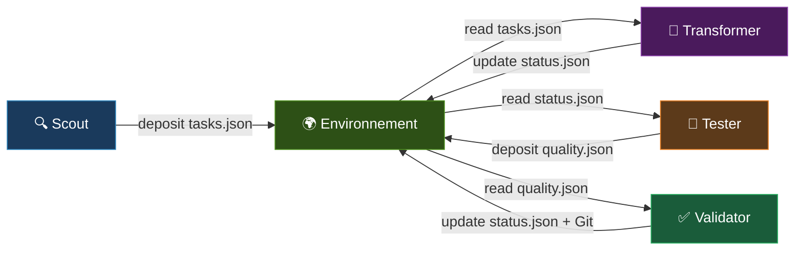
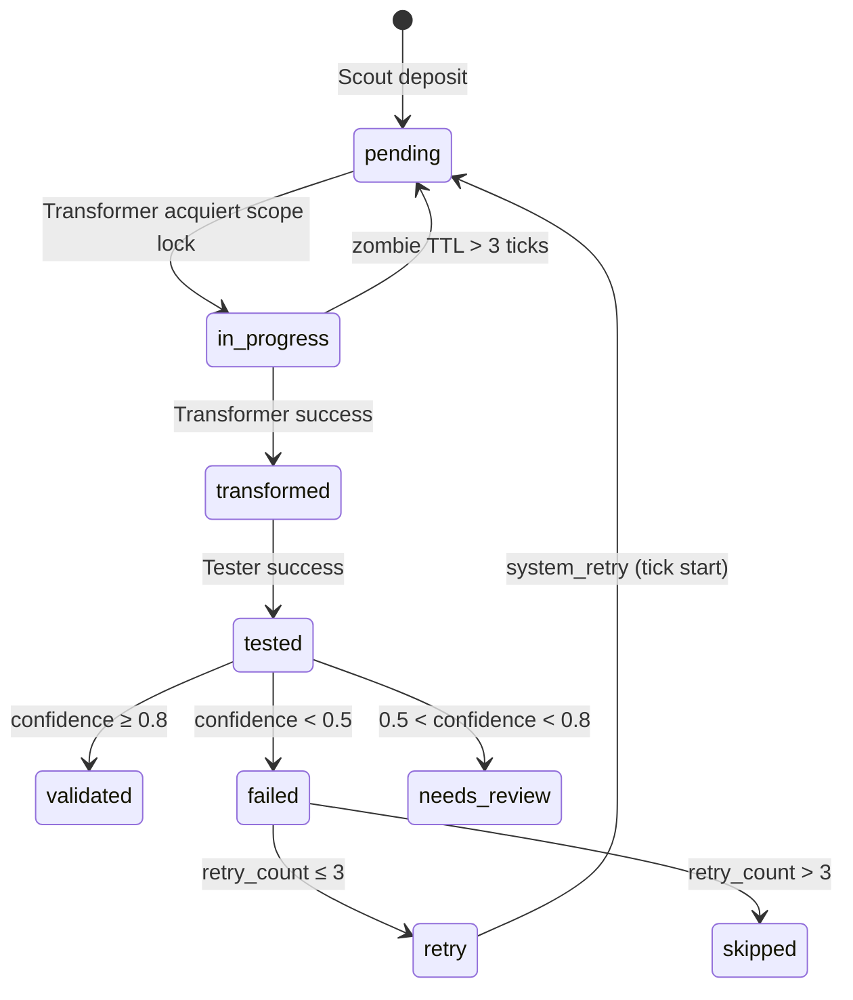

# V0.1 Sprint 3 — Documentation de Version

> **Date** : 2026-02-13  
> **Auteur** : Lotfi (avec assistance IA Claude Code & Codex)  
> **Statut** : ✅ Sprint 3 complété et validé

---

## 1. Vue d'ensemble

Le POC V0.1 implémente une **orchestration stigmergique de 4 agents LLM** pour la migration automatique de code Python 2 → Python 3. C'est la **première implémentation empirique** de la stigmergie (Grassé, 1959) appliquée aux agents LLM — aucun framework existant (MetaGPT, AutoGen, CrewAI, LangGraph) n'utilise de coordination environnementale décentralisée.

### Pourquoi pas LangChain/LangGraph ?

LangChain impose un **orchestrateur centralisé** (StateGraph, DAG) qui contredit le principe stigmergique. Notre architecture utilise zéro superviseur et zéro communication directe entre agents — tout passe par l'environnement partagé (`pheromones/`).

---

## 2. Architecture Stigmergique

### Boucle principale (Round-Robin)



### Cycle par tick

```
Tick N:
  1. apply_decay(tasks)          → intensity *= e^(-0.05)
  2. apply_decay_inhibition()    → gamma *= e^(-0.08)
  3. maintain_status(tick)       → zombie TTL release + retry→pending
  4. Scout.perceive → decide → execute → deposit
  5. Transformer.perceive → decide → execute → deposit
  6. Tester.perceive → decide → execute → deposit
  7. Validator.perceive → decide → execute → deposit
```

**Conditions d'arrêt** (OR) : tous terminaux | budget tokens | max ticks (50) | 2 cycles idle.

---

## 3. Système de Phéromones

### 3.1 tasks.json — Phéromones de tâche

**Producteur** : Scout  
**Consommateur** : Transformer

Le Scout analyse chaque fichier `.py` et détecte **19 patterns** Python 2 via deux méthodes :

- **AST** (Abstract Syntax Tree) : analyse syntaxique précise — détecte `old_division`, `urllib_import`, `metaclass_syntax`, `string_module`
- **Regex** : recherche textuelle robuste — détecte `print_statement`, `xrange`, `dict_iteritems`, etc.

**Formule d'intensité** :
```
Score brut : S_i = (pattern_count × 0.6) + (dep_count × 0.4)
Normalisation min-max : intensity_i = (S_i - S_min) / (S_max - S_min)
Clamp : [0.1, 1.0]

Décroissance par tick : intensity *= e^(-ρ)  avec ρ = 0.05
```

Les tâches non traitées **s'effacent** naturellement (comme les phéromones biologiques), évitant les blocages sur des fichiers impossibles.

### 3.2 status.json — Phéromones de statut

**Producteur** : Tous les agents  
**Machine à états** :



**Mécanismes clés** :
- **Inhibition gamma** : `+0.5` à chaque retry, decay `gamma *= e^(-0.08)`. Transformer attend `gamma < 0.1` pour re-traiter.
- **Scope lock** : mutex par fichier (1 agent à la fois) + TTL 3 ticks (zombie prevention)
- **Anti-loop** : `retry_count > 3` → fichier `skipped` (abandon sûr, le code reste Python 2)

### 3.3 quality.json — Phéromones de qualité

**Producteur** : Tester  
**Consommateur** : Transformer (few-shot learning), Validator (décision)

```
confidence = tests_passed / tests_total  (0.5 si aucun test)
Renforcement : pass → +0.1 ; fail → -0.2 + retry
```

**Stigmergie cognitive** : Le Transformer lit `quality.json` pour apprendre des erreurs passées et améliorer ses futures migrations.

### 3.4 audit_log.jsonl — Journal d'audit

Append-only, chaque modification logguée avec : `timestamp`, `agent`, `pheromone_type`, `file_key`, `action`, `fields_changed`, `previous_values`. Conforme EU AI Act Art. 14.

---

## 4. Guardrails (Normes profondes)

| Guardrail | Mécanisme | Fichier |
|---|---|---|
| Traçabilité | Timestamp + signature agent | `guardrails.py` L113-129 |
| Budget tokens | Plafond configurable, fatal si dépassé | `guardrails.py` L32-37 |
| Anti-boucle | `retry_count > 3` → skip | `guardrails.py` L39-41 |
| Scope lock | Mutex par fichier + TTL 3 ticks | `guardrails.py` L43-111 |
| Confidence seuils | 0.8 (valider), 0.5 (rollback) | `config.yaml` |

---

## 5. Configuration (`stigmergy/config.yaml`)

### Paramètres modifiés dans cette version

| Paramètre | Avant | Après | Raison |
|---|---|---|---|
| `max_tokens_total` | 200,000 | 1,000,000 | Permettre le traitement de repos plus volumineux |
| `max_response_tokens` | 4096 (hardcoded) | 0 (uncapped) | Éviter la troncation sur les gros fichiers |
| `max_budget_usd` | N/A | 0.0 (ajouté) | Budget coût optionnel via OpenRouter pricing |

---

## 6. Résultats des Gate Runs

### 6.1 Résumé comparatif

| Run | Repo | Environnement | Fichiers | Validés | Taux | Ticks | Tokens |
|---|---|---|---|---|---|---|---|
| `20260212T170852Z` | Synthetic (20 files) | Local | 20 | 19 | **95.00%** | 23 | 7,015 |
| `20260212T173610Z` | Synthetic (20 files) | Docker | 20 | 19 | **95.00%** | 23 | 6,825 |
| `20260212T170936Z` | docopt@0.6.2 | Local | 23 | 21 | **91.30%** | 29 | 83,665 |
| `20260212T173704Z` | docopt@0.6.2 | Docker | 23 | 20 | **86.96%** | 32 | 118,618 |

### 6.2 Meilleur run (docopt@0.6.2)

**Run** : `20260212T214639Z` — **22/23 validés (95.65%)**

```json
{
  "files_total": 23,
  "files_validated": 22,
  "success_rate": 0.956522,
  "total_ticks": 26,
  "total_tokens": 151866,
  "stop_reason": "all_terminal",
  "audit_completeness": 1.0
}
```

### 6.3 Plus bas run (docopt@0.6.2)

**Run** : `20260212T173704Z` — **20/23 validés (86.96%)**

```json
{
  "files_total": 23,
  "files_validated": 20,
  "success_rate": 0.869565,
  "total_ticks": 32,
  "total_tokens": 118618,
  "stop_reason": "all_terminal",
  "audit_completeness": 1.0
}
```

### 6.4 Évolution des scores (docopt@0.6.2)

```
Run 1 (T170936Z) :  21/23 = 91.30%  →  83k tokens
Run 2 (T173704Z) :  20/23 = 86.96%  → 118k tokens  (Docker, fresh env)
Run 3 (T214639Z) :  22/23 = 95.65%  → 151k tokens  (après patch uncapped)
Run 4 (T223013Z) :  22/23 = 95.65%  →  22k tokens   (phéromones persistées!)
Run 5 (T224241Z) :  22/23 = 95.65%  →  71k tokens
Run 6 (T225524Z) :  21/23 = 91.30%  → 106k tokens
```

**Observations clés** :
- Le **score augmente après le patch uncapped** (86.96% → 95.65%)
- Le **Run 4 utilise seulement 22k tokens** (vs 151k pour Run 3) → la persistance des phéromones évite de refaire le travail déjà validé (**stigmergie cognitive**)
- Le taux stabilise autour de **91-96%** sur docopt@0.6.2

---

## 7. Améliorations effectuées (Sprint 3 Patches)

### 7.1 Suppression du cap output (Sprint 3 Patch 1)
- **Problème** : `max_response_tokens: 4096` tronquait les fichiers volumineux
- **Solution** : `max_response_tokens: 0` → le LLM génère sans limite
- **Impact** : +8.7% sur docopt (86.96% → 95.65%)

### 7.2 Budget coût USD (Sprint 3 Patch 1)
- **Ajout** : `max_budget_usd` avec pricing OpenRouter
- **Impact** : Contrôle fin des coûts API

### 7.3 Hard-disable max_tokens (Sprint 3 Patch 2)
- **Problème** : Même à 0, le client envoyait potentiellement `max_tokens`
- **Solution** : Client ne transmet jamais `max_tokens` au provider

### 7.4 Script de vérification
- **Ajout** : `scripts/verify_migration.sh`
- **Fonction** : Vérifie statuts, confiance, commits Git, compilation Python 3

### 7.5 Augmentation budget tokens
- **Changement** : `max_tokens_total` de 200k → 1M
- **Raison** : Permettre des migrations plus ambitieuses

---

## 8. Stack technique

| Composant | Technologie |
|---|---|
| Langage | Python 3.11+ |
| LLM Provider | OpenRouter (Qwen 3 235B) |
| Pheromone store | JSON local + `fcntl.flock` |
| Tests | pytest + pytest-cov |
| Container | Docker + docker-compose |
| Versionning | Git (local) |
| Config | YAML |
| Métriques | CSV + JSON |
| Env vars | python-dotenv |

---

## 9. Pistes V0.2

- [ ] **Abstraction langage** : Adapter les patterns pour Java→Kotlin, JS ES5→ES6
- [ ] **Chunking intelligent** : Découper les gros fichiers en fonctions/classes
- [ ] **Parallélisme** : Plusieurs Transformers/Testers simultanés
- [ ] **Auto-tuning** : Calibrer `decay_rate`, `inhibition_threshold` via Bayesian Optimization
- [ ] **Meta-learning** : Apprentissage croisé entre repos différents
- [ ] **Dashboard** : Visualisation temps réel des phéromones

---

## 10. Fichiers de données sauvegardés

```
documentation/snapshot_v01_sprint3/
├── tasks.json              ← Phéromones de tâche (état actuel)
├── status.json             ← Phéromones de statut (état actuel)
├── quality.json            ← Phéromones de qualité (état actuel)
├── audit_log.jsonl         ← Journal d'audit complet
├── metrics_best_run/       ← Run 22/23 = 95.65%
│   ├── *_manifest.json
│   ├── *_summary.json
│   └── *_ticks.csv
└── metrics_worst_run/      ← Run 20/23 = 86.96%
    ├── *_manifest.json
    ├── *_summary.json
    └── *_ticks.csv
```

---

**Dernière mise à jour** : 2026-02-13  
**Version** : V0.1 Sprint 3
