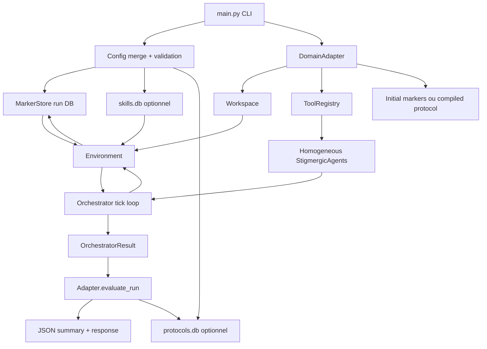
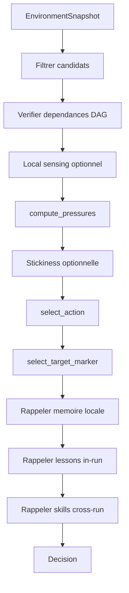
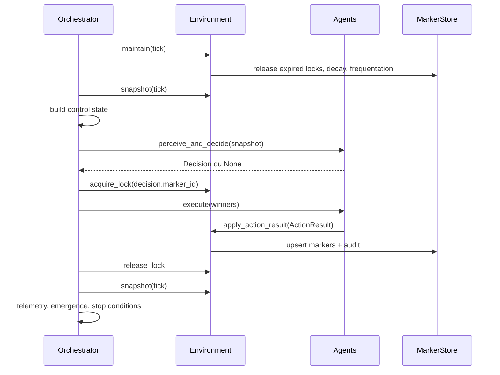

# Guide expert du framework StigmergiAgentic

Etat documente le 2026-04-23.

Ce document sert de reference pedagogique pour comprendre le framework
StigmergiAgentic dans le cadre du memoire. Il explique le systeme par couches,
depuis les concepts de stigmergie jusqu'aux details d'execution du runtime,
des adapters, de la memoire, des protocoles persistants et des campagnes
TravelPlanner.

Le but n'est pas seulement de decrire les fichiers. Le but est de rendre le
framework lisible comme un mecanisme: quelles informations circulent, qui a le
droit de modifier quoi, comment les agents se coordonnent, comment le systeme
apprend, et comment une execution devient un resultat mesurable.

## 1. Idee Directrice

StigmergiAgentic est un framework d'orchestration multi-agent fonde sur un
principe stigmergique: les agents ne se coordonnent pas par conversation
directe, ni par un chef central qui leur attribue des roles fixes. Ils se
coordonnent en lisant et en modifiant un environnement partage.

Dans ce projet, l'environnement partage est un champ de marqueurs persistants.
Chaque marqueur est une trace d'action possible, d'avancement, de qualite,
d'apprentissage ou de protocole. Les agents observent ces traces, calculent une
pression d'action, verrouillent un marqueur, executent un outil, puis deposent
de nouvelles traces.

La boucle fondamentale est donc:

```text
marqueurs visibles -> pression d'action -> lock -> outil -> nouveaux marqueurs
```

Cette boucle transforme une tache complexe en une dynamique collective. Les
agents sont volontairement homogenes: ce sont les marqueurs, les dependances,
les intensites, les inhibitions, les locks, la memoire et les outils eligibles
qui differencient le comportement.

### Ce que le framework essaie de demontrer

Le framework actuel correspond a l'etat Sprint 9 / V9. Il supporte trois claims
importants pour le memoire:

1. Generation de protocole conditionnee par objectif.
   Le runtime peut demander a un LLM de compiler un DAG de marqueurs executables
   a partir d'un objectif, au lieu de se limiter a des marqueurs initiaux codés
   manuellement par l'adapter.

2. Accumulation de competences entre runs.
   Les lecons utiles produites dans un run peuvent etre promues en `skill`
   persistantes dans une base separee, puis relues par les agents lors de runs
   ulterieurs.

3. Amelioration de coordination entre runs.
   Les metriques d'emergence peuvent produire des adaptations de configuration,
   stockees sous forme de `coordination_protocol` dans une base persistante.

## 2. Carte Mentale du Repo

Le framework se lit en cinq couches.

```text
main.py
  Charge la config, construit l'adapter, les stores, l'environnement,
  les agents et l'orchestrateur.

adapters/
  Traduit un domaine concret en workspace, objectif, outils, state machine,
  marqueurs initiaux et evaluation.

core/
  Contient le runtime generique: Marker, MarkerStore, Environment,
  StigmergicAgent, Orchestrator, pression, decay, reinforcement,
  emergence, guardrails.

tools/
  Contient les actions generiques assistant: think, decompose, file_read,
  file_write, bash_exec, web_search.

llm/
  Encapsule les appels LLM synchrones/asynchrones, les schemas de sortie,
  le budget, les retries, la tarification et les prompts.
```

Les dossiers a connaitre:

```text
core/
  marker.py             Modele Marker et StateMachine.
  marker_store.py       Persistance SQLite/WAL, locks, audit, reads.
  environment.py        Gatekeeper des mutations, reinforcement, lessons, skills.
  agent.py              Perception, pression, memoire, selection, execution.
  orchestrator.py       Boucle tick par tick, parallele, locks, emergence.
  emergence.py          Metriques, feedback loop, protocol score.
  dependency.py         DAG, topological sort, markers debloques.
  pressure.py           Pressions simple ou ACO, softmax.
  guardrails.py         Budgets, retries, TTL, traceability.
  schemas.py            Schemas Pydantic LLM/outils.

adapters/
  base.py               Contrat DomainAdapter.
  assistant/            Adapter assistant local.
  travelplanner/        Adapter TravelPlanner, outils, workspace, evaluation.

tools/
  think.py              Raisonnement structure.
  decompose.py          Decomposition en sous-marqueurs.
  file_read.py          Lecture fichier.
  file_write.py         Ecriture fichier controlee.
  bash_exec.py          Commandes shell allowlistees.
  web_search.py         Recherche Tavily/Serper/no-op.

llm/
  client.py             Client LLM provider-aware.
  prompts.py            Prompts systeme, action, protocole.

config/
  default.yaml          Valeurs communes.
  assistant.yaml        Overrides assistant.
  travelplanner.yaml    Overrides TravelPlanner.
  ablation/*.yaml       Presets experimentaux.
```

## 3. Architecture Generale



La separation est stricte:

- `core/` ne connait pas TravelPlanner.
- `adapters/` savent comment mapper un domaine vers des marqueurs et des outils.
- `tools/` executent une action et renvoient un `ActionResult`.
- `Environment` est le seul endroit qui applique les mutations au store.
- `Orchestrator` decide du rythme, du parallele, des locks et des conditions
  d'arret.
- `main.py` assemble tout, mais ne contient pas la logique interne des outils.

## 4. Le Marqueur: Atome du Systeme

Le fichier central est `core/marker.py`.

Un `Marker` est l'atome de coordination. Il represente une trace dans le medium
partage. Il n'est pas seulement une tache. Il peut etre:

- une tache a executer (`task`);
- une trace de progression (`progress`);
- un signal de qualite (`quality`);
- une lecon reutilisable (`lesson`);
- une competence persistante (`skill`);
- un protocole de coordination persistant (`coordination_protocol`);
- un marqueur dynamique propre a un adapter, par exemple `repair`.

Les champs essentiels:

```text
id             Identite stable du marqueur.
marker_type    Type logique du signal.
target         Cible lisible ou scope du marqueur.
intensity      Force du signal, dans [0, 1].
state          Etat dans la state machine.
payload        Donnees metier ou runtime.

created_by     Agent ou systeme createur.
created_at     Timestamp creation.
updated_by     Dernier auteur de mutation.
updated_at     Dernier timestamp de mutation.
last_active_at Timestamp d'activite utile pour time decay.

lock_owner     Agent qui possede le lock, ou None.
lock_tick      Tick d'acquisition du lock.
inhibition     Frein de selection, dans [0, 1].
retry_count    Nombre de reprises.
history        Historique textuel des transitions.
```

### Intensite et inhibition

L'intensite attire les agents. Plus elle est elevee, plus le marqueur contribue
a la pression d'action.

L'inhibition freine les agents. Elle sert a eviter de repeter indefiniment une
direction peu productive ou fortement conflictuelle.

Dans la logique stigmergique, intensite et inhibition sont les deux faces du
signal:

```text
intensity haute  -> "ceci merite de l'attention"
inhibition haute -> "ceci est momentanement moins prometteur"
```

### Payload

Le `payload` contient les informations variables. C'est volontairement un
dictionnaire generique. Quelques cles importantes:

```text
eligible_actions       Liste d'actions autorisees pour ce marqueur.
depends_on             Liste d'IDs de marqueurs a terminer avant execution.
objective              Objectif source.
task / description     Texte d'une sous-tache.
last_thought           Sortie du tool think.
last_read              Sortie du tool file_read.
last_write             Sortie du tool file_write.
last_bash              Sortie du tool bash_exec.
last_search            Sortie du tool web_search.
query_data             Donnees TravelPlanner.
results                Resultats de recherche TravelPlanner.
plan                   Plan TravelPlanner propose.
evaluation             Evaluation TravelPlanner.
final_plan             Plan final.
failure_reason         Cause de failure lisible.
validation_feedback    Feedback de validation pour replanification.
```

Le payload est le lieu ou l'adapter specialise le comportement sans modifier le
runtime generique.

## 5. State Machine

Le framework utilise une machine a etats configurable.

La state machine par defaut est:

```text
pending   -> active, skipped, escalated
active    -> completed, failed, skipped, escalated
failed    -> retry, skipped, escalated
retry     -> pending, skipped, escalated
completed -> verified, skipped, escalated
verified  -> terminal, skipped, escalated
terminal  -> terminal, skipped, escalated
skipped   -> skipped
escalated -> escalated
```

La transition est verifiee dans `Environment.apply_action_result()` lorsqu'un
marqueur existant change d'etat. Cela signifie que les outils ne peuvent pas
faire n'importe quelle mutation silencieuse: l'environnement sert de porte de
validation.

TravelPlanner fournit sa propre state machine dans
`adapters/travelplanner/adapter.py`, avec des etats adaptes:

```text
pending, searching, planning, validating, terminal, skipped, escalated
```

Pourquoi c'est important:

- le core reste generique;
- chaque domaine peut avoir son propre vocabulaire d'avancement;
- les transitions restent auditables;
- les outils peuvent etre specialises sans casser le runtime.

## 6. MarkerStore: Le Medium Persistant

Le `MarkerStore` dans `core/marker_store.py` est la memoire environnementale.
Il stocke les marqueurs dans SQLite avec WAL.

### Pourquoi SQLite/WAL

SQLite apporte:

- transactions atomiques;
- persistance locale;
- requetes SQL;
- compatibilite simple avec les campagnes;
- isolation possible par session;
- mode WAL pour mieux supporter lectures/ecritures concurrentes.

Le store cree trois tables principales:

```text
markers
  Stocke les marqueurs serialises.

marker_reads
  Trace quels agents ont vu quels marqueurs a quel tick.

marker_lock_events
  Trace les tentatives de lock et les conflits.
```

### Operations publiques essentielles

```text
upsert_marker(marker, agent_id)
  Insere ou met a jour un marqueur.
  Verifie lock ownership, retry limit et traceability.
  Ajoute un evenement d'audit.

get_marker(marker_id)
  Lit un marqueur par ID.

get_by_type_target(marker_type, target)
  Lit le dernier marqueur d'un couple type/cible.

query_markers(**filters)
  Requete SQL avec filtres simples.

acquire_lock(marker_id, agent_id, tick)
  Prend le lock si libre ou deja possede par le meme agent.

release_lock(marker_id, agent_id)
  Relache le lock si l'agent est proprietaire.

maintain_locks(current_tick, ttl)
  Libere les locks expires.
  Requeue les marqueurs actifs en pending si besoin.

apply_decay(current_tick, config)
  Diminue intensite et inhibition selon la config.

apply_frequentation(current_tick, config)
  Renforce les marqueurs souvent lus.

record_read(marker_id, agent_id, tick)
  Trace la perception d'un marqueur par un agent.

lock_stats_snapshot(since_tick)
  Agrege les conflits de lock.

snapshot()
  Retourne les marqueurs groupes par type.

save_protocol_marker(slot, namespace, payload)
  Persiste un protocole de coordination.

load_protocol_marker(slot, namespace)
  Recharge un protocole de coordination.
```

### Audit append-only

Toutes les mutations importantes creent un evenement dans
`pheromones/audit_log.jsonl` via `core/audit.py`.

Un evenement contient:

```text
timestamp
agent_id
action
marker_id
marker_type
target
before
after
tick optionnel
```

Cela donne au memoire une propriete forte: les decisions et mutations ne sont
pas seulement des resultats finaux. Elles sont traçables.

## 7. Environment: Le Gatekeeper

`core/environment.py` est la couche la plus importante pour comprendre les
garanties du systeme.

L'environnement possede:

- le `MarkerStore` du run;
- la config;
- le workspace;
- la state machine;
- les guardrails;
- optionnellement un `skills_store` persistant;
- des compteurs de tokens, couts, reinforcement, propagation, pruning et skills.

### Snapshot

Les agents ne lisent pas directement le store en boucle. L'orchestrateur leur
donne un `EnvironmentSnapshot`.

Un snapshot contient:

```text
tick
markers       Liste plate de marqueurs copies.
by_type       Marqueurs groupes par type.
control       Signaux runtime: recovery, temperature override, idle limit.
skills        Skills persistantes chargees depuis skills.db.
```

Lors du snapshot, l'environnement peut appliquer:

- time decay en lecture;
- ajout de telemetry de lock dans le payload;
- relief d'inhibition si le recovery controller est actif;
- chargement des skills persistantes.

### Application des resultats

Le coeur est `apply_action_result(agent_id, result)`.

Un outil ne modifie pas directement SQLite. Il retourne un `ActionResult`.
L'environnement applique ensuite les updates:

1. copie defensive du marqueur;
2. recuperation du marqueur existant;
3. validation de transition d'etat;
4. mise a jour de l'historique;
5. upsert transactionnel;
6. reinforcement si succes;
7. creation de `lesson` si succes de qualite;
8. propagation de reinforcement vers les dependances;
9. creation eventuelle de marqueur de repair;
10. promotion eventuelle en `skill`;
11. comptage tokens/cout;
12. enforcement budget.

La regle de conception est simple:

```text
Les outils proposent, l'environnement dispose.
```

### Succes reutilisable

La methode `_is_successful_terminal_state()` evite une erreur scientifique
importante: tous les marqueurs terminaux ne sont pas des succes.

Elle rejette notamment:

- `metadata.failed = true`;
- `metadata.final_pass = false`;
- `payload.final_pass = false`;
- `payload.evaluation.final_pass = false`;
- certains `plan_itinerary` terminaux sans pass explicite;
- tout `failure_reason` non vide et different de `ok`.

Cette distinction est cruciale pour ne pas promouvoir de mauvaises lecons.

## 8. Agent: Perception, Pression, Memoire, Execution

`core/agent.py` implemente `StigmergicAgent`.

Tous les agents ont la meme classe. Ils peuvent neanmoins diverger par:

- leur RNG;
- leur memoire episodique locale;
- leur profil d'affinite;
- leur historique de ligne productive;
- les marqueurs qu'ils perçoivent et verrouillent.

### Pipeline de decision



### Filtrage des candidats

Un marqueur est candidat si:

- il n'est pas terminal (`terminal`, `skipped`, `escalated`);
- il n'est pas locke par un autre agent;
- son inhibition est sous le seuil;
- au moins une action du registry est eligible;
- ses dependances `depends_on` sont satisfaites;
- il passe le local sensing si active.

Les dependances sont gerees par `core/dependency.py`. Un marqueur avec
`depends_on` ne devient visible que lorsque ses dependances sont terminales.

### Pression d'action

Les pressions sont calculees dans `core/pressure.py`.

Formule simple:

```text
score(action) += marker.intensity * action_weight
```

Formule ACO:

```text
score(action) += pheromone^alpha * heuristic^beta
```

Avec:

```text
pheromone = marker.intensity
heuristic = poids action ou affinite locale
```

Les scores sont normalises pour former une distribution. L'action est choisie
par `select_action()`:

- temperature <= 0: choix deterministe du score max;
- temperature > 0: softmax probabiliste.

### Local sensing

Le local sensing est une specialisation douce. Il ne donne pas un role fixe a
l'agent. Il modifie seulement sa perception locale en fonction de ce qui a deja
marche pour lui.

Le profil d'affinite suit:

- les types de marqueurs deja reussis;
- les mots cles des targets deja reussies;
- la recence des marqueurs.

Cela produit des trajectoires differentes entre agents sans declarer
explicitement "toi tu es planner, toi tu es validator".

### Memoire locale

Chaque agent possede une `AgentMemory` en RAM:

```text
context
action
result
relevance
tick
entry_id
```

La memoire:

- est bornee par `agents.memory_capacity`;
- decroit par `agents.memory_decay_rate`;
- est rappelee par recouvrement lexical, relevance et recence;
- est reinforcée apres un resultat de qualite.

Cette memoire disparait a la fin du run. Elle est differente des `lesson` et
`skill`, qui sont des marqueurs.

### Lessons et skills dans la decision

Un agent rappelle:

- des `lesson` du run courant depuis `snapshot.by_type["lesson"]`;
- des `skill` persistantes depuis `snapshot.skills`.

Ces elements sont injectes dans le payload runtime du marqueur avant l'appel de
l'outil. Les outils LLM peuvent donc s'en servir dans leurs prompts.

### Execution

L'agent execute ainsi:

1. recupere l'outil depuis `ToolRegistry`;
2. recharge le marqueur depuis le store;
3. verifie le lock;
4. injecte memoire, lessons et skills dans le payload runtime;
5. appelle `tool.execute(...)`;
6. credite les lessons rappelees si le resultat reussit;
7. confie le resultat a `environment.apply_action_result()`;
8. met a jour son affinite locale;
9. stocke une memoire episodique.

## 9. ToolRegistry et ActionResult

`core/tool_registry.py` definit les contrats.

Un outil doit fournir:

```python
action_type: str
is_eligible(marker: Marker) -> bool
async execute(agent_id, marker, environment, llm_client=None) -> ActionResult
```

Un `ActionResult` contient:

```text
action_type
marker_updates
consumed_tokens
cost_usd
metadata
validation optionnelle
```

Le champ `metadata` est volontairement flexible. Il transporte par exemple:

```text
failed
reason
quality_score
final_pass
replan
credited_lesson_ids
```

Le champ `validation` permet a un outil de demander une reparation ciblee via
`ValidationResult` et `RepairRequest`.

## 10. Orchestrator: La Boucle Collective

`core/orchestrator.py` coordonne l'execution tick par tick.

La boucle exacte:



### Parallele

Si `orchestrator.parallel = true`:

- les decisions des agents sont collectees en parallele;
- les winners sont executes en parallele.

La mutation reste controlee par:

- les locks du store;
- les transactions SQLite;
- l'environnement comme unique gatekeeper.

### Conditions d'arret

Le run s'arrete si:

```text
budget_exhausted
all_terminal
idle_cycles
max_ticks
```

`idle_cycles` augmente quand aucun outil n'a produit d'action reussie a un tick.

### TickRow

Chaque tick produit une ligne telemetry:

```text
tick
decisions
executed_actions
lock_conflicts
active_agents
pressures
actions_by_type
terminal_progress
maintenance
emergence
control
```

Ces lignes alimentent les metriques d'emergence.

## 11. Locks et Resolution de Conflits

Le framework evite que plusieurs agents modifient le meme marqueur en meme
temps par lock pessimiste.

Deux modes existent.

### Resolution sequentielle

Si `orchestrator.emergent_resolution.enabled = false`, l'orchestrateur parcourt
les decisions dans l'ordre et chaque agent tente d'acquerir le lock.

Le premier qui reussit execute.

### Resolution emergente

Si `emergent_resolution.enabled = true`, les decisions sont groupees par
`marker_id`. Quand plusieurs agents ciblent le meme marqueur, un gagnant est
tire avec un poids:

```text
selection_affinity + base_probability
```

Le systeme garde donc une part d'exploration tout en favorisant l'agent qui a
une affinite locale plus forte avec le marqueur.

Les echecs de lock sont traces dans `marker_lock_events`, puis reutilises par:

- les metriques d'emergence;
- le recovery controller;
- la selection de target en mode recovery.

## 12. Maintenance: TTL, Decay, Frequentation, Pruning

Au debut de chaque tick, `Environment.maintain()` lance:

```text
maintain_locks
apply_decay
apply_frequentation
prune_markers
```

### TTL des locks

`guardrails.scope_lock_ttl` limite la duree de possession d'un lock.

Si un lock expire:

- il est libere;
- si le marqueur etait `active`, il repasse `pending`;
- `retry_count` augmente;
- si `retry_count > max_retry_count`, le marqueur devient `skipped`.

### Decay

Le decay diminue progressivement l'intensite des marqueurs non terminaux et
fait baisser l'inhibition.

La config supporte:

```text
markers.decay_type: exponential ou linear
markers.default_decay_rate
markers.decay_rates_by_type
markers.inhibition_decay_rate
markers.intensity_clamp
```

Le decay differentiel est important: une `skill` peut decroitre plus lentement
qu'une tache ordinaire.

### Time decay en lecture

Si `markers.time_decay.enabled = true`, le snapshot calcule une intensite
effective a partir de `last_active_at`, sans forcement ecrire immediatement en
base.

Cela permet de rendre un signal plus faible avec le temps sans multiplier les
ecritures.

### Frequentation

Si `reinforcement.frequentation.enabled = true`, les marqueurs souvent lus par
les agents a un tick reçoivent un boost borne.

Intuition:

```text
un marqueur souvent consulte devient plus saillant
```

Cette trace de lecture est stockee dans `marker_reads`.

### Pruning

Si `markers.prune_threshold` est defini, les marqueurs dont l'intensite passe
sous ce seuil peuvent etre supprimes.

## 13. Reinforcement, Lessons, Skills

Le framework possede trois niveaux de memoire.

### Niveau 1: memoire episodique d'agent

Locale, en RAM, propre a un agent, disparait a la fin du run.

### Niveau 2: lesson markers

Persistes dans la base du run. Une lesson est creee lorsqu'un marqueur atteint
un etat de succes avec un `quality_score` suffisant.

Une lesson contient:

```text
lesson
source_marker
source_agent
source_state
quality_score
usage_count
```

Elle sert a guider d'autres actions dans le meme run.

### Niveau 3: skill markers

Persistes dans `skills.db`, donc reutilisables entre runs.

Une lesson devient une skill si:

- `skill_library.enabled = true`;
- `skill_library.read_only = false`;
- le resultat n'est pas failed;
- `quality_score >= reinforcement.lesson_threshold`;
- la lesson est creditee dans `credited_lesson_ids`;
- `usage_count >= reinforcement.promotion_min_uses`.

La skill contient:

```text
skill_text
context_fingerprint
quality_score
usage_count
source_lesson_ids
domain
```

Le fingerprint regroupe les lecons par pattern d'action:

```text
flight_search::success
hotel_search::success
restaurant_search::success
attraction_search::success
planning::success
validation::success
decomposition::success
search_strategy::success
...
```

### Pourquoi cette architecture est importante

Le systeme ne rend pas les agents "experts" en leur donnant un role fixe. Il
rend le medium plus informatif. Les agents restent homogenes, mais le champ de
marqueurs contient de plus en plus de traces utiles.

## 14. Protocol Compiler

Le protocol compiler correspond a la generation de protocole conditionnee par
objectif.

Le contrat se trouve dans `DomainAdapter.compile_protocol()`.

Quand `agents.protocol_compiler.enabled = true`, `main.py` appelle:

```text
adapter.compile_protocol(objective, config, llm_client)
```

Si la compilation reussit:

- le LLM retourne un `ProtocolSpec`;
- chaque `ProtocolMarkerSpec` devient un `Marker`;
- les actions sont verifiees contre le `ToolRegistry`;
- les intensites doivent etre dans `[0.1, 1.0]`;
- les IDs doivent etre uniques;
- le DAG doit etre acyclique.

Si quelque chose echoue:

```text
fallback -> adapter.initial_markers()
```

Cette strategie est cruciale pour la robustesse: la generation de protocole est
un accelerateur, pas un point de rupture.

## 15. Coordination Protocols Cross-Run

Les protocoles de coordination persistants sont stockes dans `protocols.db` via
des marqueurs de type `coordination_protocol`.

Chaque namespace possede trois slots:

```text
baseline
latest
best
```

### Namespace

Le namespace est construit par `main._build_protocol_namespace()` a partir de:

- adapter;
- modele LLM;
- alpha/beta de pression;
- activation skill library;
- activation protocol;
- activation feedback loop.

Un digest MD5 de 8 caracteres evite de melanger des regimes experimentaux
incompatibles.

### Au debut d'un run

`_maybe_apply_cross_run_protocol()`:

1. charge `baseline`;
2. charge `best`;
3. lit les adaptations du best;
4. les clamp contre la config baseline;
5. applique les valeurs au `config` courant.

Le clamp est controle par:

```text
emergence.cross_run.max_total_delta
```

### A la fin d'un run

`_persist_protocol()`:

1. calcule les metriques d'emergence;
2. calcule des adaptations via `compute_adaptations()`;
3. calcule un score via `compute_protocol_score(evaluation)`;
4. sauvegarde toujours `latest`;
5. cree `baseline` si absent;
6. remplace `best` seulement si le score est meilleur.

Le score donne une priorite forte au `final_pass_rate`, puis au hard constraint,
puis a la delivery, avec une petite penalite de convergence tardive.

## 16. Emergence Metrics

Les metriques sont calculees dans `core/emergence.py`.

### specialization_entropy

Mesure la diversite d'actions par agent. Si chaque agent fait beaucoup d'actions
differentes, l'entropie est haute.

### colony_specialization

```text
colony_specialization = 1 - specialization_entropy
```

Elle mesure la specialisation globale de la colonie.

### collaboration_density

Lit l'audit log et mesure la proportion de marqueurs touches par plus d'un
agent non-systeme.

### action_switching_rate

Mesure la frequence a laquelle un agent change d'action d'un tick a l'autre.
Un switching trop eleve peut indiquer du thrashing.

### convergence_tick

Premier tick ou au moins 80% des marqueurs sont terminaux.

### lock_contention_rate

```text
lock_conflicts / lock_attempts
```

### parallel_utilization

```text
active_agents / total_agents
```

Moyenne sur les ticks.

### pressure_entropy

Mesure la dispersion moyenne des pressions entre actions.

### Feedback loop

Si `emergence.feedback_loop.enabled = true`, l'orchestrateur appelle
`compute_adaptations()` tous les `interval_ticks`.

Adaptations possibles:

- ajuster `agents.local_sensing.affinity_exploration_rate`;
- augmenter `markers.inhibition_increment` en cas de contention;
- ajuster `agents.selection_temperature` selon parallel utilization et pressure
  entropy.

Les adaptations runtime sont auditees comme actions `system_emergence`.

## 17. Recovery Controller et Stickiness

Les presets V6 ajoutent deux mecanismes de controle generiques.

### Recovery controller

Le recovery controller detecte une stagnation avec contention:

- pas de progres terminal recent;
- travail restant;
- contention recente superieure au seuil;
- cooldown respecte.

Quand il s'active:

- augmente temporairement la temperature de selection;
- reduit l'inhibition visible;
- prefere des cibles moins conflictuelles;
- peut augmenter dynamiquement la limite d'idle cycles.

Objectif: sortir d'une impasse collective sans changer les agents.

### Stickiness

La stickiness encourage un agent a continuer une ligne productive recente:

- meme marqueur;
- meme target;
- meme action;
- dans une fenetre courte;
- avec un nombre max de reutilisations consecutives.

Objectif: reduire le thrashing quand une trajectoire marche.

## 18. Targeted Repair

Le targeted repair est un contrat generique entre outil de validation et
environnement.

Dans TravelPlanner, `ValidateConstraintsTool` peut retourner un
`ValidationResult` contenant un `RepairRequest`.

L'environnement transforme cette demande en nouveau marqueur:

```text
repair::<source_marker_id>::<target_marker_id>::attempt::<n>
```

Ce marqueur:

- pointe vers le plan a reparer;
- contient le feedback de validation;
- reprend les actions eligibles du plan;
- a une intensite elevee;
- devient une nouvelle cible de planification.

Cela evite de relancer tout le DAG. Le systeme peut reparer la partie qui a
echoue.

## 19. Guardrails

`core/guardrails.py` contient les normes profondes:

```text
budget tokens et cout
retry limit
lock TTL
traceability metadata
```

Les guardrails sont appliques par le store et l'environnement, pas par les
agents. Cela garantit que meme un outil ou agent imparfait ne peut pas ecrire
hors contrat sans passer par le gatekeeper.

## 20. LLM Client

`llm/client.py` encapsule les fournisseurs:

```text
openrouter
zai
deepseek
```

Il gere:

- cle API par variable d'environnement;
- base_url par provider;
- appels sync `call`;
- appels async `acall`;
- limite de concurrence via semaphore;
- retries sur erreurs transitoires;
- backoff specifique 429;
- budget tokens;
- budget USD;
- estimation de cout;
- parsing structure via Pydantic;
- extraction de code block JSON/markdown.

Les outils n'ont donc pas besoin de connaitre OpenRouter, DeepSeek ou Z.ai. Ils
reçoivent simplement un `llm_client`.

## 21. Outils Generiques Assistant

Les outils generiques vivent dans `tools/`.

### think

Produit une analyse structuree et peut suggerer:

```text
path
command
query
write
next_action
```

Il incorpore:

- contexte workspace;
- memoire episodique;
- lesson markers;
- outils disponibles.

Il fait progresser les etats simples et stocke `last_thought`.

### decompose

Transforme un objectif en sous-marqueurs.

Il supporte:

- profondeur max;
- nombre max de sous-taches;
- dependances entre sous-taches;
- fallback deterministe si le LLM ne repond pas.

Il cree des enfants:

```text
<parent_id>::subtask::<index>
```

### file_read

Lit un fichier du workspace et stocke `last_read`.

### file_write

Ecrit, append ou remplace du texte dans le workspace. Les modes sont:

```text
overwrite
append
replace_text
```

### bash_exec

Execute une commande allowlistee, avec timeout. Les commandes autorisees
viennent de:

```text
tools.allowed_commands
```

### web_search

Peut utiliser:

```text
none
tavily
serper
```

En mode `none`, l'outil reste deterministe et retourne une liste vide.

## 22. Contrat DomainAdapter

`adapters/base.py` definit l'interface:

```python
create_workspace(config) -> Workspace
create_objective(user_input, config) -> Objective
register_tools(registry) -> None
define_state_machine() -> StateMachine
initial_markers(objective, agent_id) -> list[Marker]
compile_protocol(objective, config, llm_client) -> list[Marker] | None
evaluate_run(env_snapshot) -> dict
```

Cette interface force une architecture verticale:

```text
domaine -> workspace -> tools -> markers -> evaluation
```

Ajouter un nouveau domaine revient a implementer cette interface, sans toucher
au core.

## 23. AssistantAdapter

L'adapter assistant est le mode generique local.

Il cree:

- un `LocalWorkspace` contraint par `tools.sandbox_root`;
- les outils generiques d'infrastructure;
- une state machine par defaut;
- un marqueur racine ou des sous-marqueurs fournis par l'utilisateur.

Si des subtasks sont donnees, l'adapter cree:

```text
root active, deja decomposed
children pending
```

Sinon:

```text
root pending
```

L'evaluation assistant reste simple:

- nombre total de marqueurs;
- nombre de terminaux;
- ratio terminal;
- nombre completed-or-more.

## 24. TravelPlannerAdapter

TravelPlanner est l'adapter scientifique principal actuel.

Il mappe une requete du benchmark TravelPlanner vers un DAG executable.

### Workspace

`TravelPlannerWorkspace` charge:

```text
flights
hotels
restaurants
attractions
distances
queries train/validation
```

Il fournit des recherches deterministes sur CSV:

```text
search_flights(origin, dest, date)
search_ground_transport(origin, dest)
search_hotels(city)
search_restaurants(city)
search_attractions(city)
get_distances(origin, dest)
```

Il construit aussi une `city_sequence` pour les requetes multi-villes.

### DAG initial

Pour une requete, l'adapter cree typiquement:

```text
search_flights_outbound
search_ground_transport_outbound
search_hotels_<city>
search_restaurants_<city>
search_attractions_<city>
...
search_flights_return
search_ground_transport_return
plan_itinerary
validate_constraints
finalize
```

Les dependances imposent:

```text
searches -> plan_itinerary -> validate_constraints -> finalize
```

Pour les multi-villes, les routes et recherches par ville s'enchainent avec des
dependances supplementaires.

### Outils de recherche

Les outils `SearchFlightsTool`, `SearchHotelsTool`, etc. heritent d'une base
deterministe:

1. lire les champs requis dans le payload;
2. appeler le workspace;
3. stocker les resultats dans `payload.results`;
4. passer de `pending` a `searching`, puis de `searching` a `terminal`.

Ce comportement en deux passages est important: il laisse le marqueur exister
comme trace intermediaire avant terminaison.

### PlanDayTool

`PlanDayTool` est LLM-backed. Il:

- collecte les resultats des dependances;
- injecte des payloads manquants par fallback si possible;
- compact les donnees pour le prompt;
- trie les candidats par cout avant truncation;
- filtre les hotels incompatibles;
- ajoute des few-shots issus du split train uniquement;
- demande un JSON conforme a `TravelItineraryOutput`;
- retry une fois avec prompt strict si parsing impossible;
- normalise les noms, transports, hotels, restaurants et attractions;
- gere les plans vides et les attempts.

Un plan vide peut produire:

```text
empty_plan_from_llm
schema_parse_failed
empty_llm_content
empty_plan_after_max_attempts
```

### ValidateConstraintsTool

Valide un plan avec l'evaluateur officiel.

Si le plan passe:

```text
state = terminal
metadata.final_pass = true
failure_reason = ok
```

S'il echoue:

- stocke `failed_constraints` et `failed_feedback`;
- augmente retry_count;
- remet en planning si retries disponibles;
- cree eventuellement un `RepairRequest`;
- termine en `validator_replan_exhausted` si les retries sont epuises.

### Finalize

Le marqueur `finalize` copie:

- `query_data`;
- `final_plan`;
- `evaluation`;
- `final_pass`;
- `failure_reason`.

Il devient le point de sortie que `main.py` utilise pour rendre la reponse
lisible.

## 25. Evaluation TravelPlanner

`TravelPlannerEvaluator` appelle `OfficialTravelPlannerEvaluator`, qui execute
le runner officiel dans `third_party/travelplanner_official/runner.py`.

Les metriques principales:

```text
delivery_rate
commonsense_micro
commonsense_macro
hard_constraint_micro
hard_constraint_macro
final_pass_rate
evaluated_queries
```

Le `final_pass` d'un plan exige:

```text
delivered
commonsense_macro_pass
hard_macro_pass
```

L'adapter ajoute aussi une taxonomie de failure par query:

```text
ok
multi_city_unsupported
missing_search_results
empty_plan_after_max_attempts
schema_parse_failed
empty_plan_from_llm
validator_replan_exhausted
idle_cycles
max_ticks
budget_exhausted
```

Cette taxonomie est importante pour le memoire: elle separe les echecs de
synthese, de workflow, de recherche et de contraintes.

## 26. main.py: Assemblage d'un Run

`main.py` est l'entree CLI.

Sequence:

```text
1. load_dotenv()
2. parse args
3. create session_id
4. load default config
5. merge adapter config
6. merge user config
7. apply CLI overrides
8. validate config
9. build adapter
10. create workspace
11. create objective
12. create MarkerStore run
13. create skills_store si enabled
14. create protocol_store si enabled
15. apply best cross-run protocol si possible
16. create Environment
17. register tools
18. create LLMClient si possible
19. select initial markers ou compile protocol
20. seed markers
21. build agents
22. run orchestrator
23. adapter.evaluate_run
24. persist protocol si active
25. build response
26. print dashboard et JSON summary
27. cleanup session si demande
```

### CLI utile

```bash
uv run python main.py \
  --adapter travelplanner \
  --config config/ablation/v6_C.yaml \
  --objective "Query 0"
```

### Resume JSON

Le JSON final contient:

```text
adapter
objective_id
session_id
session_db_path
stop_reason
total_ticks
agents
markers
tokens_used
cost_used
llm_provider
llm_model
reinforcement
maintenance
skill_library
coordination_protocol_applied
emergence
dag
evaluation
assistant_response
```

## 27. Configuration: Les Leviers a Connaitre

### agents

```text
num_agents
selection_temperature
memory_capacity
memory_decay_rate
local_sensing.*
stickiness.*
protocol_compiler.enabled
```

### markers

```text
decay_type
decay_rate
default_decay_rate
decay_rates_by_type
inhibition_decay_rate
inhibition_increment
inhibition_threshold
prune_threshold
session_isolation
intensity_clamp
time_decay.*
```

### reinforcement

```text
enabled
rate
propagation_factor
max_intensity
lesson_threshold
promotion_min_uses
frequentation.*
```

### skill_library

```text
enabled
read_only
db_path
```

### protocol

```text
enabled
read_only
db_path
```

### orchestrator

```text
max_ticks
idle_cycles_to_stop
parallel
emergent_resolution.*
recovery_controller.*
targeted_repair.*
```

### emergence

```text
enabled
metrics
feedback_loop.*
cross_run.*
```

### llm

```text
provider
model
temperature
max_tokens_total
max_budget_usd
request_timeout_seconds
retry_attempts
min_429_backoff_seconds
```

### pressures

```text
formula: simple ou aco
alpha
beta
default_weights
```

## 28. Presets Experimentaux

Le framework utilise des YAML pour isoler les regimes experimentaux.

Exemples:

```text
config/ablation/v5_full.yaml
  Preset V5 complet.

config/ablation/v6_base.yaml
  Base V6.

config/ablation/v6_A.yaml
  V6 avec controle anti-stagnation/local sensing selon le plan.

config/ablation/v6_B.yaml
  Variante stickiness.

config/ablation/v6_C.yaml
  V6-A plus targeted repair.

config/travelplanner_adapt_scientific.yaml
  Mode adaptation sur split train, ecrit skills/protocols.

config/travelplanner_eval_c3_gemma.yaml
  Mode evaluation validation, read-only, Gemma.
```

La logique scientifique importante est:

```text
adaptation -> train split, stores writable
evaluation -> validation split, stores read-only
```

Cela evite que la memoire persistante soit apprise sur les memes exemples que
l'evaluation finale.

## 29. Campagnes Docker

Les campagnes doivent etre lancees avec Docker, comme documente dans
`AGENTS.md` et `docker-compose.campaign.yml`.

Raisons:

- isolation des bases `skills.db` et `protocols.db`;
- environnement reproductible;
- compatibilite GNU bash;
- parallelisme sans conflit de fichiers;
- separation des resultats par service.

Services finaux actuels:

```text
gemma-stigmergie
gemma-baselines
deepseek-stigmergie
```

Analyse finale:

```bash
uv run python scripts/aggregate_campaign_comparison.py \
  --gemma campaign_results/gemma-stigmergie \
  --deepseek campaign_results/deepseek-stigmergie \
  --baselines campaign_results/gemma-baselines \
  --qwen-fixture output/travelplanner_framework_compare/v6c_retry_20260420_seed42/v6_C/seed42/benchmark_summary.json
```

## 30. Comment Tracer un Run Comme un Expert

Pour comprendre un run, il faut suivre quatre artefacts.

### 1. Le JSON summary

Regarder d'abord:

```text
stop_reason
total_ticks
evaluation.final_pass_rate
evaluation.failure_reasons
skill_library.skills_promoted
coordination_protocol_applied
emergence.lock_contention_rate
emergence.parallel_utilization
dag.nodes
dag.edges
```

### 2. La base markers.db

Verifier:

```text
combien de markers sont terminal
quels markers restent pending/planning/searching
payload.failure_reason
payload.depends_on
retry_count
inhibition
intensity
```

### 3. audit_log.jsonl

Chercher:

```text
upsert
acquire_lock
release_lock
ttl_release
decay
frequentation
recovery_activation
adaptation
```

### 4. skills.db / protocols.db

Pour verifier C2/C3:

```text
skills.db contient-il des marker_type = skill ?
protocols.db contient-il baseline/latest/best ?
coordination_protocol_applied est-il true en eval ?
```

Un run C3 dont `protocols.db` est vide ne prouve pas l'adaptation cross-run,
meme si le preset s'appelle C3.

## 31. Diagnostiquer les Echecs Courants

### idle_cycles

Symptome:

```text
stop_reason = idle_cycles
executed_actions = 0 sur plusieurs ticks
```

Causes probables:

- dependances non satisfaites;
- marqueurs inhibes;
- actions non eligibles;
- plan vide signale comme failed;
- DAG trop sequentiel pour le nombre d'agents.

### all_terminal mais final_pass faible

Symptome:

```text
stop_reason = all_terminal
final_pass_rate = 0
plan non vide
```

Cause probable:

- le workflow a livre un plan, mais les contraintes officielles echouent.

Le levier n'est pas plus d'exploration, mais meilleure reparation ou meilleure
selection de candidats.

### lock_contention_rate eleve

Symptome:

```text
lock_contention_rate > 0.7
parallel_utilization faible
```

Interpretation:

- trop d'agents ciblent les memes marqueurs;
- le DAG n'a pas assez de largeur;
- augmenter `num_agents` risque d'aggraver la contention.

### skills_promoted = 0

Verifier:

```text
skill_library.enabled
skill_library.read_only
credited_lesson_ids
quality_score
lesson_threshold
promotion_min_uses
succes reel du marker
```

### coordination_protocol_applied = false

Verifier:

```text
protocol.enabled
emergence.cross_run.enabled
protocols.db contient baseline et best
namespace compatible
adaptations non vides
read_only selon phase
```

## 32. Ajouter un Nouvel Adapter

Procedure:

1. Creer un dossier `adapters/<domain>/`.
2. Implementer un `Workspace`.
3. Implementer les tools du domaine.
4. Implementer `DomainAdapter`.
5. Definir la state machine.
6. Construire les marqueurs initiaux.
7. Definir l'evaluation.
8. Ajouter une config `<domain>.yaml`.
9. Enregistrer l'adapter dans `main.py`.
10. Ajouter tests unitaires et integration.

Le point le plus important: les tools doivent retourner des `ActionResult`,
jamais ecrire directement dans le store.

## 33. Ajouter un Nouvel Outil

Un outil doit:

- heriter de `Tool`;
- definir `action_type`;
- implementer `is_eligible(marker)`;
- implementer `async execute(...)`;
- retourner un `ActionResult`;
- ne jamais contourner `Environment.apply_action_result()`;
- placer les donnees dans le payload de marqueurs updates;
- signaler les echecs via `metadata.failed = true`.

Pattern minimal:

```python
class MyTool(Tool):
    action_type = "my_action"

    def is_eligible(self, marker: Marker) -> bool:
        return self.action_type in marker.payload.get("eligible_actions", [])

    async def execute(self, *, agent_id, marker, environment, llm_client=None):
        updated = Marker.from_dict(marker.to_dict())
        payload = dict(updated.payload)
        payload["my_result"] = "..."
        updated.payload = payload
        updated.state = "terminal"
        return ActionResult(action_type=self.action_type, marker_updates=[updated])
```

## 34. Ajouter une Nouvelle Metrique d'Emergence

Procedure:

1. Ajouter un champ a `EmergenceMetrics`.
2. Calculer la valeur dans `compute_emergence_metrics()`.
3. Ajouter la cle dans `config/default.yaml` si elle doit etre exportee.
4. L'utiliser eventuellement dans `compute_adaptations()`.
5. Ajouter des tests sur `TickRow`.

Ne pas melanger metrique et mutation: les metriques lisent les traces, elles ne
modifient pas le runtime.

## 35. Ce Qui Rend le Framework Stigmergique

Le framework est stigmergique car:

- la coordination passe par l'environnement;
- les agents ne se parlent pas directement;
- les signaux sont persistants et modifiables;
- l'intensite attire l'attention;
- l'inhibition module les impasses;
- les locks representent la competition pour une trace;
- les lessons et skills materialisent l'apprentissage dans le medium;
- les protocoles persistants materialisent l'adaptation de coordination;
- les metriques d'emergence lisent la dynamique collective apres coup.

Le point philosophique essentiel:

```text
L'organisation n'est pas principalement dans les agents.
Elle est dans le medium qu'ils lisent et transforment.
```

## 36. Glossaire Rapide

```text
Adapter
  Couche qui transforme un domaine en workspace, tools, markers et evaluation.

ActionResult
  Resultat brut d'un outil, applique ensuite par l'environnement.

Audit log
  Journal append-only des mutations de marqueurs.

Coordination protocol
  Marqueur persistant qui stocke des adaptations de coordination cross-run.

DAG
  Graphe de dependances entre marqueurs.

Environment
  Gatekeeper des mutations et des guardrails.

Inhibition
  Signal negatif ou frein de selection.

Intensity
  Force positive d'un marqueur.

Lesson
  Marqueur de connaissance cree apres un succes dans un run.

Marker
  Unite de coordination dans l'environnement stigmergique.

Pressure
  Distribution d'attention sur les actions possibles.

Skill
  Lesson promue et persistante entre runs.

StigmergicAgent
  Agent homogene qui perçoit, choisit, verrouille et execute.

Tick
  Une iteration de la boucle orchestrateur.

Tool
  Action executable par un agent.
```

## 37. Lecture Recommandee du Code

Pour devenir expert du framework, lire dans cet ordre:

1. `core/marker.py`
2. `core/tool_registry.py`
3. `core/marker_store.py`
4. `core/environment.py`
5. `core/agent.py`
6. `core/orchestrator.py`
7. `core/pressure.py`
8. `core/dependency.py`
9. `core/emergence.py`
10. `adapters/base.py`
11. `adapters/assistant/adapter.py`
12. `adapters/travelplanner/adapter.py`
13. `adapters/travelplanner/tools.py`
14. `main.py`
15. `config/default.yaml`

Cette sequence va du concept generique vers l'application scientifique.

## 38. Resume en Une Phrase

StigmergiAgentic est un runtime ou des agents homogenes resolvent des objectifs
en manipulant un champ persistant de marqueurs, dont les intensites,
inhibitions, dependances, locks, lessons, skills et protocoles transforment une
simple execution multi-agent en dynamique collective auditable et adaptable.
