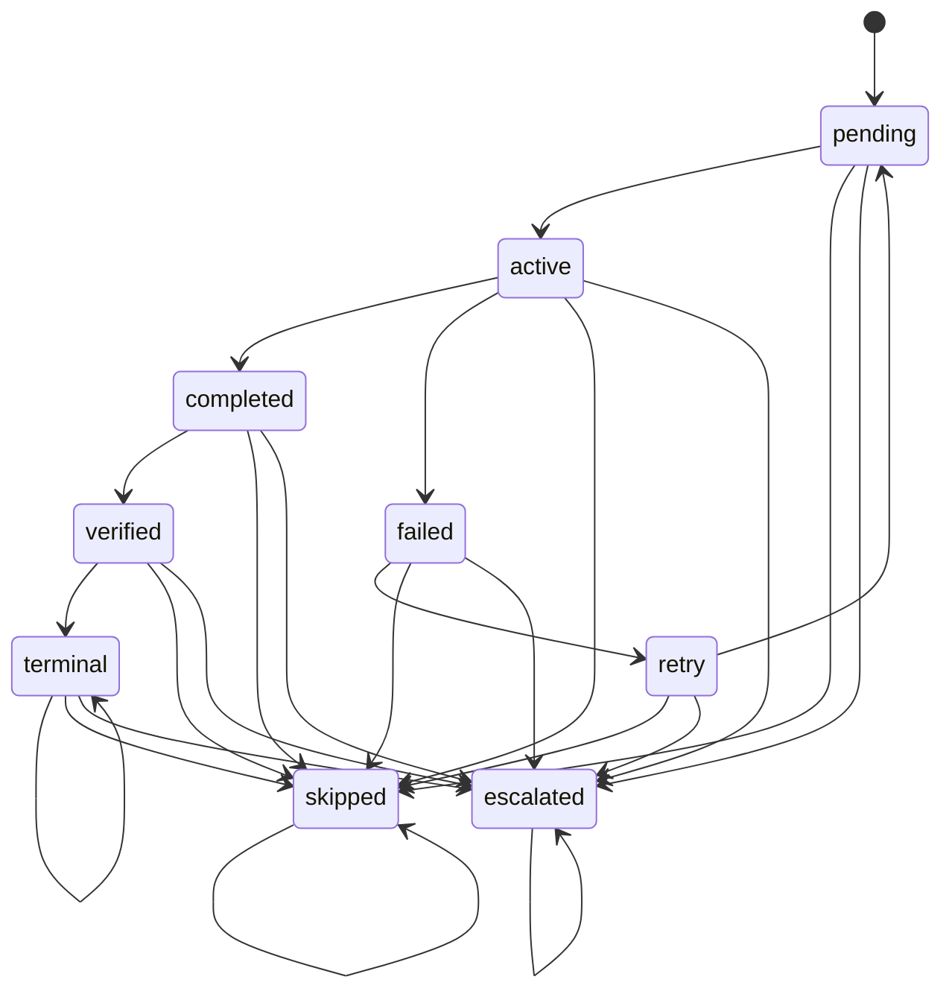
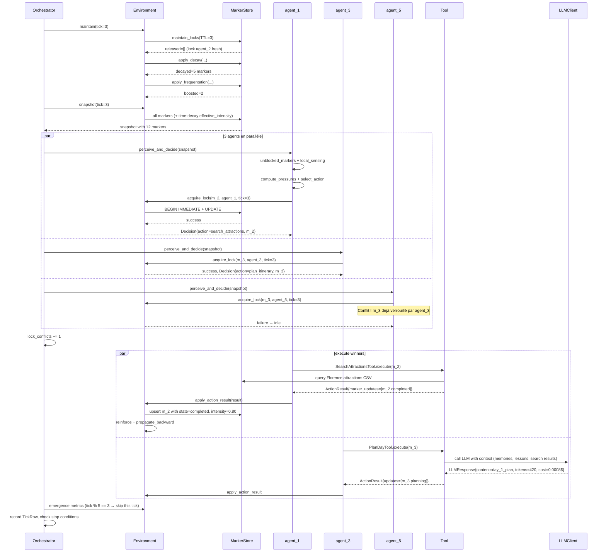
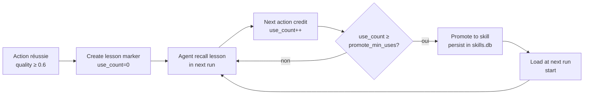

# StigmergiAgentic — Guide pédagogique expert du framework

> **Document de référence pour le mémoire EMLV.**
> Audience : toi (auteur), jury de soutenance, relecteurs externes.
> Objectif : devenir expert du framework en une lecture linéaire, sans avoir besoin d'ouvrir le code.
> Version du code documentée : V3 Sprint 9 (2026-04-21).

---

## Table des matières

**Partie I — Fondements**
1. Introduction et objectifs du framework
2. Fondements théoriques : stigmergie et ACO
3. Architecture en couches — vue d'ensemble

**Partie II — Le substrat : markers et persistance**
4. Le *Marker* — primitive de coordination
5. Le *MarkerStore* — persistance transactionnelle
6. Audit trail append-only

**Partie III — Le moteur de décision**
7. Formule de pression ACO
8. Sélection d'action : softmax vs greedy
9. L'agent stigmergique
10. *Local sensing* et exploration

**Partie IV — Le cycle runtime**
11. L'*Orchestrator* — boucle maîtresse
12. Walkthrough détaillé d'un *tick*
13. Décay et renforcement — les deux feedbacks
14. Verrouillage optimiste avec TTL
15. Dépendances DAG

**Partie V — Apprentissage et émergence**
16. *Lessons* et *skills* — apprentissage cross-run (C2)
17. Protocoles de coordination — C3
18. Métriques d'émergence
19. *Feedback adaptation* runtime

**Partie VI — Gouvernance et configuration**
20. Guardrails
21. Configuration : hiérarchie et ablations C1/C2/C3

**Partie VII — Adapters et tools**
22. Contrat *DomainAdapter*
23. *AssistantAdapter*
24. *TravelPlannerAdapter*
25. *Tools* — contrat et implémentations
26. Couche LLM

**Partie VIII — Évaluation expérimentale**
27. Baselines scientifiques comparatives
28. Campagne scientifique finale (V10)
29. Validation par tests

**Partie IX — Synthèse**
30. Glossaire des concepts
31. Aide-mémoire des formules
32. Liens vers la documentation existante
33. Ce que le document ne couvre volontairement pas

---

# Partie I — Fondements

## 1. Introduction et objectifs du framework

### 1.1 Le problème résolu

Orchestrer plusieurs agents *LLM* pour accomplir une tâche complexe pose trois défis :

1. **Coordination** : qui fait quoi, dans quel ordre, sans conflit ?
2. **Robustesse** : comment récupérer d'une erreur partielle sans tout relancer ?
3. **Traçabilité** : comment expliquer *a posteriori* chaque décision prise par le système ?

Les frameworks dominants abordent ces défis via une **orchestration centralisée** : un nœud superviseur (ou un graphe fixe) décide de l'ordre d'exécution. *LangGraph* formalise un graphe d'états, *MetaGPT* assigne des rôles séquentiels (Product Manager → Architect → Developer), *AutoGen* encode une conversation multi-agents. Ces approches sont lisibles mais fragiles : une erreur de routage se propage, un agent défaillant bloque tout, et l'ordre d'exécution est figé avant même l'exécution.

**StigmergiAgentic** adopte l'approche inverse : **aucun superviseur**. Les agents coordonnent via un **environnement partagé** — un ensemble de *markers* déposés dans une base SQLite — qui encode à la fois l'état du travail et les signaux de priorité. Cette coordination indirecte est appelée **stigmergie** (Grassé 1959) et s'inspire des colonies de fourmis qui dépose des phéromones pour guider leurs congénères sans communication directe.

### 1.2 Positionnement scientifique

| Approche | Coordination | Feedback | État | Fragilité |
|---|---|---|---|---|
| *solo_direct* (1 LLM) | aucune | aucun | interne au prompt | erreur = échec total |
| *chain-of-thought* | linéaire inline | aucun | texte généré | hallucinations cumulées |
| *self-refine* | auto-critique | 1 boucle fermée | texte | limitée par le modèle seul |
| *planner-executor* | 2 rôles séquentiels | post-exécution | graphe d'exécution | pas de backtrack |
| *MetaGPT* | 3+ rôles séquentiels | post-exécution | artefacts | séquentiel rigide |
| *LangGraph supervisor* | superviseur routeur | post-nœud | *StateGraph* centralisé | décisions bottleneck |
| **StigmergiAgentic** | **décentralisée via markers** | **en-ligne (repair + reinforcement)** | **phéromones distribuées** | **dégradation progressive** |

La contribution scientifique est de montrer qu'une **coordination stigmergique** appliquée à des agents *LLM* :
- produit des **résultats compétitifs** face aux baselines centralisées sur le benchmark *TravelPlanner* ;
- offre une **robustesse supérieure** aux erreurs partielles (repair markers localisés au lieu de relance globale) ;
- permet une **spécialisation émergente** des agents, mesurable via l'entropie d'actions.

### 1.3 Maturité actuelle

À la date de ce document (2026-04-23) :

- **Version** : V3 Sprint 9 (C1 + C2 + C3 complets).
- **Tests** : 307 tests unitaires + intégration, 100 % verts sur la gate Sprint 8 + Sprint 9.
- **Adapters validés** : *Assistant* (workloads généralistes), *TravelPlanner* (benchmark principal OSU-NLP-Group).
- **Modèles évalués** : Qwen 3.5 9B (fixture), Gemma 4 31B (principal), DeepSeek V3 (stress-test C3).
- **Campagne scientifique** : V10 en cours (Docker, 3 clés API parallèles, split train=45 / validation=180).

### 1.4 Guide de lecture

Le document progresse du **concept** vers le **détail implémentation** :

- **Parties I–II** posent les fondations théoriques et le substrat de données.
- **Parties III–IV** expliquent comment les agents décident et comment l'*Orchestrator* les fait tourner.
- **Partie V** décrit les mécanismes d'apprentissage (lessons, skills, protocols) et la boucle de *self-tuning*.
- **Partie VI** couvre la gouvernance (guardrails) et la configuration expérimentale (ablations C1/C2/C3).
- **Partie VII** détaille les adapters métier et la couche LLM.
- **Partie VIII** présente le design expérimental et les baselines.
- **Partie IX** est un aide-mémoire (glossaire, formules, liens).

Chaque section suit la même structure pédagogique :
1. **Intuition** — « pourquoi on fait ça » (une phrase).
2. **Formalisme** — définition précise, formules, diagrammes.
3. **Implémentation** — fichier:ligne exact pour vérification.
4. Optionnel : encadré **« pour un doctorant »** reliant à la littérature académique.

---

## 2. Fondements théoriques : stigmergie et ACO

### 2.1 Intuition biologique

Les fourmis résolvent le problème du **plus court chemin** vers une source de nourriture sans carte ni superviseur. Chaque fourmi, en marchant, dépose une phéromone chimique que les autres suivent. Les chemins courts sont parcourus plus fréquemment donc la phéromone s'y accumule ; la phéromone s'évapore sur les chemins peu empruntés. Résultat : après quelques heures, la colonie converge vers le chemin optimal, **sans aucune fourmi ne connaissant la topologie globale**.

Grassé a appelé ce mécanisme **stigmergie** (1959) : « coordination indirecte via l'environnement ». Sa formalisation informatique par Dorigo (1992) a donné naissance à l'**Ant Colony Optimization** (ACO), famille d'algorithmes utilisée pour le *travelling salesman problem*, le routage réseau, l'ordonnancement.

### 2.2 Traduction au framework

| Concept biologique | Équivalent StigmergiAgentic | Fichier |
|---|---|---|
| Phéromone chimique | `Marker` avec champ `intensity ∈ [0,1]` | `core/marker.py:37-58` |
| Dépôt de phéromone | `MarkerStore.upsert_marker` | `core/marker_store.py` |
| Évaporation | `decay_intensity` (exponentielle ou linéaire) | `core/decay.py:14-38` |
| Renforcement | `reinforce_on_success` (quality-modulé) | `core/reinforcement.py:12-29` |
| Choix de chemin | `compute_pressures` + `select_action` | `core/pressure.py:15-74`, `77-112` |
| Inhibition (éviter obstacles) | Champ `inhibition ∈ [0,1]` + `penalize_on_failure` | `core/marker.py:56`, `core/reinforcement.py:32-37` |

### 2.3 La formule ACO au cœur du framework

La **formule canonique ACO** pour la pression d'une action *a* est :

$$
P(a) = \sum_{m \in M_a} \tau(m)^{\alpha} \times \eta(m, a)^{\beta}
$$

où :
- $M_a$ est l'ensemble des markers éligibles pour l'action *a* (c'est-à-dire dont `payload["eligible_actions"]` inclut *a*, cf. `core/pressure.py:115-126`) ;
- $\tau(m)$ est l'intensité (la « phéromone ») du marker *m* ;
- $\eta(m, a)$ est un poids heuristique (par défaut, le poids configuré dans `pressures.default_weights`) ;
- $\alpha \geq 0$ pondère l'**exploitation** des phéromones (suivre les pistes fortes) ;
- $\beta \geq 0$ pondère l'**exploration** via l'heuristique (chercher selon la connaissance *a priori*).

Le framework implémente cette formule dans `core/pressure.py:53-63`. Les pressions brutes sont ensuite **normalisées** en distribution de probabilité (`core/pressure.py:67-73`) puis utilisées pour sélectionner une action par échantillonnage *softmax* à température configurable.

### 2.4 Pourquoi la stigmergie marche pour des LLM

Les systèmes multi-agents LLM présentent trois spécificités qui rendent la stigmergie particulièrement adaptée :

1. **Coût asymétrique** : un appel LLM est cher (tokens, latence), une lecture de marker est quasi-gratuite. La coordination via l'environnement minimise les appels LLM.
2. **Dégradation progressive** : si un agent échoue, les markers qu'il a déposés restent visibles ; d'autres agents peuvent reprendre. Pas de *single point of failure*.
3. **Parallélisme naturel** : plusieurs agents lisent le même snapshot simultanément sans conflit, seuls les verrouillages de markers sont exclusifs.

> **Pour un doctorant.** La stigmergie se distingue du *reinforcement learning* classique sur un point clé : il n'y a pas de fonction valeur apprise sur un état global. Chaque marker porte sa propre intensité, mise à jour **localement** par ses accesseurs. Cette localité est exactement ce qui rend le système *self-organizing* au sens de Heylighen (2016) : l'ordre global émerge d'interactions locales sans optimiseur central.

### 2.5 Différence avec un *workflow engine*

Un *workflow engine* (Airflow, Temporal) exécute un DAG **défini avant l'exécution**. StigmergiAgentic peut aussi compiler un DAG initial (via `compile_protocol`, cf. §17) mais le **runtime modifie ce DAG** : les markers peuvent être réinitialisés après échec, de nouveaux markers *repair* peuvent être créés, les intensités évoluent. Le DAG est un *point de départ*, pas un contrat figé.

---

## 3. Architecture en couches — vue d'ensemble

### 3.1 Diagramme d'architecture

```mermaid
flowchart TB
    subgraph External["Fournisseurs externes"]
        OR[OpenRouter]
        DS[DeepSeek]
        ZAI[ZAI]
    end

    subgraph LLM["Couche LLM (llm/)"]
        CL[LLMClient<br/>multi-provider<br/>retry + cache + budget]
        PR[prompts.py<br/>templates]
    end

    subgraph Core["Core (core/)"]
        direction TB
        ORC[Orchestrator<br/>boucle de ticks]
        AG[StigmergicAgent<br/>perceive/decide/execute]
        ENV[Environment<br/>composition root]
        STO[MarkerStore<br/>SQLite + WAL]
        AUD[AuditLog<br/>JSONL]
        GUA[GuardrailEngine<br/>budget + TTL + retry]
    end

    subgraph Adapters["Adapters (adapters/)"]
        BASE[DomainAdapter<br/>contrat abstrait]
        ASS[AssistantAdapter]
        TP[TravelPlannerAdapter]
    end

    subgraph Tools["Tools"]
        INF[Infra tools<br/>file_read, file_write,<br/>bash_exec, web_search,<br/>think, decompose]
        DOM[Domain tools<br/>SearchFlights, PlanDay,<br/>ValidateConstraints, ...]
    end

    OR --> CL
    DS --> CL
    ZAI --> CL
    CL --> AG
    PR --> AG
    AG --> ENV
    ENV --> STO
    STO --> AUD
    ENV --> GUA
    ORC --> AG
    BASE <|-- ASS
    BASE <|-- TP
    ASS --> INF
    TP --> DOM
    TP --> INF
```

### 3.2 Pattern *Ports & Adapters* (hexagonal)

Le framework respecte strictement la séparation **core agnostique / adapters métier** :

- **Core** ne connaît que des abstractions : `Marker`, `Decision`, `ActionResult`, `Tool`, `DomainAdapter`.
- **Adapters** implémentent ces abstractions pour un domaine précis (*Assistant*, *TravelPlanner*).
- **Tools** (génériques ou domaine) sont branchés au runtime via `ToolRegistry` (`core/tool_registry.py:111-142`).

Cette séparation permet :
- d'ajouter un nouveau domaine sans toucher au core ;
- de tester unitairement chaque couche de façon isolée ;
- de composer plusieurs adapters dans un même processus si nécessaire.

### 3.3 La boucle runtime en une phrase

```
snapshot → decide → lock → execute → deposit → maintain → emergence
```

- **snapshot** : chaque agent reçoit une photo (lecture seule) de tous les markers au tick *t*.
- **decide** : chaque agent calcule ses pressions ACO et choisit une action (*softmax*).
- **lock** : l'agent tente d'acquérir un verrou optimiste sur le marker ciblé (*BEGIN IMMEDIATE*).
- **execute** : l'agent exécute l'action (éventuellement un appel LLM) en parallèle des autres gagnants.
- **deposit** : le résultat est persisté (upsert marker, reinforcement, lesson extraction, skill promotion).
- **maintain** : décay des intensités, relâche des verrous expirés (TTL), boost de fréquentation.
- **emergence** : toutes les N ticks, calcul de métriques et ajustement *live* des hyperparamètres.

Cette boucle est détaillée en §11 et illustrée sur un exemple concret en §12.

---

# Partie II — Le substrat : markers et persistance

## 4. Le *Marker* — primitive de coordination

### 4.1 Intuition

Un *marker* est la trace qu'un agent laisse dans l'environnement pour :
- **annoncer une intention** (un marker *task* en état `pending`) ;
- **signaler une progression** (transition `active` → `completed`) ;
- **encoder une leçon** (un marker *lesson* avec une qualité mesurée) ;
- **demander une réparation** (un marker *repair* ciblant un autre marker défaillant).

Tous les markers vivent dans la même base SQLite, accessible à tous les agents en lecture et (sous verrou) en écriture.

### 4.2 Structure de la dataclass `Marker`

Définie dans `core/marker.py:37-58`, la dataclass compte **14 champs** :

| Champ | Type | Rôle |
|---|---|---|
| `id` | `str` | Identifiant unique, non vide |
| `marker_type` | `str` | Type métier (`task`, `progress`, `quality`, `lesson`, `skill`, `repair`, `protocol`, …) |
| `target` | `str` | Cible symbolique (ex. `"plan_itinerary"`) |
| `intensity` | `float ∈ [0,1]` | « Concentration de phéromone » |
| `state` | `str` | État dans la state machine |
| `payload` | `dict` | Données arbitraires (`depends_on`, `eligible_actions`, `search_results`, …) |
| `created_by`, `created_at` | `str` | Traçabilité de création |
| `updated_by`, `updated_at` | `str` | Traçabilité de dernière mutation |
| `last_active_at` | `str` | Horodatage pour le *time-based decay* |
| `lock_owner`, `lock_tick` | `str`/`int` ou `None` | Verrouillage optimiste |
| `inhibition` | `float ∈ [0,1]` | Répulsion (augmente après échec) |
| `retry_count` | `int ≥ 0` | Compteur de tentatives |
| `history` | `list[str]` | Historique des transitions d'état |

Les invariants sont validés dans `__post_init__` (`core/marker.py:60-77`) : *id* / *target* / *marker_type* non vides, `intensity` et `inhibition` dans [0,1], `retry_count ≥ 0`, `lock_tick ≥ 0` si présent.

### 4.3 State machine complète

Définie dans `core/marker.py:134-174` comme dictionnaire d'adjacence.



Trois états sont **absorbants** :
- `terminal` : travail terminé avec succès (acceptable pour l'évaluation).
- `skipped` : abandonné (souvent après dépassement de `retry_count`).
- `escalated` : escaladé à l'humain (ou à la couche supérieure).

L'invariant *pas de retour arrière depuis un état absorbant vers `active`* est crucial : il garantit la **terminaison finie** de la boucle principale.

> **Pour un doctorant.** Cette state machine est un *hybrid state machine* au sens de David Harel (statecharts) : elle combine une topologie d'états discrète avec des invariants numériques (`intensity`, `inhibition`). Elle est vérifiable formellement ; les tests de transitions sont dans `tests/unit/test_marker.py`.

### 4.4 Sérialisation

`Marker.to_dict` (`core/marker.py:79-98`) et `Marker.from_dict` (`core/marker.py:100-124`) assurent le round-trip JSON, utilisé pour la persistance SQLite (`payload_json`, `history_json`) et pour l'audit JSONL.

---

## 5. Le *MarkerStore* — persistance transactionnelle

### 5.1 Choix architecturaux

- **SQLite** : base embarquée, pas de serveur à gérer, portabilité maximale pour une expérience scientifique reproductible (ADR `20260226-sprint1-v2-core-reset-and-sqlite-marker-store.md`).
- **Mode WAL** (*Write-Ahead Logging*) : lecteurs concurrents sans bloquer les écrivains.
- **Transactions** : toutes les mutations utilisent `BEGIN IMMEDIATE` → lock exclusif en écriture, cohérence ACID garantie.
- **Audit hors transaction** : l'écriture JSONL est faite *après* `COMMIT` pour éviter de bloquer la DB sur une I/O lente.

### 5.2 Schéma des tables

Trois tables sont maintenues par le store (`core/marker_store.py`, ~980 lignes) :

```sql
-- Table principale
CREATE TABLE markers (
    id TEXT PRIMARY KEY,
    marker_type TEXT NOT NULL,
    target TEXT NOT NULL,
    intensity REAL NOT NULL,
    state TEXT NOT NULL,
    payload_json TEXT NOT NULL,
    created_by TEXT NOT NULL,
    created_at TEXT NOT NULL,
    updated_by TEXT NOT NULL,
    updated_at TEXT NOT NULL,
    last_active_at TEXT NOT NULL DEFAULT '',
    lock_owner TEXT,
    lock_tick INTEGER,
    inhibition REAL NOT NULL,
    retry_count INTEGER NOT NULL,
    history_json TEXT NOT NULL
);
CREATE INDEX idx_markers_type_state ON markers(marker_type, state);
CREATE INDEX idx_markers_lock_owner ON markers(lock_owner);

-- Télémétrie de lecture (pour frequentation boost)
CREATE TABLE marker_reads (
    marker_id TEXT NOT NULL,
    agent_id TEXT NOT NULL,
    tick INTEGER NOT NULL
);

-- Télémétrie de contention (pour lock_contention_rate)
CREATE TABLE marker_lock_events (
    marker_id TEXT NOT NULL,
    agent_id TEXT NOT NULL,
    tick INTEGER NOT NULL,
    acquired INTEGER NOT NULL  -- 1 = succès, 0 = conflit
);
```

### 5.3 API publique clé

| Méthode | Rôle | Utilisateurs |
|---|---|---|
| `upsert_marker(marker, agent_id)` | Insert/update atomique avec audit | `Environment.apply_action_result` |
| `acquire_lock(marker_id, agent_id, tick)` | Verrouillage optimiste | `Environment.acquire_lock` → `Agent` |
| `release_lock(marker_id, agent_id)` | Libération volontaire | `Agent` (après `execute`) |
| `apply_decay(current_tick, config)` | Décay intensité + inhibition | `Environment.maintain` |
| `apply_frequentation(current_tick, config)` | Boost lecture/traffic | `Environment.maintain` |
| `maintain_locks(current_tick, ttl)` | Libère les locks expirés | `Environment.maintain` |
| `snapshot()` | Lecture groupée par type | `Environment.snapshot` |
| `query_markers(**filters)` | Requêtes SQL-backed avec opérateurs `eq/gt/gte/lt/lte/in` | diverses |
| `record_lock_attempt`, `lock_stats`, `lock_stats_snapshot` | Télémétrie de contention | `Orchestrator` |

### 5.4 Protocole transactionnel type

```python
with self._connect() as conn:
    conn.execute("BEGIN IMMEDIATE")   # exclusive write lock
    before = self._get_marker_in_tx(conn, marker_id)
    # ... validations (state machine, retry limit) ...
    after = self._upsert_in_tx(conn, marker)
    conn.execute("COMMIT")
self._append_audit(event_with_before_and_after)  # outside tx
```

Ce protocole garantit qu'un *upsert* concurrent ne peut **jamais** produire un état incohérent : soit la transaction réussit entièrement, soit elle est annulée.

---

## 6. Audit trail append-only

### 6.1 Intuition

Chaque mutation de marker est enregistrée dans un fichier JSONL **append-only**. Cela permet :
- le **debugging forensique** (reconstruire l'historique complet d'un run) ;
- le calcul de `collaboration_density` (combien d'agents ont touché un marker donné) ;
- la **traçabilité académique** exigée pour reproduire les expériences.

### 6.2 Structure d'un événement

`AuditEvent` (`core/audit.py:13-55`) contient :

```python
@dataclass(slots=True)
class AuditEvent:
    timestamp: str           # ISO-8601, seconde
    agent_id: str            # ou "system::decay", "system::tick", ...
    action: str              # "upsert", "acquire_lock", "decay", "prune", ...
    marker_id: str
    marker_type: str
    target: str
    before: dict[str, Any]   # snapshot avant mutation
    after: dict[str, Any]    # snapshot après mutation
    tick: int | None
```

### 6.3 Invariant d'append-only

Le fichier `pheromones/audit_log.jsonl` n'est **jamais** modifié en place : chaque mutation ajoute une ligne JSON. Cet invariant est garanti par :
- `AuditLog.append` ouvre le fichier en mode `"a"` (`core/audit.py:67-70`) ;
- Aucune méthode publique ne permet d'effacer ou réécrire une ligne ;
- Le fichier est non-versionné (`.gitignore`) pour éviter les commits accidentels.

> **Pour un doctorant.** Cette approche correspond au pattern *event sourcing* de Fowler : l'état du système est l'aggrégation des événements. Elle permet une *time-travel debugging* parfait, très utilisée en systèmes distribués.

---

# Partie III — Le moteur de décision

## 7. Formule de pression ACO

### 7.1 Intuition

Chaque agent, à chaque tick, doit choisir **quelle action exécuter sur quel marker**. La formule de pression ACO transforme la « concentration de phéromone » de chaque marker en un score par action. L'action avec la pression la plus élevée est (probablement) choisie.

### 7.2 Formule canonique

Implémentée dans `core/pressure.py:15-74`.

Pour chaque action type *a* dans le `ToolRegistry`, et pour chaque marker *m* éligible (c'est-à-dire non-terminal, non-inhibé, et dont `payload["eligible_actions"]` contient *a*) :

$$
P_\text{brut}(a) = \sum_{m \in M_a} \tau(m)^{\alpha} \times \eta(m, a)^{\beta}
$$

Puis normalisation :

$$
P(a) = \frac{P_\text{brut}(a)}{\sum_{a'} P_\text{brut}(a')}
$$

Les valeurs par défaut dans les configs ablation sont $\alpha = 1.0$, $\beta = 2.0$ (voir `config/ablation/v6_C.yaml:101-103`).

### 7.3 Deux modes

Le champ `pressures.formula` peut valoir :

- `"simple"` (`core/pressure.py:64-65`) : `score += intensity * weight` — somme pondérée sans exposants.
- `"aco"` (`core/pressure.py:53-63`) : formule canonique ci-dessus. **C'est le mode utilisé dans toutes les campagnes officielles.**

### 7.4 Heuristique injectable

Par défaut, $\eta(m, a)$ vaut simplement le poids configuré `pressures.default_weights[a]` (par exemple `plan_itinerary: 1.0`, `think: 0.2`). Mais `compute_pressures` accepte un paramètre `heuristic_fn(marker, action) -> float` (`core/pressure.py:23`) permettant une heuristique *dépendant du marker*. Utilisé par le *tuning ACO* de `scripts/tune_aco_travelplanner.py` pour explorer des heuristiques spécifiques TravelPlanner.

### 7.5 Filtres appliqués avant la formule

`compute_pressures` filtre les markers avant de calculer :

1. `marker.state ∈ {terminal, skipped, escalated}` → exclu (`core/pressure.py:39-40`).
2. `marker.inhibition >= inhibition_threshold` → exclu (`core/pressure.py:41-42`).
3. `payload["eligible_actions"]` définit quelles actions peuvent agir sur ce marker (`core/pressure.py:44-48, 115-126`).

### 7.6 Exemple numérique

Imaginons un agent avec deux markers visibles :
- $m_1$ : marker `task` avec `intensity=0.9`, `eligible_actions=["plan_itinerary"]`.
- $m_2$ : marker `quality` avec `intensity=0.5`, `eligible_actions=["validate_constraints", "plan_itinerary"]`.

Poids : `plan_itinerary=1.0`, `validate_constraints=0.9`. $\alpha = 1.0$, $\beta = 2.0$.

Calculs :

$$
P_\text{brut}(\text{plan\_itinerary}) = 0.9^{1} \times 1.0^{2} + 0.5^{1} \times 1.0^{2} = 0.9 + 0.5 = 1.4
$$

$$
P_\text{brut}(\text{validate\_constraints}) = 0.5^{1} \times 0.9^{2} = 0.5 \times 0.81 = 0.405
$$

Normalisation : $P(\text{plan\_itinerary}) = 1.4 / 1.805 \approx 0.776$, $P(\text{validate\_constraints}) \approx 0.224$.

L'agent, selon sa température, choisira `plan_itinerary` avec ~78 % de probabilité.

---

## 8. Sélection d'action : softmax vs greedy

### 8.1 Fonction `select_action`

Implémentée dans `core/pressure.py:77-112`.

**Cas *greedy*** (`temperature ≤ 0`) : retourne l'action avec la pression maximale, tie-break déterministe (tri alphabétique).

**Cas *softmax*** (`temperature > 0`) :

$$
\text{softmax\_prob}(a) = \frac{\exp(P(a) / T)}{\sum_{a'} \exp(P(a') / T)}
$$

Puis échantillonnage par méthode de l'inverse-CDF.

### 8.2 Signification de la température

- $T \to 0$ : quasi-greedy (exploitation pure).
- $T = 0.1$ (valeur par défaut des configs ablation) : très légère exploration — les actions à forte pression dominent.
- $T \to \infty$ : tirage uniforme (exploration pure).

La stabilité numérique est assurée par `max_logit` soustrait avant `exp` (`core/pressure.py:99-100`), technique standard.

### 8.3 Température dynamique

La température peut **évoluer en cours de run** :
- via le `recovery_controller` : boost temporaire de +0.1 en cas de stagnation (`config/ablation/v6_C.yaml:42-43`) ;
- via le feedback d'émergence : si `pressure_entropy < 0.2`, la température augmente (`core/emergence.py:116-118`) ;
- via le feedback d'émergence : si `parallel_utilization < 0.3`, la température diminue (`core/emergence.py:112-114`).

> **Pour un doctorant.** Faire évoluer la température pendant l'exécution s'apparente à un *simulated annealing* adaptatif. À la différence près que la « température » ici n'est pas programmée à l'avance mais **pilotée par des métriques d'émergence** : c'est un contrôle en boucle fermée.

---

## 9. L'agent stigmergique

### 9.1 Rôle

Une instance de `StigmergicAgent` (`core/agent.py`, ~880 lignes) exécute la boucle `perceive → decide → execute → learn`. Tous les agents d'une run partagent le même code et la même configuration ; leur **spécialisation émerge** via leur historique d'exécution (profil d'affinité + mémoire épisodique).

### 9.2 Structures internes

**`AgentAffinityProfile`** — spécialisation émergente par fréquence :
- `type_counts[marker_type]` : combien de fois cet agent a agi sur chaque type.
- `target_keywords[token]` : tokens extraits des targets des markers traités.
- `type_affinity(marker_type)` : fréquence relative du type.
- `semantic_affinity(target)` : recouvrement lexical.
- `combined_affinity` : combinaison pondérée (poids par défaut 0.4 type + 0.3 semantic + 0.3 recency).

**`AgentMemory`** — mémoire épisodique bornée :
- Capacité par défaut 20 entrées (`agents.memory_capacity`, `config/ablation/v6_C.yaml:14`).
- `remember(context, action, result, tick, relevance)` : ajoute, évince le plus faible si plein.
- `recall(current_context, current_tick, top_k=3)` : score = `overlap(context) × relevance × 1/(1+age)`.
- `decay_all()` : multiplie toutes les pertinences par `(1 - decay_rate)`.
- `reinforce(entry_id, reward)` : booste une entrée après succès.

### 9.3 Flot `perceive_and_decide`

Étapes exécutées à chaque tick :

1. **Filtrer les markers non-bloqués** (dépendances satisfaites) via `unblocked_markers` (`core/dependency.py:67-89`).
2. **Recall mémoire** : top-k souvenirs les plus pertinents pour le contexte courant.
3. **Local sensing** : filtrage par affinité (§10).
4. **Compute pressures** : formule ACO (§7).
5. **Select action** : *softmax* (§8).
6. **Acquire lock** : tente de verrouiller le marker ciblé. En cas de conflit, l'agent reste *idle* ce tick.

Le résultat est une `Decision` (`core/tool_registry.py:15-33`) contenant :
- l'agent, l'action choisie, le marker ciblé ;
- toutes les pressions calculées (pour l'audit) ;
- la pression de l'action sélectionnée ;
- les souvenirs rappelés (pour enrichir le prompt LLM) ;
- les markers *lesson* / *skill* pertinents ;
- les flags `stickiness_applied`, `recovery_preference_applied`.

### 9.4 Flot `execute`

Une fois le verrou acquis :
1. Récupère le `Tool` via `ToolRegistry.get(decision.action_type)`.
2. Appelle `tool.execute(agent_id, marker, environment, llm_client)`.
3. Le résultat `ActionResult` est passé à `environment.apply_action_result(...)`.
4. L'agent met à jour sa mémoire via `self.memory.remember(...)` et son profil d'affinité via `self.affinity.record_action(...)`.
5. **En `finally`**, le lock est relâché.

---

## 10. *Local sensing* et exploration

### 10.1 Intuition

Sans filtrage, tous les agents verraient tous les markers et calculeraient les mêmes pressions — ils choisiraient probablement tous le marker avec l'intensité la plus haute, provoquant une contention massive sur un seul marker. Le **local sensing** évite cela en attribuant à chaque agent un « champ de vision » biaisé par sa spécialisation.

### 10.2 Mécanique

Activé via `agents.local_sensing.enabled: true` (valeur par défaut dans les configs v6_*).

Pour chaque marker candidat, un score d'affinité est calculé :

$$
\text{affinity}(m) = w_t \cdot \text{type\_affinity}(m.\text{type}) + w_s \cdot \text{semantic\_affinity}(m.\text{target}) + w_r \cdot \text{recency}(m)
$$

où les poids $w_t, w_s, w_r$ sont configurables (`config/ablation/v6_C.yaml:20-22`). Les markers avec le score le plus haut sont conservés.

### 10.3 Taux d'exploration

Pour éviter le *lock-in* (l'agent qui se spécialise trop tôt dans un mauvais rôle), un pourcentage `affinity_exploration_rate` (défaut 0.2) des décisions remplace aléatoirement le marker sélectionné par un autre candidat. Ce taux est **auto-ajusté** par le feedback d'émergence :
- Si `colony_specialization < 0.3` (trop généraliste), on **diminue** l'exploration pour forcer la spécialisation.
- Si `colony_specialization > 0.8` (trop spécialisé), on **augmente** l'exploration pour maintenir la diversité.

Cf. `core/emergence.py:94-102`.

> **Pour un doctorant.** Ce mécanisme est apparenté aux travaux *quality-diversity* (Lehman & Stanley 2011, *novelty search*) : on ne cherche pas seulement à optimiser une fitness, mais à maintenir un portefeuille de comportements divers. Ici la diversité est contrôlée par les flux de probabilités entre rôles.

---

# Partie IV — Le cycle runtime

## 11. L'*Orchestrator* — boucle maîtresse

### 11.1 Rôle

L'`Orchestrator` (`core/orchestrator.py`, ~788 lignes) coordonne tous les agents sur plusieurs ticks jusqu'à une condition d'arrêt. Il émet une télémétrie par tick (`TickRow`) et un résumé final (`OrchestratorResult`).

### 11.2 Dataclasses de télémétrie

**`TickRow`** (snapshot d'un tick) :
- `tick` : indice.
- `decisions[agent_id] = action_type` (ou `None` si idle).
- `executed_actions`, `lock_conflicts`, `active_agents`.
- `pressures[action_type]` : pressions agrégées sur tous les agents.
- `actions_by_type[action] = count`.
- `terminal_progress` : % de markers terminaux.
- `maintenance` : dict (*decayed*, *released*, *pruned*, *frequentation*).
- `emergence` : snapshot des métriques calculées à ce tick (si activé).
- `control` : état du *recovery controller*, *dynamic idle*, adaptations appliquées.

**`OrchestratorResult`** (résumé final) :
- `stop_reason` ∈ {`"all_terminal"`, `"idle_cycles"`, `"budget_exhausted"`, `"max_ticks"`}.
- `total_ticks`.
- `tick_rows: list[TickRow]`.
- `final_snapshot: EnvironmentSnapshot`.
- `emergence_summary: dict[str, Any]`.

### 11.3 Conditions d'arrêt

1. **`all_terminal`** : tous les markers non-vides sont en état absorbant.
2. **`idle_cycles`** : N ticks consécutifs sans exécution réussie (`orchestrator.idle_cycles_to_stop`, défaut 16).
3. **`budget_exhausted`** : dépassement de `llm.max_tokens_total` ou `llm.max_budget_usd`.
4. **`max_ticks`** : plafond (`orchestrator.max_ticks`, défaut 80).

### 11.4 Contrôleurs V6 (Sprint 8)

Activés dans les configs v6_A / v6_C :

- **`recovery_controller`** (`core/orchestrator.py` + config `recovery_controller`) :
  - détecte la stagnation (N ticks sans progrès) ;
  - déclenche un *boost* de température (+0.1) pendant 3 ticks ;
  - applique un *inhibition relief* de 0.2 sur les markers bloqués.
- **`dynamic_idle`** : allonge dynamiquement `idle_cycles_to_stop` quand le système est en phase de *redémarrage* post-stagnation (ajoute jusqu'à `max_extra_idle_cycles` ticks).
- **`targeted_repair`** (v6_C uniquement) : après échec de validation, crée un marker *repair* à haute intensité (0.95) ciblant précisément le marker défaillant, plutôt que de relancer tout le pipeline.

---

## 12. Walkthrough détaillé d'un *tick*

Pour rendre la boucle concrète, voici la trace d'un **tick 3** sur la requête TravelPlanner *« Plan a 7-day trip Paris → Florence → Rome, budget 5000€, 2 personnes, végétarien »*.

### 12.1 État au début du tick 3

Dans la base :
- $m_0$ : `travelplanner::q42::plan_itinerary`, `task`, state=`active`, intensity=0.82, locked_by=`agent_2` au tick 2.
- $m_1$ : `search_paris_hotels`, `search`, state=`completed`, intensity=0.61.
- $m_2$ : `search_florence_attractions`, `search`, state=`pending`, intensity=0.75.
- $m_3$ : `plan_day_1`, `task`, state=`pending`, intensity=0.70, `depends_on=[m_1]`.
- $m_4$ : `validate_constraints`, `quality`, state=`pending`, intensity=0.50, `depends_on=[m_0]`.
- Lesson marker du tick précédent : `lesson::search_paris_hotels`, intensity=0.85.

### 12.2 Séquence des opérations



### 12.3 Commentaires par étape

**Étape maintain** : le lock d'`agent_2` acquis au tick 2 n'est pas encore expiré (TTL=3, tick courant=3, différence=1 ≤ 3). Aucun release forcé.

**Étape snapshot** : l'`Environment` parcourt tous les markers et applique `effective_intensity` avec le temps écoulé depuis `last_active_at`. Un marker qui n'a pas été touché depuis 2 minutes aura une intensité visuellement décroissante pour l'agent, même si sa valeur stockée n'a pas encore été décayée par `apply_decay`.

**Étape decide parallèle** : les 6 agents (mais ici 3 illustrés) reçoivent **le même snapshot** et décident en parallèle via `asyncio.gather`. Aucune synchronisation nécessaire à ce stade.

**Étape lock** : le conflit entre `agent_3` et `agent_5` sur $m_3$ est résolu par *first-come-first-served* dans la transaction SQLite — `BEGIN IMMEDIATE` sérialise les accès en écriture. Le perdant (`agent_5`) reste idle ce tick.

**Étape execute parallèle** : les gagnants exécutent leurs actions indépendamment. `SearchAttractionsTool` est un simple *CSV query* (pas d'appel LLM, coût zéro). `PlanDayTool` fait un appel LLM avec un prompt enrichi par la mémoire de l'agent et les *lessons* disponibles.

**Étape deposit** : `environment.apply_action_result` effectue plusieurs opérations atomiques :
1. Validation de la transition d'état via `StateMachine`.
2. `upsert_marker` sur chaque marker mis à jour.
3. Si `state == terminal` et `quality_score > lesson_threshold` (0.6 par défaut) : création d'un marker *lesson*.
4. `reinforce_on_success` : boost de l'intensité proportionnel à la qualité.
5. `propagate_backward` : chaque ancêtre dans le DAG reçoit un delta $= \text{propagation\_factor}^{\text{depth}}$.
6. Si `validation.repair` est présent : création d'un marker *repair* ciblé (v6_C).

**Étape emergence** : les métriques d'émergence sont calculées tous les `emergence.feedback_loop.interval_ticks` (défaut 5). Tick 3 n'est donc pas un tick d'évaluation dans cet exemple.

### 12.4 Ce qui change entre deux runs

Sur la même query :
- Les **seeds RNG** peuvent différer → actions choisies peuvent différer.
- Les **adaptations** accumulées du tick précédent peuvent déjà avoir modifié `selection_temperature` ou `inhibition_increment`.
- En *cross-run* (C3), les **skills** et le **protocol best** du run précédent sont chargés → les agents bénéficient du savoir accumulé.

---

## 13. Décay et renforcement — les deux feedbacks

### 13.1 Décay de l'intensité

Deux formules supportées (`core/decay.py:14-38`) :

**Exponentielle** (par défaut) :
$$
I_{t+1} = I_t \cdot e^{-r}
$$

**Linéaire** :
$$
I_{t+1} = I_t - r
$$

où $r$ est `markers.decay_rate` (0.05 par défaut). Résultat *clampé* dans `intensity_clamp` (par défaut [0.1, 1.0] : l'intensité ne descend jamais en dessous de 0.1 pour éviter l'oubli total).

### 13.2 Décay par type

`decay_intensity_by_type` (`core/decay.py:41-57`) permet d'avoir des taux différents par type de marker. Valeurs par défaut (`config/ablation/v6_C.yaml:78-84`) :

| Type | Taux | Durée de demi-vie (ticks) |
|---|---|---|
| `task` | 0.03 | ~23 |
| `progress` | 0.03 | ~23 |
| `quality` | 0.02 | ~35 |
| `dependency` | 0.01 | ~69 |
| `lesson` | 0.01 | ~69 |
| `anticipatory` | 0.15 | ~5 |

Intuition : un marker *anticipatory* (« je prévois que cette action sera utile ») doit décayer rapidement s'il n'est pas confirmé ; un *lesson* accumule du savoir et doit persister longtemps.

### 13.3 Décay temporel (snapshot-time)

La fonction `effective_intensity` (`core/decay.py:69-100`) calcule l'intensité **au moment de la lecture**, en fonction du temps réel écoulé depuis `last_active_at`. Utilisée dans `Environment.snapshot` quand `markers.time_decay.enabled: true` (défaut v6_*).

Cela signifie qu'un agent qui lit le snapshot d'un marker inactif depuis 5 minutes voit une intensité plus basse que la valeur SQL stockée. La DB n'a pas besoin d'être mise à jour à chaque seconde.

### 13.4 Décay de l'inhibition

`decay_inhibition` (`core/decay.py:60-66`) applique toujours une décroissance exponentielle, taux `inhibition_decay_rate=0.08` (défaut). Une pénalité après échec s'efface donc progressivement — après ~30 ticks, elle est pratiquement nulle.

### 13.5 Renforcement positif

`reinforce_on_success` (`core/reinforcement.py:12-29`) applique une sigmoid *quality-modulée* :

$$
q_{\text{signal}} = \sigma\left(8 \cdot (q - 0.5)\right)
$$

$$
\Delta I = r \cdot (I_\text{max} - I) \cdot q_{\text{signal}}
$$

Interprétation : un succès avec $q = 0.5$ donne un signal de 0.5 ; un succès avec $q = 0.9$ donne un signal ≈ 0.98 ; un succès avec $q = 0.2$ donne un signal ≈ 0.07. Le boost est modulé par le *gap* résiduel vers le plafond d'intensité — on pousse plus fort quand on est loin du max.

### 13.6 Pénalité sur échec

`penalize_on_failure` (`core/reinforcement.py:32-37`) diminue l'intensité et **augmente l'inhibition** :

$$
I' = \max(0, I - p), \quad \text{inh}' = \min(1, \text{inh} + 0.5 p)
$$

L'inhibition freine les futures sélections (§7.5), ce qui donne au marker le temps de « refroidir » avant qu'un agent ne le re-tente.

### 13.7 Frequentation boost

`frequentation_boost` (`core/reinforcement.py:40-61`) applique une série géométrique avec *diminishing returns* :

$$
\text{boost}(n) = \min\left(\text{cap}, b \cdot \frac{1 - f^n}{1 - f}\right)
$$

où $n$ est le nombre de lectures, $b$ le boost de base (0.01), $f$ le facteur de décroissance (0.5). Après 5 lectures : $b \cdot (1 - 0.5^5)/0.5 = 0.01 \cdot 1.9375 \approx 0.0194$.

Idée : les markers lus / consultés fréquemment sont **gardés chauds**, comme un point de passage fréquenté.

### 13.8 Propagation arrière

`propagate_backward` (`core/reinforcement.py:64-107`) parcourt le DAG en BFS à partir du marker qui vient de compléter avec succès. Chaque ancêtre à profondeur $d \geq 1$ reçoit un delta :

$$
\Delta(\text{ancêtre}) = f^d
$$

où $f$ est `propagation_factor` (0.5 par défaut). Un ancêtre direct reçoit +0.5, un grand-parent +0.25, etc.

Intuition : si `plan_day_1` réussit, c'est que `search_paris_hotels` et `search_paris_attractions` (ses dépendances) étaient bien exécutées. On les renforce pour qu'ils soient re-utilisés avec plus de confiance dans les runs futurs (et pour que leur *lesson* soit plus attractive).

---

## 14. Verrouillage optimiste avec TTL

### 14.1 Choix optimiste vs pessimiste

Un verrou **pessimiste** bloque la lecture elle-même : pour modifier un marker, il faut d'abord prendre un verrou qui empêche les autres de le lire. Un verrou **optimiste** laisse tout le monde lire librement, mais seule la première écriture gagne ; les autres échouent et ré-essaient au tick suivant.

StigmergiAgentic choisit l'**optimiste** parce que :
- la contention réelle est faible (chaque marker n'est ciblé que par 0–2 agents par tick) ;
- les lectures sont très nombreuses (chaque agent lit tout à chaque tick) ;
- l'échec de verrouillage est un événement léger (juste un `idle` ce tick pour l'agent).

### 14.2 Protocole

```python
def acquire_lock(self, marker_id, agent_id, tick):
    with connect() as conn:
        conn.execute("BEGIN IMMEDIATE")
        row = fetch(conn, marker_id)
        if row.lock_owner is None or row.lock_owner == agent_id:
            update(conn, marker_id, lock_owner=agent_id, lock_tick=tick)
            record_lock_event(conn, marker_id, agent_id, tick, acquired=1)
            conn.execute("COMMIT")
            return True
        record_lock_event(conn, marker_id, agent_id, tick, acquired=0)
        conn.execute("COMMIT")
        return False
```

Le `BEGIN IMMEDIATE` garantit la sérialisation des tentatives. La table `marker_lock_events` enregistre chaque tentative (succès ou échec) pour alimenter la métrique `lock_contention_rate`.

### 14.3 TTL et libération automatique

`enforce_lock_ttl` (`core/guardrails.py:47-49`) :

```python
def enforce_lock_ttl(lock_tick, current_tick, ttl):
    return (current_tick - lock_tick) > ttl
```

Si vrai, `maintain_locks` libère le verrou et, si le marker était `active`, le ramène à `pending` tout en incrémentant `retry_count`. Le TTL par défaut est 3 ticks (`guardrails.scope_lock_ttl`).

Intuition : si un agent prend un verrou puis crashe (timeout LLM, OOM Python, etc.), son verrou est libéré après 3 ticks et le travail peut être repris par un autre agent. Le système est **liveness-safe**.

### 14.4 Interaction avec `retry_count`

Après la TTL release, `retry_count` est incrémenté. Quand il dépasse `guardrails.max_retry_count` (défaut 5), la prochaine mutation force la transition vers `skipped` (via `enforce_retry_limit` dans `upsert_marker`). Cela empêche les boucles infinies sur un marker impossible à compléter.

> **Pour un doctorant.** Cette combinaison *optimistic locking + TTL + retry limit* est une forme simplifiée de **MVCC** (*Multi-Version Concurrency Control*). Elle sacrifie une atomicité stricte (les retries peuvent créer de courtes périodes d'incohérence visible) pour une disponibilité maximale, choix typique des systèmes distribués (cf. CAP theorem).

---

## 15. Dépendances DAG

### 15.1 Déclaration

Un marker déclare ses dépendances via `payload["depends_on"]` (liste de IDs de markers). Exemple dans `initial_markers` de TravelPlanner :

```python
Marker(
    id="plan_day_1",
    payload={
        "depends_on": ["search_paris_hotels", "search_paris_attractions"],
        "eligible_actions": ["plan_itinerary"],
        ...
    },
    ...
)
```

### 15.2 Validation acyclique

`validate_dag` (`core/dependency.py:10-16`) utilise `topological_sort` basé sur l'algorithme de Kahn (`core/dependency.py:36-64`) : tri par in-degrees croissants. Si le résultat ne contient pas tous les markers, c'est qu'il y a un cycle → `ValueError`.

La validation est exécutée au démarrage (sur les markers initiaux) et à chaque mise à jour structurelle (ajout de markers *repair* notamment).

### 15.3 Filtrage des markers exécutables

`unblocked_markers(markers, terminal_ids)` (`core/dependency.py:67-89`) retourne les markers dont **toutes** les dépendances sont soit absentes de la liste actuelle, soit dans `terminal_ids` (c'est-à-dire `terminal`, `skipped` ou `escalated`).

Utilisation : dans `perceive_and_decide`, l'agent ne considère que les markers débloqués, évitant de tenter une action sur une tâche dont les prérequis ne sont pas satisfaits.

### 15.4 Lien avec le *protocol compiler*

Le *protocol compiler* (cf. §17) produit un **DAG complet** de markers pour une requête donnée, en s'appuyant sur un appel LLM qui renvoie une structure JSON conforme à `ProtocolSpec`. `validate_dag` est appelé sur le résultat avant persistance.

---

# Partie V — Apprentissage et émergence

## 16. *Lessons* et *skills* — apprentissage cross-run (C2)

### 16.1 Vocabulaire

| Terme | Définition | Persistance |
|---|---|---|
| *Lesson* | Extraction de « ce qui a marché » pour un marker terminal de haute qualité | Intra-run, dans `pheromones/markers.db` |
| *Skill* | *Lesson* validée par usage répété, promue au rang de savoir réutilisable | Cross-run, dans `skills.db` |

### 16.2 Création d'une *lesson*

Dans `Environment.apply_action_result`, si un marker transite vers `terminal` ET que son `quality_score` (extrait de `metadata`) dépasse `reinforcement.lesson_threshold` (0.6 par défaut), un marker *lesson* est créé :

```python
lesson_marker = Marker(
    id=f"lesson::{source_marker.id}",
    marker_type="lesson",
    intensity=0.8,
    state="terminal",
    payload={
        "lesson": extracted_analysis,
        "source_marker": source.id,
        "quality_score": quality,
        "tool": action_type,
        "use_count": 0,
    },
    ...
)
```

### 16.3 Promotion *lesson* → *skill*

Quand une *lesson* est **rappelée** par un agent (via `AgentMemory.recall` puis injectée dans le prompt) et que l'action qui s'ensuit réussit, le champ `use_count` est incrémenté.

Après `skill_library.promote_min_uses` usages réussis (par défaut 2) avec qualité consistente, la *lesson* est promue en *skill* : elle est copiée dans `skills.db`, un store SQLite séparé qui **survit entre runs**.

### 16.4 Chargement cross-run

Au démarrage d'une run, `Environment` charge les *skills* depuis `skills.db` (`core/environment.py` — méthodes `_load_skills_from_store`) et les inclut dans l'attribut `EnvironmentSnapshot.skills`. Chaque agent peut les rappeler au moment de construire son prompt, **sans polluer le store principal**.



### 16.5 Activation et gouvernance

Contrôlé par la section `skill_library` de la config :

- `skill_library.enabled: true` — active le mécanisme (C2).
- `skill_library.read_only: false` — autorise les écritures (*adapt phase*) ; `true` fige le store (*eval phase*).
- `skill_library.promote_min_uses: 2` — seuil de promotion.
- `skill_library.max_skills: 200` — plafond de taille.

**Contrat de campagne scientifique** : pendant *adapt* (train[0:45]), `read_only=false` pour accumuler. Pendant *eval* (validation[0:180]), `read_only=true` pour mesurer sans contaminer.

### 16.6 ADR de référence

`documentation/decisions/20260421-sprint9-full-implementation-persistent-skills-protocols-and-cross-run-coordination.md` détaille les décisions d'architecture (séparation des stores, contrat `read_only`, règles de promotion).

---

## 17. Protocoles de coordination — C3

### 17.1 Qu'est-ce qu'un *protocol* ?

Un *protocol* est un **DAG de markers pré-compilé** pour une classe de requête. Plutôt que de démarrer chaque run avec des markers initiaux *hardcodés* par l'adapter, le framework peut :

1. Demander à un LLM de **compiler une stratégie d'exécution** (via `adapter.compile_protocol(objective)`) qui renvoie un `ProtocolSpec` (DAG typé).
2. Exécuter cette stratégie comme un run normal.
3. **Évaluer** la qualité du résultat (via `compute_protocol_score`).
4. **Sauvegarder** la meilleure stratégie observée dans `protocols.db`.
5. Au prochain run sur une requête similaire, **charger** ce *best protocol* et démarrer avec un avantage.

### 17.2 Trois slots de persistance

`protocols.db` maintient trois slots par `objective_signature` :

- **`baseline`** : le protocole initial (premier jamais compilé) — jamais écrasé.
- **`latest`** : le dernier protocole compilé (peut régresser).
- **`best`** : le meilleur protocole selon `compute_protocol_score` — n'est remplacé que si un score strictement supérieur est atteint.

Au démarrage, si `emergence.cross_run.enabled: true`, le framework charge `best` (avec fallback sur `latest` puis `baseline`).

### 17.3 Formule du score

`compute_protocol_score` (`core/emergence.py:126-137`) :

$$
\text{score} = P_{\text{pass}} \cdot 10^6 + H_{\text{constraint}} \cdot 10^3 + D \cdot 10 - \tau_{\text{conv}} \cdot 0.01
$$

où :
- $P_{\text{pass}}$ = `final_pass_rate` ∈ [0, 1],
- $H_{\text{constraint}}$ = `hard_constraint_micro` ∈ [0, 1],
- $D$ = `delivery_rate` ∈ [0, 1],
- $\tau_{\text{conv}}$ = `convergence_tick` (ou 999 si non convergé).

Les **facteurs d'échelle** (10⁶, 10³, 10, -0.01) imposent une **hiérarchie lexicographique** : le `final_pass_rate` domine tout le reste, puis le respect des contraintes dures, puis la délivrabilité, puis la rapidité. Cette structure évite qu'un protocole rapide mais incorrect soit préféré à un protocole lent mais correct.

### 17.4 Adaptations clampées

Quand un *best protocol* est chargé, ses **adaptations** (ajustements de `selection_temperature`, `inhibition_increment`, etc.) sont appliquées mais **bornées par rapport à la baseline de campagne** :

```python
clamped = clamp_cross_run_adaptations(
    adaptations=loaded_adaptations,
    baseline_config=campaign_baseline_config,
    max_total_delta=0.15,
)
```

(`core/emergence.py:140-168`) — cela évite qu'une mauvaise run contamine durablement les hyperparamètres en les faisant dériver au-delà d'un seuil admissible.

### 17.5 Activation

Configuration :
- `emergence.cross_run.enabled: true` (activé dans C3 uniquement).
- `agents.protocol_compiler.enabled: true` (pour déclencher la compilation initiale).

Fichiers : `core/environment.py` (chargement/sauvegarde), `core/emergence.py` (scoring + clamping).

> **Pour un doctorant.** Ce mécanisme est apparenté au *meta-learning* de Schmidhuber : apprendre *comment structurer* le problème, pas seulement le résoudre. Le DAG de markers est ici l'objet méta-appris. La différence avec des approches modernes comme *Voyager* (Wang et al. 2023) est que *Voyager* accumule du code exécutable ; ici on accumule des **structures de coordination**.

---

## 18. Métriques d'émergence

Toutes calculées dans `core/emergence.py:26-65`.

### 18.1 `specialization_entropy`

Pour chaque agent, on calcule l'entropie normalisée de sa distribution d'actions :

$$
H_\text{agent} = -\sum_{a} p(a) \log_2 p(a) \, / \, \log_2(|A|)
$$

où $p(a)$ est la fréquence relative de l'action $a$ pour cet agent, et $|A|$ le nombre total d'actions distinctes observées. La métrique globale est la moyenne des $H_\text{agent}$.

- `specialization_entropy = 0` : chaque agent fait toujours la même action (spécialisation parfaite).
- `specialization_entropy = 1` : chaque agent répartit uniformément (généraliste parfait).

### 18.2 `colony_specialization`

$$
\text{colony\_specialization} = 1 - \text{specialization\_entropy}
$$

Métrique inverse, plus intuitive (« niveau de spécialisation »).

### 18.3 `collaboration_density`

Parse l'audit JSONL et compte la proportion de markers touchés par **plus d'un** agent :

$$
D = \frac{|\{m : |\text{agents}(m)| > 1\}|}{|\{m : |\text{agents}(m)| \geq 1\}|}
$$

Cf. `core/emergence.py:316-351`. Un $D$ élevé indique une forte collaboration (beaucoup de *hand-offs*) ; un $D$ bas indique du travail solo.

### 18.4 `action_switching_rate`

Pour chaque agent, la proportion de ticks où l'action change par rapport au tick précédent. Moyenné sur tous les agents.

- Bas (< 0.3) : *sticky*, les agents persévèrent sur leurs actions.
- Haut (> 0.7) : *chaotic*, les agents changent de rôle fréquemment.

### 18.5 `convergence_tick`

Premier tick où `terminal_progress ≥ 0.8` (80 % des markers en état absorbant). `None` si jamais atteint.

### 18.6 `lock_contention_rate`

$$
\text{contention} = \frac{\sum_t \text{lock\_conflicts}_t}{\sum_t |\{\text{decisions actives au tick } t\}|}
$$

Proportion de tentatives de verrouillage qui ont échoué. Une valeur > 0.3 signale une contention problématique → le *recovery controller* augmente `inhibition_increment` pour disperser les agents.

### 18.7 `parallel_utilization`

Moyenne sur tous les ticks de `active_agents / total_agents`. Mesure le taux d'utilisation du parallélisme ; < 0.3 signale un sous-emploi (souvent causé par trop de dépendances bloquantes).

### 18.8 `pressure_entropy`

Entropie normalisée de la distribution moyenne de pressions (sur tous les ticks, toutes actions) :

$$
H_P = - \sum_a p(a) \log_2 p(a) \, / \, \log_2(|A|)
$$

où $p(a)$ est la pression moyenne (agrégée sur les ticks) normalisée.

- Bas : le système est « focused » sur une ou deux actions dominantes.
- Haut : les actions se disputent équitablement.

---

## 19. *Feedback adaptation* runtime

### 19.1 Intuition

À la différence d'un *hyperparameter tuning* offline (coûteux, préalable à chaque expérience), le framework **ajuste ses propres hyperparamètres en cours de run** selon les métriques d'émergence observées.

### 19.2 Règles d'adaptation

Implémentées dans `core/emergence.py:68-123` :

| Condition | Adaptation | Effet |
|---|---|---|
| `colony_specialization < 0.3` | `affinity_exploration_rate` diminuée | Forcer la spécialisation |
| `colony_specialization > 0.8` | `affinity_exploration_rate` augmentée | Maintenir la diversité |
| `lock_contention_rate > 0.3` | `inhibition_increment` augmentée | Disperser les agents |
| `parallel_utilization < 0.3` | `selection_temperature` diminuée | Réduire l'exploration stérile |
| `pressure_entropy < 0.2` | `selection_temperature` augmentée | Rouvrir l'exploration |

### 19.3 Amortissement

Chaque adaptation est bornée par `emergence.feedback_loop.max_adaptation_delta` (défaut 0.2) relatif à la valeur courante via `_adaptive_step` (`core/emergence.py:393-399`) : l'étape est proportionnelle à la valeur courante, minimum 0.01. Cela évite les oscillations.

### 19.4 Application *live*

Les adaptations sont appliquées directement sur le `dict` de configuration en mémoire — pas de redémarrage. Au tick suivant, les agents liront la nouvelle valeur automatiquement. Le `TickRow.control` conserve la trace de chaque adaptation appliquée à ce tick, pour audit.

### 19.5 Clamping cross-run

Quand les adaptations doivent persister entre runs (via les protocols, cf. §17.4), elles sont ré-clampées par `clamp_cross_run_adaptations` contre la baseline de campagne. Cela **empêche la dérive** des hyperparamètres au-delà d'un seuil (±0.15 par défaut).

> **Pour un doctorant.** On est ici dans le territoire du *meta-learning* / *hyperparameter-aware training*. La particularité est que la boucle de contrôle ne touche pas aux poids du LLM (impossible, ils sont externes) mais aux **paramètres du substrat de coordination**. C'est une forme d'*adaptation sans gradient*, à rapprocher des systèmes homéostatiques (Ashby 1952).

---

# Partie VI — Gouvernance et configuration

## 20. Guardrails

### 20.1 Motivation

Un framework agent-LLM peut brûler des tokens sans fin (hallucination récursive, boucle de *think*), bloquer sur un verrou perdu, ou manquer de traçabilité. Les **guardrails** sont des checks *stateless* qui garantissent des invariants de sécurité opérationnelle.

### 20.2 `GuardrailEngine` — API

Définie dans `core/guardrails.py:22-63`.

| Méthode | Rôle | Exception |
|---|---|---|
| `enforce_budget(tokens_used, max_tokens, cost_used, max_budget_usd)` | Plafond tokens + USD | `BudgetExceededError` |
| `enforce_retry_limit(retry_count, max_retry_count)` | Retourne `True` si à skipper | — |
| `enforce_lock_ttl(lock_tick, current_tick, ttl)` | Retourne `True` si expiré | — |
| `validate_traceability(agent_id, timestamp, enabled)` | Vérifie métadonnées obligatoires | `TraceabilityError` |

### 20.3 Valeurs par défaut

- `llm.max_tokens_total` : 200 000 (dans `default.yaml`).
- `llm.max_budget_usd` : 2.0 USD (par run).
- `guardrails.max_retry_count` : 5.
- `guardrails.scope_lock_ttl` : 3 ticks.

### 20.4 Exceptions typées

Hiérarchie :
```
GuardrailError
├── BudgetExceededError
├── TraceabilityError
└── ScopeLockError
```

Chaque exception porte un message explicite, utilisé dans l'audit et les logs pour *post-mortem*.

---

## 21. Configuration : hiérarchie et ablations C1/C2/C3

### 21.1 Cascade de merge

Définie dans `core/config.py` (`load_config`, ~377 lignes) :

```
default.yaml                          (baseline universel)
  └── assistant.yaml | travelplanner.yaml   (spécialisation mode)
        └── travelplanner_{adapt,eval}_*.yaml | ablation/v*.yaml  (expérimentation)
```

Le merge est **récursif** et respecte des chemins *dotted-path* (ex. `markers.decay_rates_by_type.skill`). La validation (`validate_config`) s'assure que les valeurs finales respectent toutes les contraintes typées.

### 21.2 Ablations : tableau comparatif

| Flag | v5_full | v6_base | v6_A | v6_B | v6_C |
|---|:---:|:---:|:---:|:---:|:---:|
| `idle_cycles_to_stop` | 4 | 16 | 16 | 16 | 16 |
| `recovery_controller.enabled` | off | off | **on** | on | on |
| `recovery_controller.dynamic_idle.enabled` | — | off | **on** | on | on |
| `stickiness.enabled` | off | off | off | **on** | off |
| `targeted_repair.enabled` | — | off | off | off | **on** |
| `local_sensing.enabled` | on | on | on | on | on |
| `emergence.feedback_loop.enabled` | on | on | on | on | on |

### 21.3 Mapping ablations → conditions C1/C2/C3 du mémoire

- **C1 — baseline framework** = `v6_base` :
  - stigmergie + local sensing + reinforcement + emergence feedback.
  - PAS de recovery, PAS de targeted repair, PAS de cross-run persistence.
- **C2 — skill persistence** = `v6_A` + `skill_library.enabled: true` :
  - ajoute le *recovery controller* + *dynamic idle* + promotion *lesson → skill* en *cross-run*.
- **C3 — full stigmergie** = `v6_C` + `skill_library.enabled: true` + `emergence.cross_run.enabled: true` :
  - ajoute en plus le *targeted repair* et la persistance de *protocols* (baseline / latest / best).

> **Important.** Ce mapping est celui utilisé dans la campagne scientifique V10. Les configs `travelplanner_adapt_*.yaml` et `travelplanner_eval_c*.yaml` héritent de ces ablations et ajoutent la discrimination adapt (RW) / eval (RO) sur les stores persistants.

### 21.4 Paramètres-clés par section

**`agents`** :
- `num_agents: 6` — nombre d'agents actifs en parallèle.
- `selection_temperature: 0.1` — température *softmax* (faible, quasi-greedy).
- `memory_capacity: 20` — taille de la mémoire épisodique par agent.
- `local_sensing` : filtrage par affinité.
- `stickiness` : optionnel (v6_B), bonus de continuité pour les actions répétées.

**`orchestrator`** :
- `max_ticks: 80`, `idle_cycles_to_stop: 16`, `parallel: true`.
- `recovery_controller`, `dynamic_idle`, `targeted_repair` : mécanismes V6.

**`markers`** :
- `decay_type: exponential`, `default_decay_rate: 0.05`.
- `decay_rates_by_type` : granularité par type.
- `intensity_clamp: [0.1, 1.0]` : l'intensité ne descend jamais sous 0.1.
- `inhibition_increment`, `inhibition_decay_rate`, `inhibition_threshold`.
- `prune_threshold: 0.05` — seuil sous lequel un marker terminal est supprimé.
- `time_decay.enabled: true`, `decay_period_seconds: 60.0`.

**`pressures`** :
- `formula: "aco"`, `alpha: 1.0`, `beta: 2.0`.
- `default_weights` — poids heuristique par action.

**`reinforcement`** :
- `enabled: true`, `rate: 0.1`.
- `propagation_factor: 0.5` — delta par étape BFS.
- `lesson_threshold: 0.6` — seuil de création d'une *lesson*.
- `frequentation` : paramètres du boost lecture.

**`emergence`** :
- `feedback_loop.enabled`, `interval_ticks: 5`, `max_adaptation_delta: 0.2`.
- `cross_run.enabled` — active C3.

**`skill_library`** (C2) :
- `enabled`, `read_only`, `promote_min_uses: 2`, `max_skills: 200`.

**`llm`** :
- `model`, `provider`, `base_url_env`, `api_key_env`.
- `max_tokens_total`, `max_budget_usd`, `max_response_tokens`.
- `retry_attempts: 2`, `request_timeout_seconds: 120`.
- `reasoning.effort`, `reasoning.exclude`.

---

# Partie VII — Adapters et tools

## 22. Contrat *DomainAdapter*

### 22.1 Rôle

Le *DomainAdapter* est le **point de contact** entre un domaine métier et le core générique. Il traduit un input utilisateur (query TravelPlanner, objective Assistant) en markers initiaux, enregistre les tools domaine, et évalue le résultat.

### 22.2 Méthodes obligatoires

Définies dans `adapters/base.py` :

```python
class DomainAdapter(ABC):
    @abstractmethod
    def create_workspace(self, config) -> Workspace: ...

    @abstractmethod
    def create_objective(self, user_input, config) -> Objective: ...

    @abstractmethod
    def register_tools(self, registry: ToolRegistry) -> None: ...

    @abstractmethod
    def define_state_machine(self) -> StateMachine: ...

    @abstractmethod
    def initial_markers(self, objective, agent_id) -> list[Marker]: ...

    @abstractmethod
    def evaluate_run(self, env_snapshot) -> dict: ...
```

### 22.3 Méthode optionnelle

```python
def compile_protocol(self, objective, llm_client) -> ProtocolSpec | None: ...
```

Quand implémentée et activée (`agents.protocol_compiler.enabled`), appelée par `main.py` avant la boucle principale pour générer un DAG de markers compilé par LLM au lieu (ou en plus) des `initial_markers` *hardcodés*.

### 22.4 Flot au démarrage

1. `adapter = AdapterClass(config)`.
2. `workspace = adapter.create_workspace(config)`.
3. `objective = adapter.create_objective(user_input, config)`.
4. `state_machine = adapter.define_state_machine()`.
5. `tools = ToolRegistry()`; `adapter.register_tools(tools)`.
6. Si `compile_protocol` activé : `protocol = adapter.compile_protocol(objective, llm)` → markers issus du DAG.
7. Sinon : `markers = adapter.initial_markers(objective, agent_id="seed")`.
8. `validate_dag(markers)` → insertion dans le store.
9. Boucle orchestrator.
10. `evaluation = adapter.evaluate_run(final_snapshot)`.

---

## 23. *AssistantAdapter*

### 23.1 Périmètre

Adapter généraliste pour workloads non-TravelPlanner : génération de code, écriture de documentation, manipulation de fichiers, scripts bash contrôlés. Fichiers : `adapters/assistant/adapter.py` (221 lignes), `adapters/assistant/workspace.py` (195 lignes).

### 23.2 Workspace

`LocalWorkspace` — racine filesystem configurable (`workspace_root`), avec protections contre la sortie du sandbox (`WorkspacePathError`). Taille max de lecture par défaut 1 Mo.

### 23.3 Tools enregistrés

Les **six tools d'infrastructure** génériques :
- `FileReadTool` (`tools/file_read.py`)
- `FileWriteTool` (`tools/file_write.py`)
- `BashExecTool` (`tools/bash_exec.py`)
- `WebSearchTool` (`tools/web_search.py`)
- `ThinkTool` (`tools/think.py`)
- `DecomposeTool` (`tools/decompose.py`)

### 23.4 State machine

Utilise la state machine par défaut de `Marker` (cf. §4.3). Aucune surcharge.

### 23.5 Cas d'usage

Démarré typiquement par :
```bash
uv run python main.py --adapter assistant \
  --config config/assistant.yaml \
  --objective "Refactor src/utils.py splitting the big function in smaller ones"
```

---

## 24. *TravelPlannerAdapter*

### 24.1 Domaine

Benchmark **TravelPlanner** du groupe OSU-NLP (Xu et al., NeurIPS 2024). Objectif : générer un itinéraire respectant des contraintes dures (budget, dates, transport disponibles) et des contraintes *commonsense* (diversité de restaurants, temps de transport raisonnables). 180 queries de validation + 45 de train utilisées par le framework.

### 24.2 Workspace

`TravelPlannerWorkspace` (`adapters/travelplanner/workspace.py`, 847 lignes) encapsule cinq fichiers CSV :
- `flights.csv` : vols origine-destination avec prix, durée.
- `hotels.csv` : hôtels par ville avec tarif, capacité, note.
- `restaurants.csv` : restaurants avec cuisine, note, coût moyen.
- `attractions.csv` : POI avec lat/lon, horaires.
- `distance_matrix.csv` : temps de transit inter-villes.

Méthodes : `search_flights(origin, destination, date)`, `search_hotels(city)`, `search_restaurants(city)`, `search_attractions(city)`, `search_ground_transport(origin, dest)`.

### 24.3 Objective enrichi

À partir de l'input brut :
```json
{
    "query": "Plan a 7-day trip from Paris to Rome via Florence",
    "org": "Paris", "dest": "Rome",
    "days": 7, "people_number": 2,
    "budget": 5000,
    "local_constraint": "Vegetarian meals preferred"
}
```

`create_objective` calcule automatiquement :
- `query_idx` : position dans le dataset.
- `leg_dates` : dates de chaque jambe du voyage.
- `city_sequence` : séquence de villes (Paris → Florence → Rome).
- `budget_per_person` = `budget / people_number`.

### 24.4 Décomposition en markers initiaux

Structure hiérarchique :

```
travelplanner::<uuid>::plan_itinerary         (root, state=pending)
├── search_paris_flights                      (leaf)
├── search_paris_hotels
├── search_paris_restaurants
├── search_paris_attractions
├── search_florence_hotels
├── ...
├── plan_outbound_route                       (depends_on search_*_flights)
├── plan_day_1                                (depends_on plan_outbound_route)
├── plan_day_2
├── ...
├── plan_return_route
└── validate_constraints                      (depends_on plan_day_*)
```

Chaque marker a `eligible_actions` limité à une poignée de tools pertinents pour son type.

### 24.5 State machine spécifique

Autorise un **backtracking** atypique : `terminal` peut retransiter vers `searching` ou `planning` si une validation échoue. Cela permet aux *repair markers* de forcer une reprise ciblée sans repartir de zéro.

### 24.6 Tools domaine

Implémentés dans `adapters/travelplanner/tools.py` (1744 lignes) :

| Tool | Action type | Nature |
|---|---|---|
| `SearchFlightsTool` | `search_flights` | Query CSV |
| `SearchHotelsTool` | `search_hotels` | Query CSV |
| `SearchRestaurantsTool` | `search_restaurants` | Query CSV |
| `SearchAttractionsTool` | `search_attractions` | Query CSV |
| `SearchGroundTransportTool` | `search_ground_transport` | Query matrice |
| `PlanDayTool` | `plan_itinerary` | Appel LLM (enrichi par contextes mémoire/lesson) |
| `ValidateConstraintsTool` | `validate_constraints` | Eval externe + `RepairRequest` si échec |

### 24.7 *Repair markers*

Quand `ValidateConstraintsTool` détecte un échec de contrainte (budget dépassé, horaire de transport incohérent, etc.), il émet un `ValidationResult` contenant un `RepairRequest` ciblé :

```python
RepairRequest(
    target_marker_id="plan_day_3",
    attempt=1, max_attempts=2,
    feedback=["Budget restaurants exceeded by 120€ on day 3"],
    eligible_actions=["plan_itinerary"],
    intensity=0.95,
    marker_type="repair",
)
```

`Environment.apply_action_result` crée alors un nouveau marker `repair::plan_day_3::attempt::1` à intensité 0.95 (très attractif), qui sera immédiatement traité au tick suivant par le premier agent disponible.

### 24.8 Évaluateur

`TravelPlannerEvaluator` (`adapters/travelplanner/evaluator.py`, 227 lignes) utilise l'évaluateur officiel (`adapters/travelplanner/official_eval.py`) du papier OSU-NLP, qui produit :
- `delivered: bool` — itinéraire généré au moins partiellement.
- `commonsense: dict[str, bool]` — 6 contraintes *commonsense*.
- `hard: dict[str, bool]` — 4 contraintes dures.
- `final_pass: bool` = `delivered AND all(commonsense) AND all(hard)`.

---

## 25. *Tools* — contrat et implémentations

### 25.1 Contrat

Défini dans `core/tool_registry.py:90-108` :

```python
class Tool(ABC):
    action_type: str  # identifiant unique

    @abstractmethod
    def is_eligible(self, marker: Marker) -> bool: ...

    @abstractmethod
    async def execute(
        self, *, agent_id, marker, environment, llm_client
    ) -> ActionResult: ...
```

### 25.2 `ActionResult`

```python
@dataclass
class ActionResult:
    action_type: str
    marker_updates: list[Marker] = []
    consumed_tokens: int = 0
    cost_usd: float = 0.0
    metadata: dict = {}            # peut contenir "quality_score", "credited_lesson_ids"
    validation: ValidationResult | None = None
```

### 25.3 Tools d'infrastructure

Rangés dans `tools/` (~1100 lignes au total).

**`FileReadTool`** — lecture fichier dans le workspace, limite de taille, gestion `FileNotFoundError`. Cf. `tools/file_read.py` (86 lignes).

**`FileWriteTool`** — écriture avec création de répertoires parents, détection de binaires. Cf. `tools/file_write.py` (130 lignes).

**`BashExecTool`** — exécution asynchrone avec timeout (120 s) et **whitelist de commandes** (`allowed_commands` en config). Empêche l'exécution d'arbitraire par l'agent. Cf. `tools/bash_exec.py` (181 lignes).

**`WebSearchTool`** — recherche web (déterministe en mode test). Cf. `tools/web_search.py` (174 lignes).

**`ThinkTool`** — appel LLM de raisonnement. Reçoit en contexte :
- la mémoire épisodique rappelée ;
- les *lesson* / *skill* pertinents ;
- le résumé du workspace (`Workspace.get_context_summary()`) ;
- la liste des `action_types` disponibles.
Cf. `tools/think.py` (241 lignes).

**`DecomposeTool`** — décompose un marker en sous-markers via LLM. Limite de profondeur `max_depth=3` pour éviter la récursion infinie. Les enfants héritent d'une intensité réduite (`child_intensity_offset=0.2`) pour éviter qu'ils ne dominent les parents dans l'ordonnancement. Cf. `tools/decompose.py` (275 lignes).

### 25.4 Patterns d'implémentation des tools domaine

Trois patterns récurrents :

1. **Search tool** (ex. `SearchFlightsTool`) :
   - Pas d'appel LLM (tokens = 0).
   - Query CSV via workspace.
   - `marker.state` : `pending → completed`.
   - Output dans `payload["search_results"]`.

2. **Plan tool** (ex. `PlanDayTool`) :
   - Appel LLM avec schema Pydantic (`response_schema=DayPlanOutput`).
   - Enrichissement du prompt par mémoire + lessons + search results dépendants.
   - `marker.state` : `pending → planning` (state custom TravelPlanner).

3. **Validate tool** (ex. `ValidateConstraintsTool`) :
   - Pas (ou peu) d'appel LLM (calcul déterministe).
   - `ValidationResult` avec `RepairRequest` en cas d'échec.
   - `marker.state` : `pending → validating → terminal` ou `pending → validating → pending` (backtrack).

---

## 26. Couche LLM

### 26.1 `LLMClient`

Défini dans `llm/client.py` (921 lignes). Abstraction multi-provider :

| Provider | Base URL | Variable env |
|---|---|---|
| OpenRouter | `https://openrouter.ai/api/v1` | `OPENROUTER_API_KEY` |
| DeepSeek | `https://api.deepseek.com/v1` | `DEEPSEEK_API_KEY` |
| ZAI | `https://api.z.ai/api/coding/paas/v4` | `ZAI_API_KEY` |

### 26.2 Interface unifiée

```python
@dataclass
class LLMResponse:
    content: str
    tokens_used: int
    model: str
    latency_ms: int
    cost_usd: float
    parsed: BaseModel | None          # si response_schema fourni
    prompt_cache_hit_tokens: int      # DeepSeek cache tracking
```

```python
class LLMClient:
    def __init__(self, provider, model, config): ...

    def call(
        self,
        prompt: str,
        system: str = "",
        response_schema: type[BaseModel] | None = None,
        temperature: float = 0.7,
        max_tokens: int = 4096,
    ) -> LLMResponse: ...
```

### 26.3 Features

- **Retry exponentiel** sur `429` et `5xx` (jusqu'à `llm.retry_attempts`).
- **Budget enforcement** : chaque `call` cumule `tokens_used` et `cost_usd` ; au-delà des plafonds, `BudgetExceededError`.
- **Prompt caching** : support natif du cache DeepSeek (prefix commun extrait pour `prompt_cache_hit_tokens`).
- **Response schema** : si `response_schema` est un `pydantic.BaseModel`, la réponse est parsée et validée ; en cas d'échec de parsing, une seconde tentative de *self-correction* est faite.
- **Pricing** : fetch dynamique pour OpenRouter (`ModelPricing`), statique pour DeepSeek / ZAI.

### 26.4 Prompts système

`llm/prompts.py` (170 lignes) définit :

- `SYSTEM_STIGMERGIC_AGENT_PROMPT` : le system prompt générique injecté par les tools LLM.
- `SYSTEM_PROTOCOL_COMPILER` : le system prompt pour `compile_protocol`, avec contraintes strictes (JSON valide, DAG acyclique, actions listées uniquement).
- `SYSTEM_PROMPT_V3` : version enrichie avec placeholders pour `{memory_context}`, `{lesson_context}`, `{workspace_context}`, `{available_tools}`.

### 26.5 Observabilité

Chaque `LLMResponse` est loggué via `Environment.record_llm_call` (inclus dans l'audit) : modèle, tokens, coût, latence, cache-hit. Cela permet des analyses post-campagne sur la consommation.

---

# Partie VIII — Évaluation expérimentale

## 27. Baselines scientifiques comparatives

### 27.1 Motivation

Pour isoler la contribution de la coordination stigmergique, nous comparons aux frameworks dominants sur le même benchmark (180 queries TravelPlanner, mêmes données) et avec le **même modèle LLM** (Gemma 4 31B pour les baselines principales).

### 27.2 Les six baselines

Implémentées dans `adapters/travelplanner/scientific_baselines.py` (1045 lignes).

| Baseline | Décomposition | Accès DB réel | Feedback | Coût LLM typique |
|---|:---:|:---:|:---:|---|
| `solo_direct` | non | non | non | 1 appel |
| `solo_cot` | non (inline) | non | non | 1 appel long |
| `solo_self_refine` | non | non | 1 boucle | 3 appels |
| `planner_executor` | 2 rôles séquentiels | oui | non | M appels |
| `langgraph_supervisor` | superviseur-workers | oui | non | ~15-20 appels |
| `metagpt_sequential` | 3 rôles PM/Arch/Dev | oui | non | M appels |
| **`stigmergiagentic` (C3)** | **markers DAG dynamique** | **oui** | **repair markers** | **variable** |

### 27.3 `solo_direct`

Un seul prompt, une réponse JSON. Pas de recherche externe, pas de raisonnement intermédiaire. **Baseline minimale** pour mesurer ce qu'un LLM seul peut produire.

### 27.4 `solo_cot`

Prompt avec instruction « think step-by-step ». Le modèle expose son raisonnement avant de donner la réponse. Coût LLM : 1 appel mais tokens plus élevés.

### 27.5 `solo_self_refine`

Trois appels séquentiels :
1. Génération d'un plan initial.
2. Auto-critique du plan.
3. Plan révisé basé sur la critique.

### 27.6 `planner_executor`

Deux rôles successifs :
1. **Planner** (LLM-PM) : extrait les contraintes hard + commonsense du brief utilisateur.
2. **Executor** : applique les contraintes, fait les recherches DB réelles, planifie jour par jour.

Pas de backtracking ; si la validation finale échoue, c'est un échec sans recourse.

### 27.7 `langgraph_supervisor`

Utilise le framework LangGraph (`adapters/travelplanner/langgraph_supervisor.py`, 843 lignes). Un *supervisor agent* LLM route les appels vers des *worker nodes* spécialisés (SearchNode, RouteNode, AccommodationNode, etc.). L'état global est dans un `StateGraph`. Chaque routage = 1 appel LLM.

### 27.8 `metagpt_sequential`

Simulation de MetaGPT : trois rôles séquentiels (Product Manager, Architect, Developer). Chaque rôle génère un *artifact* (requirements, architecture, code). Le flux est linéaire, pas de feedback entre rôles.

### 27.9 `stigmergiagentic` (C3)

La condition expérimentale principale du mémoire. Configuration v6_C avec skills + protocols cross-run activés. Coordination décentralisée, feedback en-ligne, backtracking via repair markers.

### 27.10 Différences structurelles résumées

| Aspect | Baselines (4 premières) | LangGraph / MetaGPT | Stigmergiagentic |
|---|---|---|---|
| Décision | Inline dans un seul LLM | Superviseur / rôles rigides | Distribuée via pressions ACO |
| État | Prompt / message history | `StateGraph` central | Markers SQL partagés |
| Ordre d'exécution | Prédéfini | Routé par superviseur | Émergeant via verrous |
| Parallélisme | Aucun | Limité | Natif (6 agents) |
| Gestion d'erreur | Retry du prompt | Retry du nœud | Repair markers localisés |
| Persistance cross-run | Aucune | Aucune | Skills + protocols |

---

## 28. Campagne scientifique finale (V10, 2026-04-23)

### 28.1 Choix des modèles

Décidé dans `documentation/redisgn_v2/decision_log_model_switch.md` :

- **Modèle principal** : Google Gemma 4 31B (via OpenRouter). Choisi après abandon de Qwen 3.5 9B qui montrait un *collapse silencieux* au-delà de 7 jours de planning (cf. `v9_campaign_behavior_analysis.md`).
- **Stress-test C3 uniquement** : DeepSeek V3 (via endpoint direct avec cache). Permet d'isoler l'effet *modèle fort* sur la stigmergie sans le propager aux baselines.
- **Fixture historique** : Qwen 3.5 9B. Résultat pré-calculé (23.88 % final_pass) conservé dans `output/travelplanner_framework_compare/v6c_retry_20260420_seed42/v6_C/seed42/benchmark_summary.json`, réutilisé comme point « *modèle faible stigmergie* ».

### 28.2 Split dataset

- **Adapt** : TravelPlanner train[0:45], 45 queries. Skills / protocols en *write* pour accumuler.
- **Eval** : TravelPlanner validation[0:180], 180 queries. Skills / protocols en *read-only* pour éviter la contamination.

### 28.3 Orchestration Docker

`docker-compose.campaign.yml` déploie 3 services parallèles avec 3 clés API distinctes :

| Service | Modèle | Framework | Clé API |
|---|---|---|---|
| `gemma-baselines` | Gemma 4 31B | 6 baselines | `OPENROUTER_API_KEY_2` |
| `gemma-stigmergie` | Gemma 4 31B | C3 | `OPENROUTER_API_KEY` |
| `deepseek-stigmergie` | DeepSeek V3 | C3 | `DEEPSEEK_API_KEY` |

Chaque service :
1. Monte le code (RO) et `config/` (RO).
2. Lance `scripts/run_travelplanner_framework_benchmark.py` en boucle sur les queries.
3. Écrit les résultats dans `campaign_results/<service>/` (RW).
4. Nettoie le répertoire résultats au démarrage si `CLEAN_RESULTS=true`.

Lancement :
```bash
export OPENROUTER_API_KEY_2=$(grep ^OPENROUTER_API_KEY .env.key2 | cut -d= -f2)
docker compose -f docker-compose.campaign.yml up -d \
  gemma-baselines deepseek-stigmergie gemma-stigmergie
```

### 28.4 Agrégation

`scripts/aggregate_campaign_comparison.py` fusionne les trois sources + la fixture Qwen. Produit :

- `per_query_summary.csv` : une ligne par (query, model, framework) avec `final_pass`, `hard_constraint_micro`, `delivery`, `cost_usd`, `tokens`, `convergence_tick`.
- `matrix_A.csv` : **effet orchestration** à modèle fixé (Gemma) — compare les 7 frameworks sur les 180 queries.
- `matrix_B.csv` : **effet modèle** à framework fixé (stigmergie C3) — compare Gemma, DeepSeek, Qwen.
- `aggregates.json` : stats descriptives + tests de McNemar appariés par paires de frameworks.

### 28.5 Tests statistiques

**McNemar appairé** : test non-paramétrique adapté aux comparaisons binaires appariées (les mêmes 180 queries sont évaluées avec chaque framework). Le test détecte si la différence de `final_pass` entre deux frameworks est statistiquement significative.

### 28.6 Références croisées

Documentation détaillée de la campagne :
- `documentation/redisgn_v2/tuto_campagne_finale.md` : tutorial clé-en-main V10.
- `documentation/redisgn_v2/decision_log_model_switch.md` : justification du switch de modèles.
- `documentation/redisgn_v2/plan_comparison_improvement.md` : corrections par rapport à V9 (évaluation appariée, matching contexte LLM).

---

## 29. Validation par tests

### 29.1 Organisation

```
tests/
  unit/            57 fichiers, ~7360 lignes
    test_marker.py                      # state machine, invariants
    test_marker_store.py                # SQLite roundtrip, locks
    test_decay.py                       # formules décay
    test_reinforcement.py               # boost, propagation
    test_dependency.py                  # DAG, topological sort
    test_pressure.py                    # formule ACO, softmax
    test_guardrails.py                  # budget, TTL, retry
    test_config.py                      # merge, validation
    test_emergence.py                   # métriques, adaptations
    test_environment.py                 # composition
    test_agent.py                       # perceive/decide/execute
    test_agent_memory.py                # recall, decay, reinforce
    test_orchestrator.py                # tick loop, stop conditions
    test_tool_registry.py               # enregistrement, éligibilité
    test_travelplanner_tools.py         # search, plan, validate
    test_travelplanner_scientific_baselines.py  # 6 baselines
    test_environment_skill_promotion.py # promotion lesson→skill
    test_protocol_persistence.py        # slots baseline/latest/best
    test_emergence.py                   # specialization_entropy
    test_llm_client_deepseek.py         # provider DeepSeek
    ...
  integration/     5 fichiers
    test_assistant_run.py               # end-to-end Assistant
    test_travelplanner.py               # end-to-end TravelPlanner
    test_skill_persistence.py           # cross-run skills
    test_protocol_cross_run.py          # cross-run protocols
    test_protocol_compiler_integration.py # compile + roundtrip
  fixtures/
    travelplanner_data.py               # synthetic queries
    mock_adapter.py                     # test DomainAdapter
```

### 29.2 Gates de validation

**Sprint 8 non-regression** :
```bash
uv run pytest tests/unit/test_config.py tests/unit/test_marker_store.py \
  tests/unit/test_environment.py tests/unit/test_agent.py \
  tests/unit/test_orchestrator.py tests/unit/test_travelplanner_tools.py -q
# 81 passed
```

**Sprint 9 existing** :
```bash
uv run pytest tests/unit/test_emergence.py tests/unit/test_protocol_compiler.py -q
# 14 passed
```

**Sprint 9 new** :
```bash
uv run pytest tests/unit/test_environment_skill_promotion.py \
  tests/unit/test_protocol_persistence.py -q
# 13 passed

uv run pytest tests/integration/test_skill_persistence.py \
  tests/integration/test_protocol_cross_run.py \
  tests/integration/test_protocol_compiler_integration.py -q
# 18 passed
```

**Suite complète** : 307 passed (hors tests optionnels LangGraph qui dépendent d'un package externe).

### 29.3 Tests critiques par couche

**State machine & Marker** :
- `test_marker.py::test_state_transitions_pending_to_active_allowed`
- `test_marker.py::test_state_transitions_terminal_to_active_raises`
- `test_marker.py::test_intensity_clamp_validation`

**Concurrence & Locks** :
- `test_marker_store.py::test_acquire_lock_succeeds_first_agent`
- `test_marker_store.py::test_acquire_lock_fails_second_agent`
- `test_marker_store.py::test_maintain_locks_releases_expired_and_increments_retry`

**Skill Promotion (C2)** :
- `test_environment_skill_promotion.py::test_lesson_promoted_when_threshold_met`
- `test_skill_persistence.py::test_skill_marker_survives_cross_run`

**Protocol Persistence (C3)** :
- `test_protocol_persistence.py::test_save_and_load_protocol_marker_roundtrip`
- `test_protocol_cross_run.py::test_best_protocol_loaded_on_second_run`
- `test_protocol_cross_run.py::test_clamped_adaptations_applied_at_startup`

**Emergence & Feedback** :
- `test_emergence.py::test_specialization_entropy_is_normalized`
- `test_emergence.py::test_compute_adaptations_triggers_temperature_adjustment`

**Configuration** :
- `test_config.py::test_merge_config_respects_hierarchy`
- `test_config.py::test_dotted_path_merge_updates_nested_value`

---

# Partie IX — Synthèse

## 30. Glossaire des concepts

| Terme | Définition |
|---|---|
| **ACO** | *Ant Colony Optimization*. Famille d'algorithmes inspirée des colonies de fourmis (Dorigo 1992). Ici, formule de pression $\tau^\alpha \eta^\beta$. |
| **Absorbant (état)** | État dont on ne sort plus : `terminal`, `skipped`, `escalated`. |
| **Adapter** | Module implémentant le contrat `DomainAdapter` pour traduire un domaine métier en markers + tools. |
| **Affinity** | Score de spécialisation d'un agent, combinant fréquence de type et recouvrement lexical. |
| **Audit log** | Fichier JSONL append-only tracant toutes les mutations de markers. |
| **Cross-run** | Mécanisme de persistance entre runs (skills, protocols). |
| **DAG** | *Directed Acyclic Graph*. Structure des dépendances entre markers. |
| **Decay** | Évaporation de l'intensité (phéromone) au fil du temps. |
| **Decision** | Structure produite par `perceive_and_decide` : agent + action + marker + pressions. |
| **Emergence** | Ordre global résultant d'interactions locales non coordonnées. |
| **Environment** | *Composition root* : expose `snapshot`, `maintain`, `apply_action_result`. |
| **Frequentation boost** | Renforcement d'intensité proportionnel au trafic de lecture (diminishing returns). |
| **Greedy** | Sélection d'action à pression maximale, sans exploration (T = 0). |
| **Guardrail** | Check stateless garantissant un invariant de sécurité (budget, TTL, retry). |
| **Inhibition** | Champ [0,1] signalant la répulsion ; augmente sur échec, décaye exponentiellement. |
| **Intensity** | Champ [0,1] signalant l'attractivité du marker (« phéromone »). |
| **Lesson** | Marker extrait d'une exécution terminale de haute qualité ; support de l'apprentissage. |
| **Lock (optimistic)** | Verrou en écriture acquis via `BEGIN IMMEDIATE`, avec TTL et release automatique. |
| **Marker** | Primitive de coordination stigmergique ; objet SQL partagé entre tous les agents. |
| **MarkerStore** | Couche de persistance SQLite + WAL + audit JSONL. |
| **Orchestrator** | Boucle maîtresse exécutant les ticks, la résolution de verrous et la télémétrie. |
| **Pheromone** | Métaphore biologique désignant l'intensité d'un marker. |
| **Pressure** | Score normalisé par action, calculé à partir des markers éligibles. |
| **Propagation (backward)** | Renforcement des ancêtres d'un marker terminé avec succès, delta = $f^d$. |
| **Protocol** | DAG de markers pré-compilé par LLM ; persistable en baseline / latest / best. |
| **Repair marker** | Marker créé en réponse à un échec de validation, haute intensité, ciblage localisé. |
| **Self-organizing** | Propriété d'un système produisant un ordre global sans contrôleur centralisé. |
| **Skill** | *Lesson* promue au rang de savoir cross-run après usages répétés. |
| **Snapshot** | Photo immuable de tous les markers fournie à un agent au début d'un tick. |
| **Softmax** | Sélection probabiliste avec température : $p(a) \propto \exp(P(a)/T)$. |
| **State machine** | Graphe des transitions d'état autorisées pour un marker. |
| **Stickiness** | Option (v6_B) biaisant l'agent vers la réutilisation de l'action précédente. |
| **Stigmergie** | Coordination indirecte via l'environnement (Grassé 1959). |
| **Target** | Champ symbolique d'un marker désignant l'objet de l'action (ex. `plan_itinerary`). |
| **Targeted repair** | Option (v6_C) créant des markers `repair` localisés au lieu de relancer le pipeline. |
| **Temperature** | Paramètre de sampling *softmax* ; contrôle exploration vs exploitation. |
| **Terminal progress** | Proportion de markers dans un état absorbant ; sert à `convergence_tick`. |
| **Tick** | Pas de temps discret du runtime. |
| **Tool** | Primitive d'action (Tool + ToolRegistry, contrat async `execute`). |
| **TTL** | *Time-to-live* d'un lock ; défaut 3 ticks. |
| **WAL** | *Write-Ahead Logging* SQLite ; mode de journalisation concurrent. |
| **Workspace** | Abstraction de l'environnement métier (filesystem, DB CSV, …). |

---

## 31. Aide-mémoire des formules

### 31.1 Décay exponentiel
$$
I_{t+1} = I_t \cdot e^{-r}, \quad \text{clamp}(I_{t+1}, I_\text{min}, I_\text{max})
$$

### 31.2 Décay linéaire
$$
I_{t+1} = I_t - r
$$

### 31.3 Décay temporel (snapshot-time)
$$
I_\text{eff} = I_\text{stored} \cdot e^{-r \cdot \Delta t / T_\text{period}}
$$

### 31.4 Décay d'inhibition
$$
\text{inh}_{t+1} = \text{inh}_t \cdot e^{-r_\text{inh}}
$$

### 31.5 Pression ACO
$$
P_\text{brut}(a) = \sum_{m \in M_a} \tau(m)^{\alpha} \times \eta(m, a)^{\beta}
$$
$$
P(a) = \frac{P_\text{brut}(a)}{\sum_{a'} P_\text{brut}(a')}
$$

### 31.6 Softmax à température
$$
p_\text{soft}(a) = \frac{\exp(P(a) / T)}{\sum_{a'} \exp(P(a') / T)}
$$

### 31.7 Renforcement avec qualité
$$
q_\text{signal} = \sigma(8(q - 0.5)), \quad \Delta I = r \cdot (I_\text{max} - I) \cdot q_\text{signal}
$$

### 31.8 Pénalité sur échec
$$
I' = \max(0, I - p), \quad \text{inh}' = \min(1, \text{inh} + 0.5 p)
$$

### 31.9 Frequentation boost
$$
\text{boost}(n) = \min\left(\text{cap}, b \cdot \frac{1 - f^n}{1 - f}\right)
$$

### 31.10 Propagation arrière
$$
\Delta(\text{ancêtre à profondeur } d) = f^d
$$

### 31.11 Entropie de spécialisation
$$
H_\text{agent} = -\sum_a p(a) \log_2 p(a) / \log_2(|A|), \quad H = \overline{H_\text{agent}}
$$

### 31.12 Score de protocole
$$
\text{score} = P_\text{pass} \cdot 10^6 + H_\text{constraint} \cdot 10^3 + D \cdot 10 - \tau_\text{conv} \cdot 0.01
$$

### 31.13 Clamping cross-run
$$
\text{clamped}(x) = \min(x_\text{base} + \delta, \max(x_\text{base} - \delta, x))
$$

---

## 32. Liens vers la documentation existante

### 32.1 Artefacts de sprint

| Sprint | Fichier | Thème |
|---|---|---|
| S1 | `documentation/redisgn_v2/sprint_01_artifact.md` | MarkerStore, SQLite, audit JSONL |
| S2 | `sprint_02_artifact.md` | Agent, Orchestrator simple |
| S3 | `sprint_03_artifact.md` | LLM, budgets, infra tools |
| S4 | `sprint_04_artifact.md` | Runtime V3, adapters |
| S5 | `sprint_05_artifact.md` | Memory, lessons, emergence first pass |
| S6 | `sprint_06_artifact.md` | TravelPlanner adapter, fidelity eval |
| S7 | `sprint_07_artifact.md` | V5-full execution hardening |
| S8 | `sprint_08_artifact.md` | V6 runtime controls (recovery, targeted repair) |
| S9 | `sprint_09_artifact.md` | Persistance C2/C3 |

### 32.2 ADR (Architecture Decision Records)

Index : `documentation/decisions/INDEX.md`

**ADR les plus structurants pour le mémoire** :
- `20260226-sprint1-v2-core-reset-and-sqlite-marker-store.md` — Choix SQLite WAL.
- `20260226-sprint2-v2-agent-orchestrator-runtime.md` — Conception Agent/Orchestrator.
- `20260304-sprint4-v3-runtime-overhaul.md` — Contrat DomainAdapter.
- `20260304-sprint5-v3-memory-emergence-lessons.md` — Lessons, quality score, emergence.
- `20260322-sprint6-v4-stigmergic-corrections.md` — Corrections V4.
- `20260416-sprint7-v5-full-execution-hardening.md` — Tuning, décay, frequentation.
- `20260418-sprint8-v6-general-runtime-controls.md` — Recovery controller, targeted repair.
- `20260421-sprint9-full-implementation-persistent-skills-protocols-and-cross-run-coordination.md` — C2/C3 complet.

### 32.3 Documents méthodologiques et expérimentaux

- `documentation/redisgn_v2/decision_log_model_switch.md` — Justification du switch Qwen → Gemma/DeepSeek.
- `documentation/redisgn_v2/case_study_codemigration_protocol.md` — Étude de cas OC4 (code migration).
- `documentation/redisgn_v2/plan_comparison_improvement.md` — Corrections V9 → V10.
- `documentation/redisgn_v2/tuto_campagne_finale.md` — Tutorial V10 clé-en-main.
- `documentation/redisgn_v2/v9_campaign_behavior_analysis.md` — Analyse du collapse Qwen.
- `documentation/thesis_emergent_behaviors.md` — Réflexions sur les comportements émergents.

### 32.4 Code de référence

| Module | Fichier | Lignes |
|---|---|---|
| Marker | `core/marker.py` | 174 |
| MarkerStore | `core/marker_store.py` | 980 |
| Agent | `core/agent.py` | 880 |
| Orchestrator | `core/orchestrator.py` | 788 |
| Environment | `core/environment.py` | 700 |
| Emergence | `core/emergence.py` | 403 |
| Config | `core/config.py` | 377 |
| Decay | `core/decay.py` | 110 |
| Reinforcement | `core/reinforcement.py` | 115 |
| Dependency | `core/dependency.py` | 97 |
| Guardrails | `core/guardrails.py` | 63 |
| Audit | `core/audit.py` | 90 |
| Pressure | `core/pressure.py` | 126 |
| Tool Registry | `core/tool_registry.py` | 142 |
| Schemas | `core/schemas.py` | 149 |
| TravelPlanner adapter | `adapters/travelplanner/adapter.py` | 872 |
| TravelPlanner tools | `adapters/travelplanner/tools.py` | 1744 |
| TravelPlanner workspace | `adapters/travelplanner/workspace.py` | 847 |
| Scientific baselines | `adapters/travelplanner/scientific_baselines.py` | 1045 |
| LangGraph supervisor | `adapters/travelplanner/langgraph_supervisor.py` | 843 |
| Assistant adapter | `adapters/assistant/adapter.py` | 221 |
| LLMClient | `llm/client.py` | 921 |
| Prompts | `llm/prompts.py` | 170 |

---

## 33. Ce que le document ne couvre volontairement pas

Pour rester focalisé sur la compréhension du framework, ce guide **omet délibérément** :

- **Historique des décisions** : voir les 17 ADR dans `documentation/decisions/`.
- **Détails de refactoring par sprint** : voir les 9 `sprint_XX_artifact.md`.
- **Détails d'ingénierie Docker** : commentés inline dans `docker-compose.campaign.yml`.
- **Résultats empiriques** : produits par la campagne V10 en cours, consolidés *a posteriori* dans les documents de résultats.
- **Détails d'implémentation des baselines** : `scientific_baselines.py` est commenté par baseline ; voir aussi `langgraph_supervisor.py`.
- **Protocole expérimental détaillé** : `tuto_campagne_finale.md` documente précisément les commandes et le suivi.
- **Volet managérial** : `documentation/managerial_playbook.md` et `implications_manageriales_et_pratiques.md`.

### 33.1 Pour aller plus loin

Par ordre de priorité de lecture complémentaire :

1. `sprint_09_artifact.md` — pour les détails d'implémentation C2 / C3.
2. `decision_log_model_switch.md` — pour la méthodologie de campagne.
3. ADR `20260421-sprint9-full-implementation-persistent-skills-protocols-and-cross-run-coordination.md` — pour les décisions architecturales de la persistance.
4. `case_study_codemigration_protocol.md` — pour la généralisation à un second domaine (OC4).
5. `tuto_campagne_finale.md` — pour lancer vous-même une campagne.

### 33.2 Vérifications conseillées

Pour renforcer votre maîtrise du framework après lecture :

- Ouvrir `core/marker_store.py` et localiser les trois requêtes SQL mentionnées en §5.2.
- Exécuter `uv run pytest tests/unit/test_emergence.py -v` et lire les noms des tests — ils constituent une documentation exécutable des invariants d'émergence.
- Lancer un smoke run : `uv run python main.py --adapter travelplanner --config config/travelplanner_adapt.yaml --objective "Query 0"` puis ouvrir `pheromones/audit_log.jsonl` pour observer les mutations.
- Relire la cascade de config en cherchant une clé précise (ex. `pressures.beta`) dans chaque fichier du cascade pour comprendre où elle est définie / écrasée.

---

*Fin du guide. Pour toute question ou complément, se référer aux documents listés en §32.*
