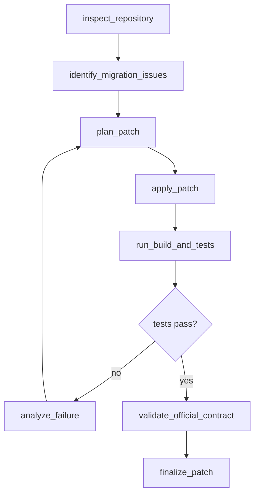

# Plan scientifique de bascule vers la migration de code

**Date :** 2026-04-26  
**Statut :** plan directeur avant implémentation  
**Décision :** tourner la page TravelPlanner comme benchmark principal et reconstruire une évaluation crédible sur la migration de code, avec MigrationBench comme terrain primaire.

---

## 1. Décision de cadrage

TravelPlanner a été utile comme banc de stress, mais il n'est pas le bon terrain pour prouver le potentiel réel du framework. Le benchmark récompense surtout la production d'un artefact final unique, avec peu de surface pour la coordination inter-agents, la mémoire de patterns, la réparation outillée et la spécialisation progressive.

La suite doit donc être traitée comme une nouvelle étude scientifique, pas comme une simple "campagne de plus". On repart avec trois principes :

1. **Ne plus construire un benchmark maison comme preuve principale.** Les fixtures maison servent uniquement aux tests unitaires, aux smoke tests et au debug.
2. **Utiliser un benchmark externe, reproductible et execution-based.** Le terrain principal sera MigrationBench, orienté migration Java 8 vers Java 17/21.
3. **Évaluer le framework comme un artefact DSR.** On doit mesurer la performance, mais aussi expliquer quand, pourquoi et par quels mécanismes l'artefact apporte ou n'apporte pas de valeur.

La décision sur C3 est volontairement prudente mais ferme :

- **On abandonne les résultats C3 TravelPlanner comme preuve scientifique.**
- **On gèle C3 comme architecture intégrée.**
- **On garde les idées utiles de C3 comme mécanismes séparés : protocol, skills, compiler.**
- **On construit d'abord `V7 Elastic Colony` : ticks dynamiques, agents élastiques, décomposition progressive, spécialisation émergente.**
- **On ne réintroduit protocol/skills/compiler qu'après avoir mesuré ces fondations séparément.**

---

## 2. Sources scientifiques et benchmark cible

### 2.1 Benchmark primaire : MigrationBench

MigrationBench est le meilleur candidat principal parce qu'il évalue une tâche repository-level de migration de code, avec un cadre officiel et automatisé. Le papier annonce un corpus complet de **5 102 repositories** et un subset représentatif de **300 repositories**, centrés sur la migration Java 8 vers Java 17/21. L'évaluation vérifie notamment que le repository compile, que les tests passent, que les classes compilées correspondent à la version Java cible, que les tests restent invariants ou non décroissants, et que les dépendances sont conformes selon le mode minimal ou maximal.

Dans le papier MigrationBench, la baseline SD-Feedback atteint, sur le selected subset avec Claude-3.5-Sonnet-v2, **62.33 % pass@1 en migration minimale** et **27.33 % pass@1 en migration maximale**. Cette information est importante : elle donne un ordre de grandeur réaliste et évite de vendre un objectif magique.

### 2.2 Benchmarks secondaires

**Poly-MigrationBench** peut devenir une extension après Java, mais pas le point de départ. Il couvre notamment .NET Framework vers .NET Core, Node.js vers Node.js 22, et Python vers Python 3.13. C'est intéressant pour la généralisation, mais trop large pour commencer proprement.

**SWE-bench** peut servir d'ancrage méthodologique, pas de benchmark principal. Il est execution-based et bien connu, mais il mesure surtout la résolution d'issues GitHub, pas la migration de code. Il faut aussi rester prudent car des critiques récentes signalent des problèmes de contamination, de tests trop étroits ou trop larges, et de spécifications incomplètes.

**CODEMENV / benchmarks fonction-level** peuvent servir à tester des micro-compétences de skills, comme reconnaître des APIs incompatibles ou générer des cartes de migration réutilisables. Ce ne doit pas être la preuve principale du framework.

### 2.3 Sources à citer

- MigrationBench paper, arXiv 2505.09569 : https://arxiv.org/abs/2505.09569
- MigrationBench GitHub : https://github.com/amazon-science/MigrationBench
- JavaMigration / SD-Feedback baseline : https://github.com/amazon-science/JavaMigration
- AWS DevOps blog on MigrationBench and Poly-MigrationBench : https://aws.amazon.com/blogs/devops/amazon-introduces-two-benchmark-datasets-for-evaluating-ai-agents-ability-on-code-migration/
- SWE-bench paper, arXiv 2310.06770 : https://arxiv.org/abs/2310.06770
- SWE-bench official evaluation guide : https://www.swebench.com/SWE-bench/guides/evaluation/
- Agentless paper, "Demystifying LLM-Based Software Engineering Agents" : https://lingming.cs.illinois.edu/publications/fse2025.pdf
- OpenAI analysis on SWE-bench Verified limitations : https://openai.com/index/why-we-no-longer-evaluate-swe-bench-verified/

---

## 3. Questions de recherche

La campagne doit répondre à une question centrale :

**RQ-MIG :** Est-ce que le framework stigmergique améliore la migration repository-level de code par rapport à des baselines simples ou structurées, à modèle, budget et protocole d'évaluation comparables ?

On découpe ensuite la question en sous-questions testables :

| ID | Question | Réponse attendue |
|---|---|---|
| RQ1 | Le framework fait-il mieux que `solo_direct` et `solo_cot` ? | Gain strict sur succès officiel MigrationBench ou meilleur front coût/succès. |
| RQ2 | Le framework fait-il mieux qu'un `planner_executor` simple ? | Si non, l'orchestration multi-agents n'est pas justifiée. |
| RQ3 | Le framework fait-il mieux qu'une baseline agentless/self-debug ? | C'est le vrai test sévère, car Agentless montre qu'un pipeline simple peut battre des agents complexes. |
| RQ4 | Les skills améliorent-ils réellement les migrations suivantes ? | Gain mesurable après adaptation, sur repos ou patterns disjoints. |
| RQ5 | La coordination s'améliore-t-elle elle-même ? | Diminution des cycles de réparation, lock conflicts, actions redondantes, ou meilleur succès avec protocole appris. |
| RQ6 | Le compiler génère-t-il un système agentique utile à partir d'une spec ? | DAG généré valide, couvre discovery/build/test/repair/finalize, et n'est pas inférieur au DAG manuel. |

La réponse scientifique peut être positive, négative ou mixte. Ce qui est interdit, c'est une réponse floue.

---

## 4. Ce qu'on veut prouver, et ce qu'on ne doit pas prétendre trop tôt

### 4.1 From-Scratch Agent Generation

La version actuelle du framework ne prouve pas encore une génération from-scratch forte. Pour le tester proprement, l'adaptateur doit fournir seulement les capacités minimales du domaine :

- cloner ou ouvrir un repository ;
- lire, chercher et modifier des fichiers ;
- lancer Maven, tests, inspections et évaluations ;
- produire un patch final ;
- enregistrer traces et métriques.

Le protocole agentique, lui, doit être généré ou assemblé à partir d'une spec de migration. On doit donc comparer :

- `manual_dag_v6` : workflow écrit explicitement ;
- `compiler_generated_dag` : workflow généré depuis la spec ;
- `compiler_generated_with_guard` : workflow généré mais fallback si les étapes critiques manquent.

Un vrai "oui" à From-Scratch Agent Generation exige au minimum que le DAG généré soit valide, exécutable, traçable et non catastrophique face au DAG manuel.

### 4.2 Self-Optimizing Agent Functionality

Les skills doivent être évalués comme des hypothèses scientifiques, pas comme de la décoration.

Critère minimal :

- les skills sont appris uniquement depuis des runs réussis ;
- ils sont courts, génériques, typés et auditables ;
- ils sont injectés dans les outils où ils peuvent agir ;
- leur usage est tracé ;
- on compare `skills_off` vs `skills_on` à protocole constant.

Exemple de preuve acceptable :

- les repos qui contiennent `javax.xml.bind` ou `source/target 1.8` sont réparés plus vite après apprentissage ;
- les skills correspondants sont réellement rappelés ;
- le gain ne vient pas seulement de plus de tokens ou de retries.

### 4.3 Self-Optimizing Agent Collaboration

La coordination doit être testée séparément de la performance brute.

Indicateurs minimaux :

- moins de marqueurs redondants ;
- moins de lock conflicts ;
- moins de cycles discovery -> repair -> test inutiles ;
- plus de validations finales propres ;
- protocole appris réutilisé avec namespace stable ;
- amélioration sur repos similaires mais non vus en train.

Si la performance augmente mais que la coordination ne s'améliore pas, on pourra dire que le framework aide l'exécution, pas encore que la collaboration s'auto-optimise.

---

## 5. Design expérimental

### 5.1 Corpus

La campagne doit utiliser trois niveaux de corpus :

| Niveau | Usage | Taille cible | Source |
|---|---:|---:|---|
| `toy` | tests unitaires, CI, debug rapide | 2-5 repos synthétiques | repo local |
| `smoke` | validation bout-en-bout | 3-5 repos | MigrationBench selected |
| `pilot` | calibration coût/échec | 10-20 repos | MigrationBench selected |
| `main_30` | résultat mémoire minimal crédible | 30 repos | MigrationBench selected stratifié |
| `main_60` | résultat renforcé si budget OK | 60 repos | MigrationBench selected stratifié |
| `confirmatory_100` | optionnel, si tout est stable | 100 repos | MigrationBench selected stratifié |

Le subset doit être pré-enregistré dans un fichier versionné :

```text
fixtures/migrationbench/subsets/main_30.jsonl
fixtures/migrationbench/subsets/main_60.jsonl
fixtures/migrationbench/subsets/confirmatory_100.jsonl
```

Chaque ligne doit contenir :

```json
{
  "instance_id": "stable-id",
  "github_url": "https://github.com/owner/repo",
  "base_commit": "sha",
  "target_java": 17,
  "migration_mode": "minimal",
  "stratum": {
    "repo_size": "small|medium|large",
    "test_count": "low|medium|high",
    "dependency_age": "low|medium|high",
    "build_complexity": "single-module|multi-module"
  }
}
```

### 5.2 Migration mode

On commence par **Java 8 -> Java 17 minimal migration**.

Raison :

- c'est déjà difficile ;
- le score SD-Feedback donne un référentiel ;
- la maximal migration ajoute la mise à jour de dépendances majeures, donc beaucoup plus de bruit.

La maximal migration devient une extension seulement si minimal migration est stable.

### 5.3 Modèles

Le modèle principal reste **Gemma via OpenRouter** pour cohérence avec la campagne actuelle.

Matrice recommandée :

| Étape | Modèle | Rôle |
|---|---|---|
| Dev/smoke | Gemma | modèle principal, coût contrôlé |
| Main | Gemma | comparaison baselines vs framework |
| Confirmatoire | DeepSeek | vérifier que l'effet ne dépend pas uniquement de Gemma |
| Optionnel | Qwen ancien ou petit modèle | stress-test faible capacité |

On ne mélange pas les modèles dans la même conclusion. La conclusion principale doit être : "à modèle constant, l'orchestration apporte / n'apporte pas X".

---

## 6. Baselines scientifiques

Les baselines doivent être plus fortes que celles de TravelPlanner. Sinon, un jury peut dire que le framework gagne contre des adversaires faibles.

| Baseline | Pourquoi elle est nécessaire |
|---|---|
| `no_change` | Mesure la difficulté réelle du corpus et détecte les repos qui passent déjà. |
| `dependency_only_script` | Baseline déterministe : ajuste `pom.xml`, source/target/release, Maven plugins, sans LLM. |
| `solo_direct` | LLM seul, patch direct, coût faible. |
| `solo_cot` | LLM seul avec raisonnement structuré. |
| `planner_executor` | Baseline forte et simple : planifier, éditer, tester, réparer. |
| `agentless_self_debug` | Baseline anti-agent : localize -> repair -> validate, inspirée Agentless/SD-Feedback. |
| `langgraph_supervisor` | Graphe supervisé, bon comparateur pour orchestration explicite. |
| `stigmergic_v6_clean` | Framework sans C3, pour mesurer le runtime stigmergique de base. |
| `c3_protocol_only` | Test isolé du protocole persistant. |
| `c3_skills_only` | Test isolé des skills. |
| `c3_compiler_only` | Test isolé du compiler. |
| `c3_full_refactor` | Seulement si au moins un bras isolé montre un signal. |

Ordre de priorité :

1. `no_change`, `dependency_only_script`, `solo_direct`, `planner_executor`, `agentless_self_debug`, `stigmergic_v6_clean`.
2. `langgraph_supervisor` si l'environnement est stable.
3. V7 ablations après stabilité, puis seulement ensuite éventuel retour des mécanismes C3.

---

## 7. Architecture de l'adaptateur code migration

### 7.1 Principe

L'adaptateur ne doit pas cacher l'intelligence dans du code manuel. Il doit fournir une interface de travail fiable, et laisser les stratégies aux agents, aux baselines ou au compiler.

On sépare donc :

- **Adapter = capacités et IO.**
- **Framework = coordination, mémoire, skills, protocole, compilation.**
- **Evaluator = vérité externe, officielle, reproductible.**

### 7.2 Fichiers à créer

```text
adapters/migrationbench/
  __init__.py
  adapter.py
  workspace.py
  tools.py
  evaluator.py
  scientific_baselines.py
  agentless_baseline.py
  schemas.py
```

Rôle des fichiers :

| Fichier | Contrat |
|---|---|
| `adapter.py` | Crée les markers initiaux, extrait le patch final, expose la spec au compiler. |
| `workspace.py` | Clone repo, checkout commit, applique patch, lance commandes, rollback, collecte logs. |
| `tools.py` | Outils LLM et non-LLM : inspect, search, edit, build, test, validate. |
| `evaluator.py` | Wrappe MigrationBench officiel et ajoute métriques internes. |
| `scientific_baselines.py` | Baselines comparables, mêmes limites de budget, même format de sortie. |
| `agentless_baseline.py` | Pipeline localize -> repair -> validate sans coordination stigmergique. |
| `schemas.py` | Contrats Pydantic pour patches, test results, migration report, run summary. |

### 7.3 Outils minimaux

| Outil | Type | Sortie obligatoire |
|---|---|---|
| `InspectBuildTool` | non-LLM + résumé LLM optionnel | Java version, Maven plugins, modules, erreurs préexistantes. |
| `SearchCodeTool` | non-LLM | occurrences, fichiers candidats, snippets bornés. |
| `ReadFileTool` | non-LLM | contenu borné + hash. |
| `EditPatchTool` | LLM ou diff parser | patch unifié, fichiers modifiés, apply status. |
| `RunMavenTool` | non-LLM | exit code, stdout/stderr tronqués, test summary. |
| `AnalyzeFailureTool` | LLM | cause typée, prochaine action recommandée. |
| `ValidateMigrationTool` | non-LLM | patch appliqué, build pass, tests pass, class version, official eval status. |
| `FinalizePatchTool` | non-LLM | `patch.diff`, `migration_report.json`, `run_summary.json`. |

### 7.4 Markers initiaux V6 clean

DAG manuel minimal :



Garde-fous :

- max repair cycles par repo ;
- timeout Maven ;
- taille maximale de patch ;
- interdiction de modifier les tests sauf mode explicitement autorisé ;
- rollback propre après patch invalide ;
- logs stdout/stderr par tentative.

### 7.5 Compiler C3

Le compiler doit recevoir une spec compacte :

```yaml
domain: migrationbench
goal: migrate Java 8 Maven repository to Java 17 minimal migration
must_preserve:
  - existing tests
  - public behavior
  - repository buildability
must_produce:
  - unified git diff
  - migration report
critical_stages:
  - inspect
  - localize
  - patch
  - build
  - test
  - repair
  - validate
  - finalize
forbidden:
  - delete tests
  - bypass tests
  - fake evaluator output
```

Guard obligatoire :

- si le DAG généré ne contient pas inspection, patch, build/test, repair et finalization, alors `protocol_compiler_used=false`;
- la raison du fallback est écrite dans `run_summary.json`;
- le DAG généré est sauvegardé dans `compiled_protocol.yaml`.

---

## 8. Architecture vNext : colonie élastique

### 8.1 Diagnostic sur l'architecture actuelle

Le runtime actuel contient déjà plusieurs briques utiles, mais il reste trop rigide pour soutenir les ambitions initiales du framework.

| Sujet | État actuel | Limite scientifique |
|---|---|---|
| Ticks | `orchestrator.max_ticks` fixe, avec arrêt par `idle_cycles` et un `dynamic_idle_limit` optionnel. | Le système a une borne de sécurité, mais pas une vraie politique adaptative de temps de travail. |
| Agents | `agents.num_agents` fixe au démarrage via `_build_agents`. | Le nombre d'agents est choisi avant de voir la taille du DAG, la complexité du repo ou le degré de parallélisme réel. |
| Décomposition | `DecomposeTool` utilise `max_depth` et crée un DAG initial ou des sous-marqueurs selon le prompt. | Risque de devenir un `planner_executor` déguisé si le DAG initial est complet, figé et seulement exécuté ensuite. |
| Spécialisation | Chaque agent a un `AgentAffinityProfile` basé sur ses succès précédents, utilisé par local sensing. | Bonne graine, mais il n'y a pas de naissance/mort d'agents, pas de spécialisation durable exportée, pas de rôle émergent explicite. |
| Adaptation | `compute_adaptations` ajuste température, exploration locale et inhibition selon émergence. | Les adaptations ne changent pas encore la population, la granularité du travail ou la profondeur de décomposition. |
| C3 | Protocoles, skills et compiler ont été assemblés trop tôt. | Trop de mécanismes superposés, attribution faible, bugs de mesure et d'intégration. |

Conclusion : la version actuelle est une colonie à population fixe avec quelques réflexes adaptatifs. Ce n'est pas encore une colonie élastique.

### 8.2 Décision : geler C3 et construire V7 Elastic Colony

La décision recommandée est nette :

- **C3 TravelPlanner est abandonné comme trajectoire principale.**
- **Le nom C3 ne doit plus porter la prochaine preuve scientifique.**
- **Les idées utiles de C3 sont conservées comme mécanismes isolés : skills, protocols, compiler.**
- **La prochaine architecture forte doit s'appeler `V7 Elastic Colony` ou équivalent.**

Pourquoi ?

1. C3 a mélangé trop de choses à la fois : memory, skills, protocol, compiler, scoring, namespace, adaptation.
2. C3 a essayé de prouver l'auto-optimisation avant que le runtime ne soit capable d'adapter sa propre population et sa granularité de travail.
3. Le vrai saut conceptuel n'est pas "ajouter une base de skills", c'est rendre la colonie capable de dimensionner son effort.

La suite doit donc être :

```text
V6 static migration baseline
  -> adapter MigrationBench fiable
  -> baselines fortes
  -> scoring officiel
  -> résultat statique honnête

V7 Elastic Colony
  -> ticks dynamiques
  -> agent pool élastique
  -> décomposition atomique/progressive
  -> spécialisation émergente mesurable
  -> seulement ensuite retour des skills/protocols/compiler
```

### 8.3 Ticks dynamiques

On ne supprime pas `max_ticks`. Il doit rester comme **borne de sécurité**. Mais on ne doit plus raisonner comme si `max_ticks=80` était le budget naturel d'une tâche.

Le runtime doit distinguer :

- `hard_max_ticks` : plafond absolu de sécurité ;
- `min_ticks_before_stop` : éviter l'arrêt trop tôt ;
- `dynamic_stop_policy` : décider si continuer a encore une valeur ;
- `budget_pressure` : réduire l'effort quand tokens/coût/runtime montent ;
- `progress_velocity` : continuer si le système progresse ;
- `stagnation_signal` : arrêter ou déclencher réparation si rien ne bouge.

Contrat proposé :

```yaml
orchestrator:
  hard_max_ticks: 120
  min_ticks_before_stop: 8
  dynamic_tick_budget:
    enabled: true
    base_ticks: 24
    max_extra_ticks: 96
    progress_window: 5
    min_progress_delta: 0.02
    budget_soft_stop_ratio: 0.85
    continue_if_unblocked_markers: true
    stop_if_no_progress_and_low_pressure: true
```

Heuristique initiale :

```text
continue if:
  terminal_progress increased recently
  OR repair markers were created recently
  OR unblocked critical markers remain
  OR official validation has not run yet

stop if:
  all terminal
  OR budget exhausted
  OR no progress for window and no new repair signal
  OR no unblocked marker and no pending dependency can be satisfied
  OR hard_max_ticks reached
```

Métriques à tracer :

- `dynamic_ticks_granted`;
- `dynamic_stop_reason`;
- `progress_velocity`;
- `stagnation_windows`;
- `repair_ticks_used`;
- `budget_pressure_at_stop`.

### 8.4 Agent pool élastique

Le nombre d'agents doit devenir une conséquence du travail disponible, pas une constante arbitraire.

Config proposée :

```yaml
agents:
  num_agents_mode: "elastic"
  min_agents: 2
  max_agents: 12
  spawn_policy:
    enabled: true
    unblocked_per_agent: 2
    critical_marker_age_ticks: 3
    high_utilization_threshold: 0.85
    low_utilization_threshold: 0.25
    contention_reduce_threshold: 0.35
    cooldown_ticks: 2
  retirement_policy:
    enabled: true
    idle_ticks_before_retire: 4
    preserve_min_agents: true
```

Règle simple pour V7-A :

```python
target_agents = clamp(
    min_agents,
    max_agents,
    ceil(unblocked_marker_count / unblocked_per_agent),
)
```

Règle améliorée pour V7-B :

```text
increase agents if:
  parallel_utilization > 0.85
  AND unblocked_marker_count > active_agents * unblocked_per_agent
  AND lock_contention_rate < 0.25

decrease agents if:
  parallel_utilization < 0.25
  OR lock_contention_rate > 0.35
  OR budget_pressure > 0.85
```

Naissance :

- nouvel agent `agent-N` ;
- seed RNG stable `seed + N` ;
- mémoire vide ou mémoire colonie selon config ;
- rôle initial optionnel dérivé du marker qui a déclenché la naissance.

Retraite :

- un agent sans décision productive pendant `idle_ticks_before_retire` peut être retiré ;
- ses stats d'affinité sont sauvegardées dans `colony_specialization`;
- aucune action en cours ne doit être interrompue.

Métriques :

- `agents_spawned`;
- `agents_retired`;
- `active_agent_count_by_tick`;
- `mean_agents_active`;
- `agent_pool_reason`;
- `success_per_agent`;
- `cost_per_active_agent`.

### 8.5 Décomposition progressive et atomicité

Le problème du `DecomposeTool` au tick 1 est réel. S'il produit un DAG complet puis que les autres agents l'exécutent sans remise en question, on est proche d'un planner-executor avec overhead.

La correction n'est pas de supprimer la décomposition. C'est de la rendre **progressive, locale et contestable**.

Nouveau contrat :

```yaml
decompose:
  mode: "progressive_atomic"
  max_depth_hard: 5
  atomicity_check:
    enabled: true
    ask_llm: true
    stop_if_tool_executable: true
  complexity_limits:
    max_pending_markers: 40
    max_children_per_marker: 6
    stop_decompose_budget_ratio: 0.70
  redecompose:
    enabled: true
    only_on_failure_or_ambiguity: true
    max_redecompose_per_marker: 1
```

Prompt de décision :

```text
Given this marker and available tools, decide whether the task is atomic.
Atomic means it can be executed now by exactly one available tool call or one bounded patch attempt.

Return:
{
  "atomic": true|false,
  "reason": "...",
  "suggested_action": "inspect|patch|test|repair|finalize|decompose",
  "subtasks": [...]
}
```

Règles anti-planner-executor :

- ne jamais exiger un DAG complet dès le tick 1 ;
- autoriser de nouveaux markers après test/build failure ;
- autoriser re-décomposition d'un marker seulement si une preuve locale le justifie ;
- tracer `decomposition_trigger`: `initial_complexity`, `failure_repair`, `missing_context`, `validation_gap`;
- comparer `initial_dag_size` vs `final_dag_size`.

Signal scientifique fort :

```text
emergent_decomposition_ratio =
  markers_created_after_tick_1 / total_markers_created
```

Si ce ratio est proche de zéro, le système n'est probablement pas très stigmergique sur ce run.

### 8.6 Spécialisation émergente des agents

Aujourd'hui, chaque agent apprend localement une affinité sur les types de markers et les mots-clés des targets. C'est utile, mais encore trop discret.

V7 doit rendre la spécialisation visible, mesurable et exploitable.

Approche :

- chaque agent reste initialement homogène ;
- après plusieurs succès, son profil se spécialise ;
- le scheduler favorise l'agent sur les markers compatibles ;
- un agent peut recevoir un label descriptif non contraignant : `build_repair_specialist`, `dependency_migration_specialist`, `test_failure_analyst`;
- les labels sont déduits de l'historique, jamais imposés comme rôles manuels au départ.

Config :

```yaml
agents:
  specialization:
    enabled: true
    min_successes_for_label: 3
    label_update_interval_ticks: 5
    use_labels_in_prompt: true
    export_profiles: true
```

Métriques :

- `specialization_entropy`;
- `colony_specialization`;
- `agent_label_stability`;
- `agent_marker_affinity_mean`;
- `specialist_success_delta`;
- `cross_repo_specialization_transfer`.

Critère de preuve :

```text
Un agent est spécialisé seulement si :
  son label est stable sur plusieurs ticks
  AND son taux de succès est supérieur sur son type de marker
  AND le scheduler lui assigne plus souvent ces markers
```

### 8.7 Rapport avec MigrationBench

MigrationBench est un meilleur terrain pour V7 parce que la tâche a naturellement plusieurs fronts de travail :

- analyser `pom.xml`;
- identifier version source/target/release ;
- corriger plugins Maven ;
- gérer dépendances cassées ;
- corriger APIs Java supprimées ;
- lancer build ;
- analyser erreurs de compilation ;
- relancer tests ;
- produire patch final.

Cette structure donne une vraie raison d'avoir une colonie :

- plusieurs markers peuvent être débloqués en parallèle ;
- les échecs de build créent des repair markers locaux ;
- certains repos simples n'ont besoin que de 2 agents ;
- certains repos multi-module peuvent justifier 8-12 agents ;
- le nombre de ticks utile dépend du feedback Maven/tests.

La campagne MigrationBench doit donc comparer deux familles :

| Famille | Bras | But |
|---|---|---|
| Static | `stigmergic_v6_clean_static` | Socle comparable à TravelPlanner, population fixe. |
| Elastic ticks | `v7_dynamic_ticks` | Mesurer l'effet d'un arrêt/extension adaptatif. |
| Elastic agents | `v7_elastic_agents` | Mesurer l'effet de la population dynamique. |
| Progressive decomposition | `v7_progressive_decompose` | Mesurer si le DAG émerge vraiment. |
| Specialization | `v7_specialization` | Mesurer si les agents deviennent meilleurs localement. |
| Full V7 | `v7_elastic_colony` | Combinaison seulement après signaux isolés. |

On ne doit pas lancer `full V7` directement. Même erreur que C3 sinon.

### 8.8 Ordre d'implémentation technique

Ordre recommandé :

1. **MigrationBench static first.** Construire l'adaptateur, les baselines et l'évaluateur sans changer le runtime.
2. **V7-A dynamic ticks.** Ajouter `hard_max_ticks`, `dynamic_tick_budget`, métriques et tests unitaires.
3. **V7-B elastic agents.** Ajouter agent pool spawn/retire dans `Orchestrator`, avec config opt-in.
4. **V7-C progressive atomic decomposition.** Remplacer la logique `max_depth` seule par atomicity + hard guard.
5. **V7-D visible specialization.** Exporter profils, labels émergents et métriques par agent.
6. **V7-E isolated ablations on MigrationBench pilot.** Tester chaque mécanisme séparément.
7. **V7-F full elastic colony.** Combiner uniquement les mécanismes positifs ou explicables.

Ce point est important : V7 ne doit pas retarder le socle MigrationBench. On construit d'abord une piste d'atterrissage fiable, puis on fait décoller la colonie. Sinon on refait C3 : beaucoup d'idées, peu d'attribution.

---

## 9. Contrat de sortie

Chaque run, baseline ou framework, doit produire le même contrat.

```json
{
  "instance_id": "owner__repo-id",
  "framework": "stigmergic_v6_clean",
  "provider": "openrouter",
  "model": "google/gemma-4-31b-it",
  "seed": 42,
  "artifact_delivered": true,
  "patch_delivered": true,
  "patch_applies": true,
  "official_success": false,
  "strict_success": false,
  "failure_reason": "tests_failed",
  "migration_mode": "minimal",
  "target_java": 17,
  "build_success": true,
  "test_success": false,
  "compiled_major_version_ok": true,
  "test_count_non_decreasing": true,
  "dependency_policy_ok": null,
  "tokens_total": 12345,
  "cost_total_usd": 0.0123,
  "runtime_seconds": 530.2,
  "repair_cycles": 2,
  "files_modified_count": 3,
  "patch_lines_added": 21,
  "patch_lines_deleted": 8,
  "markers_created": 44,
  "coordination_overhead": 11,
  "skills_loaded_count": 4,
  "skills_injected_count": 2,
  "protocol_namespace": "migrationbench_gemma_seed42_v1",
  "coordination_protocol_loaded": true,
  "coordination_protocol_applied": true,
  "protocol_compiler_used": false,
  "compiler_fallback_reason": "missing_validate_stage"
}
```

Règle stricte :

```text
strict_success = artifact_delivered
              AND patch_delivered
              AND patch_applies
              AND official_success
```

Un patch absent, vide, inapplicable ou non évalué compte comme échec. Pas d'ambiguïté.

---

## 10. Métriques

### 10.1 Métrique primaire

La métrique primaire est :

```text
strict_success_rate = strict_success / requested_instances
```

Elle doit être calculée sur toutes les instances demandées, pas seulement les instances réussies ou enregistrées.

### 10.2 Métriques MigrationBench

| Métrique | Sens |
|---|---|
| `official_success` | Résultat officiel MigrationBench. |
| `build_success` | Le repo compile après patch. |
| `test_success` | Les tests passent. |
| `compiled_major_version_ok` | Les `.class` correspondent à Java 17. |
| `test_methods_invariant` | Les méthodes de test n'ont pas été supprimées ou contournées. |
| `test_count_non_decreasing` | Le nombre de tests ne diminue pas. |
| `dependency_policy_ok` | Obligatoire seulement pour maximal migration. |

### 10.3 Métriques d'efficience

| Métrique | Pourquoi |
|---|---|
| `tokens_total` | Mesurer le coût cognitif. |
| `cost_total_usd` | Mesurer la soutenabilité. |
| `runtime_seconds` | Mesurer la praticabilité. |
| `repair_cycles` | Capturer la capacité de self-debug. |
| `tool_calls_total` | Quantifier l'orchestration. |
| `tokens_per_success` | Éviter qu'un système gagne seulement en brûlant du budget. |

### 10.4 Métriques de coordination

| Métrique | Signal |
|---|---|
| `markers_created` | Volume de coordination. |
| `lock_conflicts` | Friction entre agents. |
| `redundant_actions` | Actions répétées sans nouveau signal. |
| `repair_loop_count` | Stabilité de la boucle. |
| `protocol_applied_rate` | Usage réel du protocole. |
| `skill_usage_success_delta` | Impact des skills rappelés. |
| `specialization_index` | Agents ou rôles réellement spécialisés. |

### 10.5 Taxonomie d'échec

Chaque échec doit être classé :

| Failure reason | Définition |
|---|---|
| `setup_failed` | Le repo ne peut pas être préparé. |
| `baseline_already_fails` | Le point de départ est invalide. |
| `no_patch_generated` | Aucun patch final. |
| `patch_apply_failed` | Diff inapplicable. |
| `build_failed` | Maven compile échoue. |
| `tests_failed` | Tests échouent. |
| `java_version_failed` | Mauvaise version compilée. |
| `test_regression_or_deleted_tests` | Tests supprimés ou régressions. |
| `dependency_policy_failed` | Maximal migration seulement. |
| `timeout` | Dépassement runtime. |
| `budget_exhausted` | Dépassement tokens/coût. |
| `tool_error` | Erreur harness, Docker, filesystem. |
| `invalid_output_contract` | JSON/patch résumé invalide. |

---

## 11. Analyses statistiques

Les résultats doivent être interprétés en apparié, car chaque framework tente les mêmes repositories.

Analyses obligatoires :

| Analyse | Usage |
|---|---|
| McNemar | Comparer `strict_success` framework vs baseline sur les mêmes repos. |
| Bootstrap 95 % CI | Intervalles de confiance des taux. |
| Wilcoxon signed-rank | Comparer coût, tokens, runtime sur repos appariés. |
| Pareto frontier | Succès vs coût par succès. |
| Stratification | Comparer petits/moyens/grands repos, single/multi-module, faible/forte dette de dépendances. |
| Failure taxonomy | Dire pourquoi ça échoue, pas seulement combien. |

Reporting minimal :

```text
matrix_success.csv
matrix_cost.csv
paired_mcnemar.csv
pareto_points.csv
failure_taxonomy.csv
per_instance_results.jsonl
campaign_manifest.json
benchmark_summary.json
```

---

## 12. Anti-biais et crédibilité scientifique

Cette campagne doit être pré-enregistrée dans le repo avant les runs principaux.

Règles :

- subset IDs fixés avant exécution ;
- seed fixée à 42 ;
- prompts et configs versionnés ;
- pas de sélection manuelle des meilleurs runs ;
- pas de retry illimité ;
- tout run demandé mais absent compte comme échec ;
- logs complets conservés ;
- DB skills/protocols neuves pour chaque campagne ;
- split adaptation et évaluation disjoint ;
- coûts/tokens reportés même quand le run échoue ;
- baselines et framework ont le même budget maximal ;
- aucun résultat C3 n'est revendiqué sans ablation isolée.

Critère de reproductibilité :

```text
docker compose -f docker-compose.campaign.yml up gemma-migrationbench-baselines
docker compose -f docker-compose.campaign.yml up gemma-migrationbench-stigmergie
uv run python scripts/aggregate_migrationbench_comparison.py ...
```

La commande exacte pourra changer, mais le principe non.

---

## 13. Plan d'implémentation

### Phase 0 — Clôturer TravelPlanner proprement

Objectif : figer TravelPlanner comme résultat secondaire ou négatif contrôlé.

Livrables :

- rapport final V6 Gemma ;
- comparaison avec baselines ;
- note de décision : TravelPlanner ne porte pas la preuve principale ;
- archivage des résultats C3 comme diagnostic invalide ou exploratoire.

Gate :

- aucun nouveau développement C3 TravelPlanner tant que MigrationBench n'est pas stable.

### Phase 1 — Reproduire MigrationBench sans notre framework

Objectif : prouver que l'évaluateur externe fonctionne localement.

Tâches :

- cloner ou installer MigrationBench ;
- construire une image Docker Java 17 + Maven 3.9.6 ;
- télécharger ou référencer le selected subset ;
- lancer `no_change` sur 3 repositories ;
- lancer un patch vide ou patch simple pour vérifier le format predictions ;
- capturer les logs officiels.

Livrables :

```text
external/MigrationBench/                  # ou submodule/documentation d'installation
docker/migrationbench-evaluator.Dockerfile
fixtures/migrationbench/smoke_5.jsonl
output/migrationbench_preflight/
documentation/redisgn_v2/migrationbench_preflight_report.md
```

Gate :

- l'évaluateur officiel produit un résultat déterministe ;
- les logs par repo sont lisibles ;
- un repo absent ou non évaluable est marqué explicitement.

### Phase 2 — Construire l'adaptateur minimal

Objectif : produire un patch diff évalué par MigrationBench.

Tâches :

- créer `adapters/migrationbench/`;
- implémenter `MigrationBenchWorkspace`;
- implémenter `RunMavenTool`, `SearchCodeTool`, `EditPatchTool`, `FinalizePatchTool`;
- brancher `main.py --adapter migrationbench`;
- créer tests unitaires sur toy repo local.

Livrables :

```text
adapters/migrationbench/
tests/unit/test_migrationbench_workspace.py
tests/unit/test_migrationbench_tools.py
tests/integration/test_migrationbench_toy_repo.py
```

Gate :

- un toy repo Java 8 est migré en Java 17 ;
- patch final non vide ;
- patch applicable ;
- sortie JSON contractuelle complète.

### Phase 3 — Baselines fortes

Objectif : éviter le piège "notre framework bat des baselines faibles".

Tâches :

- implémenter `no_change`;
- implémenter `dependency_only_script`;
- implémenter `solo_direct`;
- implémenter `planner_executor`;
- implémenter `agentless_self_debug`;
- exporter tous les résultats au même format.

Livrables :

```text
adapters/migrationbench/scientific_baselines.py
adapters/migrationbench/agentless_baseline.py
scripts/run_migrationbench_framework_benchmark.py
scripts/run_migrationbench_query_export.py
tests/unit/test_migrationbench_scientific_baselines.py
```

Gate :

- chaque baseline produit `patch.diff` ou échec typé ;
- tous les outputs ont `strict_success`;
- aucun succès n'est possible sans patch évalué.

### Phase 4 — Runner campagne Docker

Objectif : rendre les campagnes robustes avant les vrais runs.

Tâches :

- runner Python unique ;
- checkpoint SQLite ;
- logs stdout/stderr par repo ;
- manifest complet ;
- preflight API/model/provider/namespace ;
- reprise après interruption ;
- agrégation automatique.

Livrables :

```text
scripts/run_migrationbench_campaign.py
scripts/aggregate_migrationbench_comparison.py
docker-compose.campaign.yml
campaign_results/migrationbench_smoke/
```

Gate :

- interruption volontaire puis reprise sans doublons ;
- coût/tokens non nuls quand API utilisée ;
- `requested_instances` reste le dénominateur ;
- Docker obligatoire pour les campagnes.

### Phase 5 — Smoke scientifique

Objectif : tuer les bugs avant de payer une campagne.

Plan :

- 5 repos MigrationBench selected ;
- bras : `no_change`, `dependency_only_script`, `solo_direct`, `planner_executor`, `agentless_self_debug`, `stigmergic_v6_clean`;
- modèle : Gemma ;
- seed : 42.

Gate :

- au moins une baseline produit des patches applicables ;
- le framework produit des patches applicables ;
- aucun run sans patch n'est compté comme succès ;
- les échecs sont classés ;
- l'agrégateur produit tables et graphes.

### Phase 6 — Pilot 10-20 repos

Objectif : estimer coût, runtime, failure modes et variance.

Questions :

- quel budget par repo ?
- combien de timeouts ?
- les repos multi-module explosent-ils le runtime ?
- `agentless_self_debug` est-il déjà très fort ?
- la stigmergie ajoute-t-elle autre chose que des tokens ?

Gate :

- si `stigmergic_v6_clean` est dominé par `planner_executor` et `agentless_self_debug` sans signal qualitatif, ne pas lancer de full V7 ni de retour C3 intégré ;
- si le runner ou l'évaluateur a plus de 5 % d'erreurs harness, corriger avant main.

### Phase 7 — Main 30 repos

Objectif : résultat mémoire minimal crédible.

Bras obligatoires :

- `no_change`;
- `dependency_only_script`;
- `solo_direct`;
- `planner_executor`;
- `agentless_self_debug`;
- `stigmergic_v6_clean`.

Bras conditionnels :

- `langgraph_supervisor` si l'environnement est stable ;
- `c3_protocol_only`, `c3_skills_only`, `c3_compiler_only` seulement après signal V6.

Gate de succès scientifique :

- résultat complet sur 30 repos ;
- analyse appariée ;
- coût et runtime reportés ;
- failure taxonomy ;
- conclusion honnête sur la dominance ou non.

### Phase 8 — V7 Elastic Colony ablations

Objectif : répondre aux ambitions initiales sans refaire l'erreur C3, c'est-à-dire sans mélanger les effets avant d'avoir mesuré chaque mécanisme.

Bras :

| Bras | Ticks | Agents | Decompose | Specialization | Question |
|---|---|---|---|---|---|
| `v6_static` | fixed guard | fixed | current | current hidden affinity | Base framework. |
| `v7_dynamic_ticks` | dynamic | fixed | current | current | Le budget temporel adaptatif aide-t-il ? |
| `v7_elastic_agents` | fixed guard | elastic | current | current | La population dynamique aide-t-elle ? |
| `v7_progressive_decompose` | fixed guard | fixed | progressive atomic | current | Le DAG émerge-t-il vraiment ? |
| `v7_specialization` | fixed guard | fixed | current | visible/exported | La spécialisation améliore-t-elle l'exécution ? |
| `v7_elastic_colony` | dynamic | elastic | progressive atomic | visible/exported | Combinaison, seulement après signaux isolés. |

Règle :

- pas de `v7_elastic_colony` publication-grade si aucun bras isolé ne montre de signal ou d'explication causale ;
- pas de retour à `skills/protocol/compiler` tant que V7 static/elastic n'est pas interprétable ;
- les anciens bras C3 peuvent être réintroduits plus tard comme `skills_on`, `protocol_on`, `compiler_on`, mais pas comme hypothèse principale.

### Phase 9 — Main 60 / confirmatoire DeepSeek

Objectif : renforcer la validité externe.

Deux chemins possibles :

- si `main_30` est clair : extension `main_60` Gemma ;
- si `main_30` montre un effet intéressant mais fragile : confirmer avec DeepSeek sur 30 repos.

On ne fait pas les deux si le budget ne le permet pas.

---

## 14. Interprétation des résultats

### Cas A — Le framework bat les baselines

Claim possible :

> Sur MigrationBench minimal Java 8 -> 17, à modèle constant, le framework stigmergique améliore le taux de migration réussie ou le front coût/succès par rapport aux baselines simples et agentless.

Conditions :

- McNemar ou CI soutiennent l'effet ;
- pas seulement plus de retries ;
- coûts reportés ;
- failure analysis cohérente.

### Cas B — Le framework est équivalent mais plus coûteux

Claim possible :

> Le framework n'est pas performance-justifié sur cette tâche, mais l'étude identifie les limites de l'orchestration stigmergique et précise les conditions nécessaires pour qu'elle soit utile.

C'est un résultat DSR acceptable si l'analyse est propre.

### Cas C — Le framework perd contre Agentless

Claim possible :

> Une baseline agentless/self-debug constitue un rival plus fort que prévu ; la contribution devient un résultat négatif contrôlé et une refonte des mécanismes C3.

Ce n'est pas confortable, mais c'est scientifiquement défendable.

### Cas D — Un mécanisme hérité C3 aide, mais pas l'intégration complète

Claim possible :

> Les mécanismes d'adaptation isolés montrent un potentiel, mais leur intégration complète introduit une surcharge ou des interférences.

C'est probablement le scénario le plus réaliste à court terme.

---

## 15. Critères de réussite

### Critère minimal pour le mémoire

- MigrationBench smoke et main_30 exécutés ;
- baselines fortes incluses ;
- évaluation officielle utilisée ;
- outputs complets et auditables ;
- analyse statistique appariée ;
- conclusion honnête, même négative.

### Critère fort

- `stigmergic_v6_clean` bat `solo_direct` et `planner_executor` sur strict success ou Pareto coût/succès ;
- `agentless_self_debug` ne domine pas totalement ;
- failure taxonomy montre un avantage sur les repos nécessitant plusieurs cycles de réparation.

### Critère V7 / C3

- au moins un bras V7 isolé améliore V6 clean ou explique une réduction nette des erreurs ;
- les ticks dynamiques changent réellement le nombre de ticks consommés ;
- l'agent pool change réellement la population active ;
- la décomposition progressive crée des markers après tick 1 ;
- la spécialisation est visible dans les profils et reliée au succès ;
- les anciens mécanismes C3 ne reviennent qu'après ces preuves.

---

## 16. Livrables attendus

### Code

```text
adapters/migrationbench/
scripts/run_migrationbench_campaign.py
scripts/run_migrationbench_framework_benchmark.py
scripts/aggregate_migrationbench_comparison.py
config/migrationbench_v6_clean_gemma.yaml
config/migrationbench_c3_protocol_only_gemma.yaml
config/migrationbench_c3_skills_only_gemma.yaml
config/migrationbench_c3_compiler_only_gemma.yaml
config/migrationbench_c3_full_gemma.yaml
config/migrationbench_v7_dynamic_ticks_gemma.yaml
config/migrationbench_v7_elastic_agents_gemma.yaml
config/migrationbench_v7_progressive_decompose_gemma.yaml
config/migrationbench_v7_specialization_gemma.yaml
config/migrationbench_v7_elastic_colony_gemma.yaml
```

### Tests

```text
tests/unit/test_migrationbench_workspace.py
tests/unit/test_migrationbench_tools.py
tests/unit/test_migrationbench_evaluator.py
tests/unit/test_migrationbench_scientific_baselines.py
tests/unit/test_migrationbench_campaign_runner.py
tests/unit/test_dynamic_tick_budget.py
tests/unit/test_elastic_agent_pool.py
tests/unit/test_progressive_decompose.py
tests/unit/test_agent_specialization_profiles.py
tests/integration/test_migrationbench_toy_repo.py
```

### Données et résultats

```text
fixtures/migrationbench/CORPUS.md
fixtures/migrationbench/subsets/smoke_5.jsonl
fixtures/migrationbench/subsets/main_30.jsonl
fixtures/migrationbench/subsets/main_60.jsonl
campaign_results/migrationbench/
output/migrationbench_analysis/
```

### Documentation

```text
documentation/redisgn_v2/plan_migrationbench_scientific_campaign.md
documentation/redisgn_v2/migrationbench_preflight_report.md
documentation/redisgn_v2/migrationbench_main_results.md
documentation/decisions/20260426-migrationbench-primary-benchmark.md
```

---

## 17. Checklist avant lancement main_30

- [ ] MigrationBench officiel installé et testé.
- [ ] Docker Java 17 + Maven stable.
- [ ] `no_change` fonctionne.
- [ ] `dependency_only_script` fonctionne.
- [ ] `solo_direct` fonctionne.
- [ ] `planner_executor` fonctionne.
- [ ] `agentless_self_debug` fonctionne.
- [ ] `stigmergic_v6_clean` fonctionne.
- [ ] Tous les bras sortent le même contrat JSON.
- [ ] Les patches vides ne peuvent pas réussir.
- [ ] Les runs absents comptent comme échec.
- [ ] Les logs stdout/stderr sont sauvegardés.
- [ ] Les coûts/tokens sont non nuls si API appelée.
- [ ] Les subsets sont figés.
- [ ] Les configs sont figées.
- [ ] L'agrégateur produit McNemar, bootstrap CI, Pareto et failure taxonomy.
- [ ] Un smoke 5 repos passe sans bug harness.
- [ ] Un pilot 10-20 repos donne un coût acceptable.
- [ ] Une note de décision valide ou refuse C3 pour la suite.
- [ ] Une note de décision valide ou refuse V7 avant toute combinaison full elastic.

---

## 18. Position DSR

Dans le mémoire, cette campagne doit être présentée comme le vrai cycle d'évaluation fort de l'artefact :

| DSR element | Implémentation |
|---|---|
| Problem relevance | Migration Java 8 -> 17 est un problème industriel réel. |
| Artifact | Framework stigmergique multi-agents avec markers, population élastique, décomposition progressive, spécialisation émergente, skills/protocols/compiler optionnels. |
| Design evaluation | MigrationBench officiel + baselines fortes + analyse appariée. |
| Research contribution | Conditions où la coordination stigmergique aide ou n'aide pas. |
| Rigor | Benchmark externe, Docker, logs, fixed subsets, statistiques. |
| Communication | Résultats reproductibles, tables, failure taxonomy, discussion des menaces à la validité. |

La valeur scientifique ne dépend pas uniquement d'un score supérieur. Elle dépend de la capacité à répondre proprement :

- Est-ce que ça marche ?
- Contre quoi ?
- À quel coût ?
- Dans quels cas ?
- Grâce à quel mécanisme ?
- Avec quelles limites ?

---

## 19. Prochaine action recommandée

La prochaine action n'est pas de lancer une grosse campagne. La prochaine action est :

1. Finaliser le rapport TravelPlanner V6 et le figer.
2. Installer MigrationBench et reproduire un eval officiel sur 3 repos.
3. Créer l'adaptateur `migrationbench` minimal avec toy repo.
4. Implémenter `no_change`, `dependency_only_script`, `solo_direct`, `planner_executor`, `agentless_self_debug`.
5. Faire un smoke 5 repos avec Gemma.
6. Ensuite seulement, implémenter `V7 dynamic_ticks` comme première amélioration runtime isolée.

Seulement après ça, on parle de main_30.

Ce plan est dur, mais c'est justement ce qui le rend défendable. On arrête de demander au framework de se prouver sur un benchmark qui ne lui donne presque pas d'espace pour exister, et on le met sur une tâche où coordination, réparation, mémoire et audit peuvent réellement compter.
