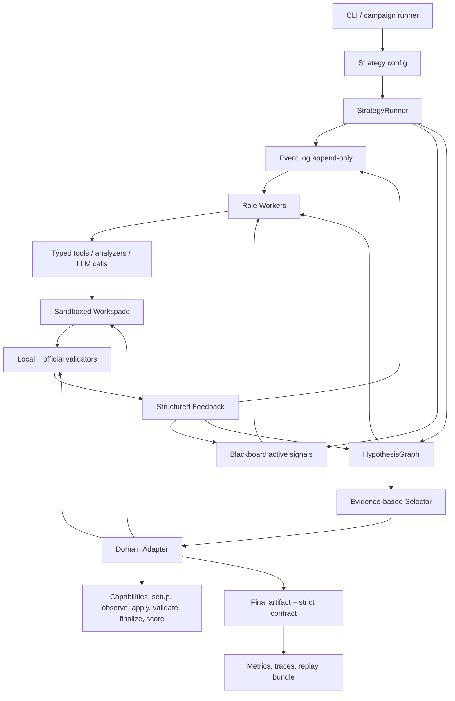

# Plan V10 — StigmergiAgentic 2.0, runtime plug-and-play de résolution vérifiée

**Date :** 2026-05-03  
**Statut :** plan directeur avant refonte  
**Contexte :** post-mortem V6/V7.1/V7.2 sur MigrationBench `main_30`, DeepSeek seed42  
**Position :** repartir sur une V10 plutôt que produire une V7.3 incrémentale  

---

## 1. Résumé exécutif

La V10 doit transformer StigmergiAgentic d'un runtime centré sur des marqueurs génériques et une population d'agents en un **runtime plug-and-play de résolution vérifiée**.

La thèse de conception est la suivante :

> StigmergiAgentic 2.0 n'est pas un framework multi-agent libre. C'est un runtime de recherche vérifiée où des agents, outils ou heuristiques spécialisés produisent, testent, réparent et sélectionnent des hypothèses via un espace partagé stigmergique.

La conséquence pratique est importante :

- le coeur du framework ne doit plus connaître Maven, TravelPlanner, SWE-bench, Java, Python ou un benchmark particulier ;
- chaque domaine doit entrer par un adapter minimal et stable ;
- chaque tentative de solution doit devenir une hypothèse traçable ;
- chaque échec doit devenir un feedback structuré ;
- chaque amélioration doit être mesurable par ablation ;
- chaque run doit être rejouable.

La V10 garde la philosophie stigmergique, mais la rend plus nette. La colonie ne doit plus être prouvée par le nombre d'agents qui tournent. Elle doit être prouvée par :

- la diversité des hypothèses explorées ;
- la coordination indirecte par traces partagées ;
- la sélection par signaux validés ;
- la réutilisation contrôlée des feedbacks ;
- la capacité à renforcer ou inhiber des trajectoires sans conversation directe entre agents.

---

## 2. Diagnostic brutal de V1 à V7

### 2.1 Ce qui a marché

Les versions précédentes ont construit un vrai socle :

- un modèle de marqueurs persistants ;
- une boucle tick-based multi-agent ;
- des locks et du decay ;
- une instrumentation d'émergence ;
- des adapters TravelPlanner puis MigrationBench ;
- des protocoles, skills et mémoires cross-run ;
- une première boucle de réparation MigrationBench avec branches candidates.

Ce socle est utile. Il ne faut pas tout jeter. Mais il faut déplacer la responsabilité architecturale.

### 2.2 Ce qui a échoué

Les résultats V6/V7.1/V7.2 sur MigrationBench indiquent un problème plus profond qu'un simple bug :

| Symptôme | Lecture |
|---|---|
| `patch_applies` élevé mais `strict_success` presque nul | Le framework produit parfois des artefacts syntaxiquement livrables, mais pas des solutions validées. |
| Explosion des `llm_calls` en V7 | La boucle de réparation n'est pas assez intelligente pour convertir les erreurs en actions fiables. |
| Agents multiples mais contribution faible | Le multi-agent est visible dans l'exécution, pas encore dans la causalité des gains. |
| Feedback Maven recraché au LLM | Le feedback existe, mais il n'est pas assez structuré pour devenir un vrai signal stigmergique. |
| Bug de finalisation best-partial | Les contrats d'artefact, d'évaluation et de sélection n'étaient pas unifiés. |

La conclusion honnête :

> V7 a amélioré la mécanique de boucle, mais pas encore l'architecture scientifique du framework.

### 2.3 Le défaut principal

Le framework actuel mélange trois choses dans le même niveau :

1. le contrôle d'exécution ;
2. la représentation des traces stigmergiques ;
3. la logique domaine/benchmark.

Résultat : dès qu'un benchmark devient dur, on ne sait plus si l'échec vient du modèle, de l'adapter, du workflow, du contrat d'artefact, de la sélection, de la mémoire ou de la colonie.

La V10 doit donc séparer ces couches.

---

## 3. État de l'art utile en mai 2026

Cette section ne vise pas à copier un système existant. Elle sert à extraire les principes qui doivent guider la refonte.

### 3.1 SWE-agent : l'interface agent-machine compte autant que l'agent

SWE-agent défend l'idée qu'un agent logiciel est un nouvel utilisateur du système informatique et qu'il lui faut une interface adaptée pour naviguer dans un repo, éditer des fichiers et lancer des tests. Le papier montre que l'Agent-Computer Interface peut changer significativement la performance, pas seulement le modèle utilisé. [S1]

Implication V10 :

- le framework doit fournir une interface repo/test/patch propre ;
- les agents ne doivent pas improviser comment lire, modifier ou valider un projet ;
- l'interface doit rendre les actions observables, typées et réversibles.

### 3.2 Agentless : une boucle simple peut battre des agents complexes

Agentless montre qu'un pipeline simple `localization -> repair -> patch validation`, sans agents autonomes complexes qui décident librement de leurs prochaines actions, peut être très compétitif sur SWE-bench Lite. [S2]

Implication V10 :

- la baseline interne de la V10 doit être une boucle simple et forte ;
- toute complexité stigmergique doit battre ou compléter cette boucle ;
- le multi-agent ne doit pas être ajouté avant d'avoir un rôle causal mesurable.

### 3.3 Anthropic : workflows avant agents ouverts

Anthropic distingue les workflows, où les LLMs et outils suivent des chemins de code prédéfinis, des agents qui contrôlent dynamiquement leur processus. Leur recommandation pratique est de commencer par la solution la plus simple et de n'augmenter la complexité que si le gain justifie coût et latence. [S3]

Implication V10 :

- la V10 doit être workflow-first ;
- l'autonomie ouverte doit être une option locale, pas le mode par défaut ;
- les phases bien définies doivent être contrôlées par le runtime.

### 3.4 AutoCodeRover : la recherche de code structurée est un levier majeur

AutoCodeRover combine LLM et recherche structurée dans le code, notamment via la structure classes/méthodes et, quand possible, la localisation guidée par tests. [S4]

Implication V10 :

- les adapters doivent pouvoir exposer des outils de localisation structurée ;
- le framework doit stocker les localisations comme hypothèses, pas seulement comme texte de prompt ;
- la qualité de contexte doit devenir une métrique.

### 3.5 OpenHands : sandbox, environnement et benchmark comme plateforme

OpenHands présente une plateforme où les agents interagissent avec code, shell et navigateur, avec sandboxing, coordination multi-agent et benchmarks intégrés. [S5]

Implication V10 :

- l'exécution doit être sandboxée et traçable ;
- les side effects doivent être capturés par le runtime ;
- le framework doit traiter benchmark, workspace et outils comme des surfaces contrôlées.

### 3.6 SDK modernes : tracing, guardrails, checkpoints, replay

Les SDK modernes d'agents convergent vers une même exigence : observer, interrompre, rejouer et contrôler l'exécution. L'OpenAI Agents SDK inclut du tracing des générations LLM, tool calls, handoffs, guardrails et événements personnalisés. [S6] Ses guardrails permettent de valider ou bloquer les entrées, sorties et appels d'outils. [S7] LangGraph met en avant la persistance, les checkpoints, le replay, le time travel et la tolérance aux pannes. [S8]

Implication V10 :

- un run non rejouable est un run scientifiquement faible ;
- tout appel LLM, outil, patch, validation et décision doit être un événement ;
- le runtime doit permettre de reprendre ou de forker une trajectoire.

### 3.7 Benchmarks récents : les tâches deviennent plus longues, plus sales, plus réalistes

MigrationBench cible la migration Java 8 vers Java 17/21 au niveau repository, avec 5 102 repositories et un subset représentatif de 300 repositories. Sa baseline SD-Feedback atteint des scores élevés avec Claude-3.5-Sonnet-v2, ce qui montre que la boucle de feedback est un levier fort. [S9]

OpenAI a indiqué ne plus considérer SWE-bench Verified comme une bonne mesure des capacités frontier, notamment à cause de problèmes de tests et de contamination, et recommande SWE-bench Pro. [S10] SWE-bench Pro propose des tâches plus longues, plus proches de problèmes d'entreprise, avec 1 865 problèmes issus de 41 repositories. [S11] Multi-SWE-bench étend l'évaluation multi-langage à Java, TypeScript, JavaScript, Go, Rust, C et C++. [S12]

Implication V10 :

- l'évaluation doit être execution-based et repo-level ;
- les métriques doivent séparer livraison, application, validation locale, validation officielle et coût ;
- le framework doit rester benchmark-agnostic pour survivre à l'évolution des benchmarks.

### 3.8 Stigmergie : le nombre d'agents n'est pas le coeur du concept

Heylighen définit la stigmergie comme une coordination par les traces laissées dans un médium. Le même mécanisme peut coordonner des agents collectifs, des actions individuelles successives, des systèmes cognitifs ou des institutions. La trace peut être persistante ou transitoire, qualitative ou quantitative. [S13]

Implication V10 :

- la colonie n'est pas le nombre d'agents ;
- la colonie est le système de traces qui stimule ou inhibe les actions futures ;
- une hiérarchie de contrôle peut coexister avec une coordination stigmergique si elle fixe les règles du médium sans choisir arbitrairement les solutions.

---

## 4. Vision V10

### 4.1 Changement de définition

Ancienne définition implicite :

```text
Un framework multi-agent où plusieurs agents homogènes interagissent avec des marqueurs.
```

Nouvelle définition :

```text
Un runtime plug-and-play qui transforme une tâche vérifiable en recherche d'hypothèses,
coordonnée par traces partagées, validée par outils, et mesurée par ablation.
```

### 4.2 Le coeur de la V10

La V10 repose sur cinq objets :

| Objet | Rôle |
|---|---|
| `Adapter` | Expose un benchmark, repo ou domaine à travers un contrat minimal. |
| `EventLog` | Journal append-only de tout ce qui s'est passé. |
| `Blackboard` | Vue courante et compacte des signaux utiles. |
| `HypothesisGraph` | Graphe des hypothèses, branches, réparations, scores et parentés. |
| `StrategyRunner` | Exécute une stratégie déclarée : agentless, branching, stigmergic, memory, etc. |

### 4.3 Principe de base

Chaque tentative devient une hypothèse :

```text
localisation -> candidate patch -> applied branch -> validation -> diagnosis -> repair
```

Chaque hypothèse possède :

- une origine ;
- un parent ;
- des fichiers ciblés ;
- un patch ou une action ;
- un statut ;
- des validations ;
- un coût ;
- un score ;
- des signaux positifs ou négatifs ;
- une raison d'abandon ou de sélection.

---

## 5. Comment la V10 respecte la philosophie stigmergique

### 5.1 La stigmergie n'est pas "beaucoup d'agents"

La V10 doit assumer une phrase forte :

> Un système peut être stigmergique avec peu d'agents si les actions se coordonnent par traces dans l'environnement.

Dans ce projet, l'environnement est le médium computationnel :

- `EventLog` pour les traces historiques ;
- `Blackboard` pour les traces actives ;
- `HypothesisGraph` pour les traces de recherche ;
- `ValidationRecords` pour les traces de vérité expérimentale ;
- `PheromoneSignals` pour les attracteurs et inhibiteurs de trajectoire.

Les agents n'ont pas besoin de se parler. Ils doivent lire et modifier ce médium.

### 5.2 Hiérarchie et colonie ne sont pas contradictoires

La hiérarchie V10 ne doit pas dire :

```text
Agent 1, fais X. Agent 2, fais Y. Agent 3, choisis Z.
```

Elle doit dire :

```text
Voici les phases autorisées, les budgets, les validateurs, les contrats d'artefact
et les règles de renforcement. La colonie explore dans cet espace.
```

Autrement dit :

- la hiérarchie définit les lois physiques du monde ;
- la colonie produit les trajectoires ;
- les validateurs donnent le signal de réalité ;
- le sélecteur applique une décision explicable.

### 5.3 Les traces doivent être actionnables

Un message comme "Maven failed" n'est pas encore une trace stigmergique utile. Il devient utile quand il est structuré :

```json
{
  "failure_type": "dependency_resolution_error",
  "location": "pom.xml",
  "symbols_missing": ["javax.xml.bind.JAXBContext"],
  "candidate_causes": ["missing_jaxb_dependency_after_java_8"],
  "evidence": ["package javax.xml.bind does not exist"],
  "recommended_next_actions": [
    "add jakarta/xml-bind-api or javax.xml.bind dependency according to source imports",
    "rerun mvn test after patch"
  ]
}
```

Ce feedback peut alors :

- attirer un repairer vers `pom.xml` ;
- inhiber une branche qui répète la même erreur ;
- renforcer une localisation ;
- créer une nouvelle hypothèse ;
- alimenter une métrique de réutilisation.

### 5.4 La colonie vit dans l'HypothesisGraph

L'aspect colonial devient visible ici :

```text
b1: bump source/target -> compile error
  -> r1: add dependency A -> test failure
  -> r2: add dependency B -> compile success, test success
b2: upgrade parent Spring -> dependency resolution error
  -> r3: pin plugin -> patch applies, official fail
b3: minimal compiler plugin only -> class version ok, missing symbol
```

La colonie n'est pas "trois agents dans un chat".  
La colonie est cet espace de chemins concurrents, renforcés, inhibés, réparés et sélectionnés.

### 5.5 Les signaux phéromonaux doivent être mesurables

Une phéromone V10 est un signal structuré, pas une métaphore vague.

Exemples :

| Signal | Effet |
|---|---|
| `support(file:pom.xml, cause:source_target_8)` | augmente la priorité des patches liés au build config |
| `inhibit(branch:b2, reason:same_failure_repeated)` | réduit la probabilité de réparer cette branche |
| `reinforce(pattern:jaxb_missing, source:compile_log)` | favorise les actions liées à JAXB |
| `novelty(branch:b4)` | encourage une alternative si les autres stagnent |
| `confidence(localization:src/main/java/X.java)` | oriente la génération de patch |

Score indicatif :

```text
pheromone_score =
  validation_weight
+ evidence_weight
+ novelty_weight
+ reuse_weight
- repeated_failure_penalty
- cost_penalty
- staleness_penalty
```

La formule exacte doit être testée par ablation. Le point important est que le signal doit être inspectable.

---

## 6. Architecture cible



### 6.1 Couche adapter

L'adapter expose un domaine. Il ne décide pas de la stratégie globale.

Contrat cible :

```python
class DomainAdapter:
    def setup(self, instance: BenchmarkInstance) -> WorkspaceHandle:
        ...

    def observe(self, workspace: WorkspaceHandle) -> Observation:
        ...

    def apply(self, candidate: Candidate, workspace: WorkspaceHandle) -> ApplyResult:
        ...

    def validate(self, candidate: Candidate, workspace: WorkspaceHandle) -> ValidationResult:
        ...

    def diagnose(self, validation: ValidationResult, workspace: WorkspaceHandle) -> FeedbackDigest:
        ...

    def finalize(self, candidate: Candidate, workspace: WorkspaceHandle) -> ArtifactResult:
        ...

    def score(self, artifact: ArtifactResult) -> ScoreResult:
        ...
```

Le framework peut ainsi piloter :

- MigrationBench ;
- SWE-bench ;
- TravelPlanner ;
- un repo local ;
- un benchmark futur.

### 6.2 Couche EventLog

L'EventLog est append-only. Rien n'est effacé. Rien n'est réécrit.

Événements minimaux :

```json
{
  "event_id": "evt_...",
  "run_id": "run_...",
  "instance_id": "repo_x",
  "timestamp": "2026-05-03T18:00:00Z",
  "type": "validation.completed",
  "actor": "verifier",
  "hypothesis_id": "h_b2_r1",
  "payload": {},
  "cost": {},
  "links": {
    "parent_event_id": "evt_..."
  }
}
```

L'EventLog sert à :

- rejouer une trajectoire ;
- auditer les décisions ;
- calculer les métriques ;
- reconstruire le blackboard ;
- comparer les runs.

### 6.3 Couche Blackboard

Le Blackboard est la vue active, compacte, orientée décision.

Il contient :

- les signaux de localisation ;
- les hypothèses ouvertes ;
- les feedbacks récents ;
- les erreurs récurrentes ;
- les contraintes de budget ;
- les candidats sélectionnables ;
- les inhibitions et renforcements.

Contrairement à l'EventLog, le Blackboard peut être recalculé. Il n'est pas la vérité historique ; il est le tableau de bord du moment.

### 6.4 Couche HypothesisGraph

Le graphe est le coeur de la recherche.

Noeud minimal :

```json
{
  "hypothesis_id": "h_b3_r2",
  "parent_id": "h_b3",
  "kind": "candidate_patch",
  "status": "validated_local_failed_official",
  "candidate": {
    "type": "typed_edit_set",
    "files": ["pom.xml"]
  },
  "validation": {
    "patch_applies": true,
    "compile_success": true,
    "test_success": false,
    "official_success": false
  },
  "diagnosis": {
    "failure_type": "test_failure"
  },
  "score": {
    "quality": 0.42,
    "cost": 0.07,
    "risk": 0.35
  }
}
```

Ce graphe remplace le "marker soup" pour les tâches de résolution vérifiée. Les markers peuvent rester comme mécanisme générique bas niveau, mais la V10 doit exposer un modèle explicite d'hypothèses.

---

## 7. Boucle standard V10

Boucle générique :

```text
observe
  -> localize
  -> propose candidates
  -> apply candidates in isolated branches
  -> validate
  -> diagnose failure
  -> repair / branch / discard
  -> select best
  -> finalize
  -> official eval
  -> report
```

### 7.1 États de stratégie

| État | Rôle |
|---|---|
| `observing` | Capturer contexte initial et contraintes. |
| `localizing` | Identifier fichiers, symboles, configs ou sous-problèmes pertinents. |
| `proposing` | Générer une ou plusieurs hypothèses candidates. |
| `applying` | Appliquer les hypothèses dans des branches isolées. |
| `validating` | Exécuter validateurs locaux et officiels si autorisé. |
| `diagnosing` | Transformer les erreurs en feedback structuré. |
| `repairing` | Générer des corrections ciblées à partir du feedback. |
| `selecting` | Choisir le meilleur candidat selon preuves. |
| `finalizing` | Exporter l'artefact final dans le contrat commun. |
| `stopped` | Arrêt sur succès, budget, stagnation ou impossibilité typée. |

### 7.2 Stop reasons typés

Un arrêt doit toujours être explicite :

- `strict_success`;
- `no_candidate_generated`;
- `all_candidates_invalid`;
- `budget_exhausted`;
- `timeout`;
- `repeated_failure_plateau`;
- `official_eval_unavailable`;
- `adapter_contract_error`;
- `model_schema_failure`;
- `human_interrupt`.

---

## 8. Rôles V10 : agents réduits mais utiles

La V10 ne supprime pas les agents. Elle réduit leur liberté inutile.

### 8.1 Rôles de base

| Rôle | Peut être LLM ? | Peut être heuristique ? | Responsabilité |
|---|---:|---:|---|
| `Planner` | Oui | Oui | Optionnel, construit une stratégie locale si la tâche est floue. |
| `Localizer` | Oui | Oui | Produit des hypothèses de localisation. |
| `CandidateGenerator` | Oui | Partiel | Produit des candidats conformes au schéma. |
| `Verifier` | Non par défaut | Oui | Exécute validateurs, jamais juge libre. |
| `Diagnoser` | Oui | Oui | Structure les erreurs et causes probables. |
| `Repairer` | Oui | Oui | Propose une réparation ciblée. |
| `Selector` | Non par défaut | Oui | Sélectionne à partir de preuves, scores et règles. |
| `Archivist` | Non | Oui | Produit traces, résumés et replay bundle. |

### 8.2 Règle de conception

Un rôle peut être implémenté par :

- un LLM ;
- une heuristique ;
- un outil déterministe ;
- un appel externe ;
- une combinaison.

Mais ce choix doit être déclaré dans la stratégie et visible dans les ablations.

### 8.3 Ce qu'on arrête de faire

À éviter :

- agents homogènes nombreux sans spécialisation mesurée ;
- conversations directes entre agents comme mécanisme principal ;
- prompts de réparation qui reçoivent un log brut énorme ;
- sélection par "le LLM pense que ce patch est bon" ;
- finalisation d'un patch non validé ;
- mémoire cross-run cachée pendant l'évaluation.

---

## 9. Contrat plug-and-play

### 9.1 Objectif utilisateur

À terme, l'expérience doit ressembler à :

```bash
uv run stigmergi run \
  --adapter migrationbench \
  --subset fixtures/migrationbench/subsets/main_30.jsonl \
  --strategy v10_branching_repair \
  --model deepseek-v4-flash
```

Ou :

```bash
uv run stigmergi run \
  --adapter swebench \
  --subset lite_50.jsonl \
  --strategy v10_agentless_feedback \
  --model claude-opus-4.7
```

Le framework doit charger :

- l'instance ;
- le workspace ;
- la stratégie ;
- le modèle ;
- les budgets ;
- les validateurs ;
- l'output contract.

Sans modifier le coeur.

### 9.2 Adapter minimal

Chaque adapter doit fournir :

| Fonction | Description |
|---|---|
| `setup(instance)` | Prépare workspace et contexte. |
| `observe()` | Produit l'observation initiale. |
| `capabilities()` | Déclare outils et validateurs disponibles. |
| `apply(candidate)` | Applique un candidat dans une branche/sandbox. |
| `validate(candidate)` | Retourne un résultat structuré. |
| `diagnose(validation)` | Transforme échec en feedback structuré. |
| `finalize(candidate)` | Exporte l'artefact final. |
| `score(result)` | Convertit résultat en métriques standard. |

### 9.3 Interdiction centrale

Le `core/` ne doit jamais contenir :

- `mvn`;
- `pom.xml`;
- `pytest`;
- `TravelPlanner`;
- `SWE-bench`;
- `Java 17`;
- un nom de benchmark ;
- une règle métier d'un dataset.

Ces éléments vivent dans l'adapter ou dans des plugins de capacité.

---

## 10. Feedback structuré

### 10.1 Pourquoi c'est critique

Recycler une erreur brute dans un prompt n'est pas suffisant. Le modèle voit le symptôme, mais pas forcément :

- la cause probable ;
- la localisation pertinente ;
- les actions déjà tentées ;
- les branches à éviter ;
- les contraintes du benchmark ;
- les recommandations testables.

La V10 doit transformer tout échec en objet exploitable.

### 10.2 Schéma cible

```json
{
  "feedback_id": "fb_...",
  "hypothesis_id": "h_b2",
  "failure_type": "compile_error",
  "severity": "blocking",
  "locations": [
    {
      "path": "src/main/java/com/acme/Demo.java",
      "line": 42,
      "symbol": "javax.xml.bind.JAXBContext"
    }
  ],
  "evidence": [
    "package javax.xml.bind does not exist"
  ],
  "candidate_causes": [
    "Java 17 removed JAXB from the JDK",
    "missing explicit JAXB dependency"
  ],
  "actions_already_tried": [
    "bump maven-compiler-plugin source/target to 17"
  ],
  "recommended_next_actions": [
    {
      "action": "add_dependency",
      "target": "pom.xml",
      "rationale": "JAXB classes are no longer bundled with Java 17"
    }
  ],
  "anti_actions": [
    "do not only change source/target again"
  ]
}
```

### 10.3 Sources de feedback

| Source | Exemple |
|---|---|
| Build logs | Maven, Gradle, pytest, npm test |
| Static analyzers | imports manquants, APIs dépréciées |
| Patch application | hunks invalides, fichiers absents |
| Official evaluator | tests officiels, classe Java cible, invariants |
| HypothesisGraph | erreurs répétées, branches dominées |
| Memory train-only | patterns validés sur train |

---

## 11. Mémoire propre

### 11.1 Séparation obligatoire

La mémoire doit être traitée comme un protocole expérimental, pas comme une commodité.

| Type | Autorisé pendant eval ? | Règle |
|---|---:|---|
| In-run memory | Oui | Seulement à partir des événements du run courant. |
| Cross-run train memory | Non, sauf mode adapt | Écrite uniquement sur train/adapt. |
| Eval read-only memory | Oui si pré-enregistrée | Figée, versionnée, déclarée dans manifest. |
| Eval write memory | Non | Interdite pour les résultats finaux. |

### 11.2 Skill V10

Une skill doit être un artefact vérifiable :

```json
{
  "skill_id": "skill_jaxb_java17",
  "source_runs": ["run_train_001", "run_train_014"],
  "trigger": {
    "failure_type": "compile_error",
    "evidence_contains": "javax.xml.bind"
  },
  "action_template": {
    "kind": "dependency_hint",
    "target": "pom.xml"
  },
  "score": {
    "uses": 8,
    "successes": 5,
    "regressions": 1
  },
  "status": "candidate|validated|retired"
}
```

### 11.3 Règle de non-pollution

Une mémoire qui n'a pas :

- provenance ;
- split ;
- score ;
- compteur d'usage ;
- preuve de non-régression ;
- version ;

ne doit pas entrer dans une campagne scientifique.

---

## 12. Stratégies et ablation ladder

La V10 doit être construite comme une échelle d'ablation dès le départ.

| Bras | Nom | Description | Question scientifique |
|---|---|---|---|
| `A0` | `direct` | LLM direct vers artefact final | Niveau modèle brut |
| `A1` | `agentless_basic` | `localize -> repair -> validate` | Pipeline simple |
| `A2` | `agentless_structured_feedback` | A1 + feedback structuré | Le diagnostic aide-t-il ? |
| `A3` | `branching_repair` | A2 + branches candidates | L'exploration parallèle aide-t-elle ? |
| `A4` | `stigmergic_blackboard` | A3 + signaux/phéromones/inhibition | La coordination indirecte aide-t-elle ? |
| `A5` | `role_colony` | A4 + instances spécialisées multiples | La diversité d'acteurs ajoute-t-elle un gain ? |
| `A6` | `train_memory` | A5 + mémoire train-only | La mémoire améliore-t-elle les runs futurs ? |

Règle :

> Aucun mécanisme V10 ne doit être ajouté sans bras d'ablation qui permet de le retirer.

---

## 13. Métriques V10

### 13.1 Funnel d'artefact

Pour les benchmarks de patch :

| Métrique | Définition |
|---|---|
| `candidate_generated` | Au moins une hypothèse candidate existe. |
| `artifact_delivered` | Un artefact final existe dans le contrat attendu. |
| `patch_applies` | Le patch s'applique sur checkout propre. |
| `local_valid` | Les validateurs locaux passent. |
| `official_valid` | L'évaluateur officiel passe. |
| `strict_success` | Toutes les conditions du benchmark sont satisfaites. |
| `cost_per_success` | Coût total divisé par succès stricts. |

### 13.2 Métriques de colonie

Pour prouver que l'aspect stigmergique n'est pas décoratif :

| Métrique | Lecture |
|---|---|
| `hypothesis_count` | Nombre d'hypothèses explorées. |
| `branching_factor` | Diversité de trajectoires. |
| `lineage_depth` | Profondeur utile de réparation. |
| `pheromone_hit_rate` | Part des décisions influencées par signaux. |
| `feedback_reuse_rate` | Feedbacks utilisés dans les actions suivantes. |
| `repeated_failure_suppression` | Capacité à éviter les mêmes erreurs. |
| `selection_regret` | Écart entre candidat choisi et meilleur candidat observé. |
| `role_contribution_entropy` | Répartition réelle des contributions par rôle. |
| `cost_per_valid_candidate` | Coût pour produire un candidat localement valide. |

### 13.3 Métriques de plug-and-play

| Métrique | Objectif |
|---|---|
| `adapter_core_leak_count` | Doit rester à 0 : aucune règle domaine dans core. |
| `new_adapter_files_touched` | Ajouter un adapter ne doit pas modifier core. |
| `contract_test_pass_rate` | Tous les adapters passent les tests de contrat. |
| `strategy_reuse_count` | Une même stratégie marche sur plusieurs adapters. |

---

## 14. Roadmap de refonte

### Phase 0 — Freeze scientifique

Objectif : arrêter de mélanger l'ancien et le nouveau.

Livrables :

- geler V6, V7.1, V7.2 comme artefacts historiques ;
- documenter les bugs connus ;
- conserver les résultats négatifs ;
- ajouter une page "V10 starts here" ;
- empêcher les comparaisons V10 vs V7 sans mention du changement d'architecture.

Critère de sortie :

- un lecteur peut comprendre pourquoi V10 existe sans lire tout l'historique.

### Phase 1 — Contrats fondamentaux

Objectif : créer le squelette plug-and-play.

Livrables :

- `core_v10/contracts.py` ;
- `DomainAdapterV10` ;
- `Candidate`, `ApplyResult`, `ValidationResult`, `FeedbackDigest`, `ArtifactResult` ;
- tests de contrat avec fake adapter ;
- output contract commun.

Critère de sortie :

- un fake adapter peut exécuter `observe -> propose -> apply -> validate -> finalize`.

### Phase 2 — EventLog et replay

Objectif : rendre chaque run auditable.

Livrables :

- `EventLog` append-only JSONL/SQLite ;
- IDs stables ;
- event schema ;
- replay minimal ;
- export bundle ;
- traces LLM/tool/validation.

Critère de sortie :

- un run peut être reconstruit depuis l'EventLog.

### Phase 3 — HypothesisGraph

Objectif : remplacer les patch candidates implicites par un graphe explicite.

Livrables :

- modèle de noeud ;
- parenté ;
- statuts ;
- scores ;
- branch isolation ;
- visualisation Mermaid/JSON ;
- tests de sélection.

Critère de sortie :

- on peut expliquer pourquoi un candidat final a été choisi.

### Phase 4 — StrategyRunner A1/A2

Objectif : construire une baseline interne forte.

Livrables :

- stratégie `agentless_basic` ;
- stratégie `agentless_structured_feedback` ;
- feedback digest ;
- limits de coût ;
- benchmark toy ;
- MigrationBench smoke.

Critère de sortie :

- A1/A2 fonctionnent de bout en bout sans mécanisme colonial avancé.

### Phase 5 — Branching repair A3

Objectif : explorer plusieurs trajectoires sans multi-agent décoratif.

Livrables :

- branches candidates isolées ;
- repair lineage ;
- repeated failure detection ;
- selector evidence-based ;
- metrics `branching_factor`, `selection_regret`.

Critère de sortie :

- plusieurs branches peuvent être comparées proprement.

### Phase 6 — Stigmergic blackboard A4

Objectif : réintroduire la stigmergie explicitement.

Livrables :

- signaux support/inhibition/reinforcement/novelty ;
- blackboard recalculable ;
- décision influencée par signaux ;
- instrumentation `pheromone_hit_rate`;
- ablation A3 vs A4.

Critère de sortie :

- on peut montrer quand un signal stigmergique change une décision.

### Phase 7 — Role colony A5

Objectif : ajouter des rôles multiples uniquement si A4 est stable.

Livrables :

- workers spécialisés ;
- budgets par rôle ;
- contribution metrics ;
- no direct chat policy ;
- contention control.

Critère de sortie :

- la diversité des rôles améliore au moins une métrique sans exploser le coût.

### Phase 8 — Mémoire train-only A6

Objectif : tester l'apprentissage sans contaminer l'évaluation.

Livrables :

- skill schema V10 ;
- train/adapt mode ;
- eval read-only mode ;
- provenance ;
- regression counters ;
- ablation A5 vs A6.

Critère de sortie :

- gain ou absence de gain interprétable sur un split tenu à part.

---

## 15. Structure de fichiers proposée

```text
core_v10/
  contracts.py
  event_log.py
  blackboard.py
  hypothesis_graph.py
  strategy_runner.py
  strategies/
    direct.py
    agentless_basic.py
    structured_feedback.py
    branching_repair.py
    stigmergic_blackboard.py
    role_colony.py
  roles/
    localizer.py
    candidate_generator.py
    diagnoser.py
    repairer.py
    selector.py
  feedback/
    schema.py
    classifiers.py
  observability/
    traces.py
    replay.py
    reports.py

adapters_v10/
  base.py
  migrationbench/
    adapter.py
    maven_feedback.py
    validators.py
  swebench/
    adapter.py
  travelplanner/
    adapter.py

scripts/
  run_v10_benchmark.py
  aggregate_v10_results.py
  replay_v10_run.py

tests/
  unit/v10/
  integration/v10/
```

Ce dossier peut coexister avec l'ancien `core/` pendant la migration. Il ne faut pas refactorer tout l'ancien runtime avant d'avoir une V10 minimale qui tourne.

---

## 16. Risques et garde-fous

| Risque | Garde-fou |
|---|---|
| Recréer V7 avec de nouveaux noms | Commencer par A1/A2 simples, pas par role colony. |
| Sur-adapter MigrationBench | Tests de contrat + adapter leak count. |
| Perdre la philosophie stigmergique | Définir les traces, signaux, renforcements et métriques dès A4. |
| Ajouter de la mémoire contaminante | Train/eval split obligatoire et manifest read-only. |
| LLM comme juge caché | Selector déterministe par défaut, LLM seulement pour diagnostic/proposition. |
| Coûts incontrôlés | Budgets par phase, par rôle et par hypothèse. |
| Runs non reproductibles | EventLog, replay bundle, seeds, manifests. |
| Benchmarks obsolètes | Adapter contract benchmark-agnostic. |

---

## 17. Critères de succès V10

### 17.1 Succès architectural

La V10 est architecturalement réussie si :

- un nouvel adapter peut être ajouté sans modifier `core_v10/` ;
- une stratégie peut être utilisée sur au moins deux adapters ;
- chaque run produit un replay bundle ;
- chaque finalisation passe par un contrat unique ;
- les ablations peuvent retirer chaque mécanisme majeur.

### 17.2 Succès scientifique

La V10 est scientifiquement utile si :

- A1/A2 donnent une baseline simple crédible ;
- A3 montre ou réfute clairement l'intérêt du branching ;
- A4 montre ou réfute clairement l'intérêt des signaux stigmergiques ;
- A5 montre ou réfute clairement l'intérêt des rôles multiples ;
- A6 montre ou réfute clairement l'intérêt de la mémoire train-only.

Un résultat négatif est acceptable si l'attribution est propre.

### 17.3 Succès philosophique

La V10 respecte StigmergiAgentic si :

- les agents se coordonnent par l'environnement partagé ;
- les traces laissées modifient les probabilités d'action futures ;
- les réussites renforcent des chemins ;
- les échecs inhibent ou réorientent des chemins ;
- la sélection émerge de preuves accumulées, pas d'une conversation d'agents ;
- le médium partagé reste lisible, persistant et auditable.

---

## 18. Questions à débattre avec Claude Opus

1. Faut-il garder le nom `Marker` dans la V10 ou introduire clairement `Event`, `Signal`, `Hypothesis` ?
2. Le `Blackboard` doit-il être une projection recalculée depuis l'EventLog ou une table persistée indépendante ?
3. Le `Selector` doit-il être strictement déterministe dans toutes les campagnes scientifiques ?
4. Où placer les analyzers domaine comme Maven : adapter, plugin de capacité, ou package séparé ?
5. Faut-il faire coexister `core/` et `core_v10/` ou migrer progressivement les modules existants ?
6. Quels signaux stigmergiques A4 sont minimaux pour prouver la philosophie sans ajouter trop de complexité ?
7. Quel benchmark doit servir au premier smoke V10 : toy repo, MigrationBench smoke, ou un repo local contrôlé ?
8. La mémoire A6 doit-elle apprendre des skills humaines lisibles ou seulement des distributions de signaux ?

---

## 19. Décision recommandée

Ne pas faire V7.3.

Faire :

```text
V10.0 = contracts + EventLog + HypothesisGraph + A1/A2
V10.1 = branching repair A3
V10.2 = stigmergic blackboard A4
V10.3 = role colony A5
V10.4 = train-only memory A6
```

Le premier objectif n'est pas de battre MigrationBench immédiatement. Le premier objectif est de créer une architecture où un échec MigrationBench devient explicable, rejouable et améliorable sans toucher au coeur.

---

## 20. Sources

- [S1] SWE-agent: Agent-Computer Interfaces Enable Automated Software Engineering — arXiv — https://arxiv.org/abs/2405.15793
- [S2] Agentless: Demystifying LLM-based Software Engineering Agents — arXiv — https://arxiv.org/abs/2407.01489
- [S3] Building Effective Agents — Anthropic Engineering — https://www.anthropic.com/engineering/building-effective-agents
- [S4] AutoCodeRover: Autonomous Program Improvement — arXiv — https://arxiv.org/abs/2404.05427
- [S5] OpenHands: An Open Platform for AI Software Developers as Generalist Agents — arXiv — https://arxiv.org/abs/2407.16741
- [S6] Tracing — OpenAI Agents SDK — https://openai.github.io/openai-agents-python/tracing/
- [S7] Guardrails — OpenAI Agents SDK — https://openai.github.io/openai-agents-python/guardrails/
- [S8] Persistence and checkpointing — LangGraph documentation — https://docs.langchain.com/oss/python/langgraph/persistence
- [S9] MigrationBench: Repository-Level Code Migration Benchmark from Java 8 — arXiv — https://arxiv.org/abs/2505.09569
- [S10] Why SWE-bench Verified no longer measures frontier coding capabilities — OpenAI — https://openai.com/index/why-we-no-longer-evaluate-swe-bench-verified/
- [S11] SWE-Bench Pro: Can AI Agents Solve Long-Horizon Software Engineering Tasks? — arXiv — https://arxiv.org/abs/2509.16941
- [S12] Multi-SWE-bench: A Multilingual Benchmark for Issue Resolving — arXiv — https://arxiv.org/abs/2504.02605
- [S13] Stigmergy as a universal coordination mechanism II: Varieties and evolution — Cognitive Systems Research — https://www.sciencedirect.com/science/article/abs/pii/S1389041715000376

