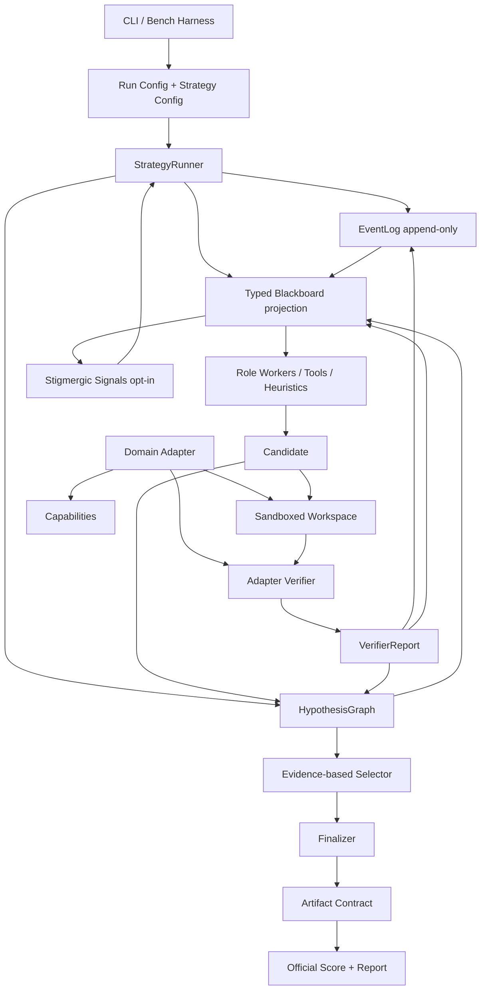

# Plan V10 - StigmergiAgentic 2.0 from scratch

**Date :** 2026-05-03  
**Statut :** plan canonique de refonte apres confrontation du plan Claude et du plan V10 initial  
**Decision :** ouvrir une nouvelle branche de travail et reconstruire un nouveau noyau, sans faire une V3 nettoyee  
**Position :** vraie rupture architecturale, conservation uniquement des briques qui ne contraignent pas le nouveau design  

---

## 1. Position de depart

Le plan de Claude est bon sur le diagnostic : le pari "stigmergie pure role-free + plus d'agents = emergence utile" ne suffit plus. Il faut un pivot vers un framework hybride :

```text
blackboard typé + verifier loop + hypotheses testables + stigmergie mesurée
```

Mais pour obtenir une vraie rupture, on ne doit pas repartir du noyau V3 comme centre de gravite. On ouvre une nouvelle ligne :

```text
core_v10/
```

L'ancien framework devient une archive et une source d'idees. Il ne dicte plus la structure.

La V10 doit donc etre :

> un runtime plug-and-play de resolution verifiee, ou des hypotheses sont produites, testees, reparees, renforcees ou inhibees via un medium partage.

La stigmergie reste au coeur de la these, mais elle est reformulee :

> La colonie n'est pas le nombre d'agents. La colonie est l'espace de traces, hypotheses, signaux, validations, renforcements et inhibitions qui modifie les actions futures.

---

## 2. Ce que l'on reprend du plan Claude

### 2.1 Points acceptes

Le plan Claude apporte des briques solides :

- pivot scientifique vers un hybride blackboard + stigmergie ;
- abandon de la defense d'une stigmergie pure role-free ;
- hypotheses H1/H2/H3 testables ;
- verifier loop obligatoire ;
- blackboard type ;
- skill library verifier-gated inspiree de Voyager ;
- bench harness unifie ;
- tree-search verifier-guided comme piste avancee ;
- suppression des mecanismes Sprint 9 qui n'ont pas produit de preuve empirique ;
- comparaison honnete contre des baselines fortes.

Ces elements doivent rester.

### 2.2 Points modifies

Je modifie quatre decisions du plan Claude.

#### Modification 1 - nouveau coeur avant nettoyage de V3

Claude conserve trop vite `Marker`, `MarkerStore`, `Orchestrator`, `pressure`, `decay` et `agent.py` comme fondations.

Dans cette version :

- `core_v10` est le coeur ;
- les briques V3 peuvent etre recopiees, adaptees ou laissees en compatibilite ;
- aucune brique V3 n'est sacree ;
- le premier objectif est la coherence du nouveau modele, pas la conservation maximale.

#### Modification 2 - EventLog et HypothesisGraph avant Blackboard

Claude place le blackboard au centre. C'est utile, mais pas suffisant.

Dans cette version :

```text
EventLog = source de verite historique
HypothesisGraph = structure de recherche
Blackboard = projection active et typée
```

Le blackboard ne doit pas devenir une nouvelle soupe de markers. Il doit etre une vue propre, reconstruisible, orientee decision.

#### Modification 3 - branching simple avant MCTS

Claude introduit vite `MCTS-light`.

Dans cette version :

- on commence par une strategie branching simple avec selector deterministe ;
- on mesure ensuite la couche stigmergique ;
- seulement apres on introduit tree-search verifier-guided.

Raison : sinon on ne saura pas si le gain vient de la stigmergie ou d'un optimiseur de recherche.

#### Modification 4 - best partial diagnostique autorise, strict success interdit sans verifier

Claude dit qu'aucun candidat ne peut sortir sans verifier OK.

Dans cette version :

- aucun candidat ne peut compter comme `strict_success` sans verifier local + official contract ;
- un `best_partial` peut etre exporte comme artefact diagnostique ;
- il doit etre marque explicitement `partial_unverified`, `local_failed` ou `official_failed`.

Cela preserve l'analyse du funnel sans tricher sur le succes.

---

## 3. Reformulation scientifique

Question centrale :

> Quelle hybridation entre coordination explicite par blackboard type, recherche d'hypotheses verifiees, et coordination stigmergique par traces renforcees maximise la performance, la tracabilite et la transferabilite cross-run sur des taches LLM long-horizon verifiables ?

### 3.1 Hypotheses

| ID | Hypothese | Test |
|---|---|---|
| H1 | Un runtime verifier-first avec hypotheses explicites surpasse la coordination V3/V7 actuelle. | V10 A1/A2 vs V3/V7 archive. |
| H2 | Une couche stigmergique sur blackboard apporte un gain mesurable quand plusieurs hypotheses concurrentes existent. | A4 vs A3, a budget constant. |
| H3 | Une memoire verifier-gated transfere mieux que les skills textuelles Sprint 9. | A6 train/eval vs A5 read-only. |
| H4 | Le blackboard type reduit les erreurs de coordination et de metrique par rapport au marker soup. | telemetry consistency, replay success, adapter leak count. |

### 3.2 Claim defensible

On ne pretend pas :

```text
plus d'agents = meilleure intelligence
```

On pretend :

```text
un medium partage, structure et verifie peut coordonner des contributions heterogenes,
produire une recherche d'hypotheses auditable, et rendre mesurable l'apport stigmergique.
```

---

## 4. Inspirations externes retenues

| Source | Ce que l'on retient |
|---|---|
| SWE-agent | L'interface agent-machine compte : repo, shell, edition, tests et feedback doivent etre propres. |
| Agentless | Une boucle simple `localize -> repair -> validate` est une baseline forte ; toute complexite doit la battre. |
| Anthropic Effective Agents | Workflows previsibles avant agents ouverts ; complexite seulement si elle apporte un gain. |
| Blackboard MAS 2510.01285 | Agents specialises qui s'auto-elisent via un blackboard partage, sans master-slave rigide. |
| OpenHands | Event-stream, sandbox et observation/action comme substrate agentique. |
| Voyager | Skills executables + description + verification d'execution avant promotion. |
| ReST-MCTS / process reward search | Recherche guidee par verifier comme couche avancee, pas comme fondation initiale. |
| MigrationBench / SWE-bench Pro / Multi-SWE-bench | Benchmarks repo-level, execution-based, longs, plus proches du monde reel. |
| Heylighen sur la stigmergie | Coordination par traces dans un medium, pas necessairement par conversation directe. |

---

## 5. Architecture cible



### 5.1 Les cinq piliers

| Pilier | Role |
|---|---|
| `AdapterContract` | Branche un benchmark ou domaine sans fuite dans le core. |
| `EventLog` | Source de verite append-only, rejouable. |
| `HypothesisGraph` | Graphe des candidats, branches, reparations, scores et parenté. |
| `Blackboard` | Projection typée de l'etat courant pour auto-election et coordination. |
| `VerifierLoop` | Transforme les hypotheses en preuves, echecs structures et rewards. |

### 5.2 Ce qui change par rapport a V3/V7

Ancien modele :

```text
markers -> pressure -> lock -> tool -> more markers
```

Nouveau modele :

```text
events -> hypotheses -> blackboard projection -> role contribution
       -> verification -> feedback -> signals -> selection
```

Les markers peuvent survivre comme representation interne ou legacy adapter, mais ils ne sont plus le modele conceptuel central.

---

## 6. Nouveau noyau `core_v10`

Structure proposee :

```text
core_v10/
  __init__.py
  contracts.py
  event_log.py
  hypothesis_graph.py
  blackboard.py
  verifier.py
  strategy_runner.py
  signals.py
  selectors.py
  budgets.py
  replay.py
  feedback/
    __init__.py
    schema.py
    classifiers.py
  strategies/
    direct.py
    verifier_loop.py
    typed_blackboard.py
    branching_repair.py
    stigmergic_blackboard.py
    verifier_guided_search.py
    memory_augmented.py
  memory/
    __init__.py
    episodic.py
    semantic.py
    procedural.py
  observability/
    __init__.py
    traces.py
    reports.py
```

### 6.1 Principe de migration

On ne refactor pas d'abord l'ancien `core/`.  
On cree d'abord `core_v10/`, puis on branche un premier adapter minimal.

Ordre :

```text
fake adapter -> toy patch adapter -> MigrationBench smoke -> MigrationBench main_30
```

Si une brique V3 est utile, on la recupere. Sinon on la laisse derriere.

---

## 7. Contrats fondamentaux

### 7.1 `RunInstance`

```python
@dataclass(frozen=True)
class RunInstance:
    instance_id: str
    benchmark: str
    objective: str
    metadata: dict[str, Any]
```

### 7.2 `Candidate`

```python
@dataclass(frozen=True)
class Candidate:
    candidate_id: str
    parent_id: str | None
    kind: Literal["patch", "plan", "answer", "tool_sequence"]
    payload: dict[str, Any]
    signature: str
    provenance: dict[str, Any]
```

### 7.3 `VerifierReport`

```python
@dataclass(frozen=True)
class VerifierReport:
    candidate_id: str
    status: Literal["passed", "failed", "partial", "infra_failed"]
    score: float
    signals: dict[str, Any]
    feedback: "FeedbackDigest"
    artifact_status: dict[str, bool]
    cost: dict[str, float]
```

### 7.4 `FeedbackDigest`

```python
@dataclass(frozen=True)
class FeedbackDigest:
    failure_type: str
    severity: Literal["blocking", "warning", "info"]
    locations: list[dict[str, Any]]
    evidence: list[str]
    candidate_causes: list[str]
    actions_already_tried: list[str]
    recommended_next_actions: list[dict[str, Any]]
    anti_actions: list[str]
```

### 7.5 `ArtifactContract`

```python
@dataclass(frozen=True)
class ArtifactContract:
    artifact_id: str
    candidate_id: str | None
    delivered: bool
    applies: bool | None
    local_valid: bool | None
    official_valid: bool | None
    strict_success: bool
    status: Literal[
        "strict_success",
        "official_failed",
        "local_failed",
        "partial_unverified",
        "empty",
        "infra_failed",
    ]
```

---

## 8. EventLog

### 8.1 Role

L'EventLog est la source de verite. Il remplace les logs disperses, les compteurs reconstruits a la main et les telemetry stubs.

Tout ce qui compte doit etre un evenement :

- observation ;
- appel LLM ;
- appel outil ;
- creation candidat ;
- application patch ;
- validation ;
- diagnostic ;
- selection ;
- finalisation ;
- erreur ;
- timeout ;
- budget stop.

### 8.2 Schema minimal

```json
{
  "event_id": "evt_001",
  "run_id": "run_20260503_001",
  "instance_id": "repo_x",
  "timestamp": "2026-05-03T18:00:00Z",
  "type": "candidate.verified",
  "actor": "migrationbench_verifier",
  "hypothesis_id": "h_b2_r1",
  "payload": {},
  "cost": {
    "llm_calls": 0,
    "runtime_seconds": 42.1,
    "usd": 0.0
  },
  "links": {
    "parent_event_id": "evt_000"
  }
}
```

### 8.3 Regle forte

Si une metrique ne peut pas etre reconstruite depuis l'EventLog et les artifacts, elle n'est pas une metrique scientifique.

---

## 9. HypothesisGraph

### 9.1 Role

Le graphe porte la recherche.

Un noeud represente :

- une localisation ;
- un candidat ;
- une branche de patch ;
- une reparation ;
- une hypothese de cause ;
- une finalisation.

### 9.2 Pourquoi c'est central

MigrationBench a montre que produire beaucoup de patches applicables ne suffit pas. Il faut savoir :

- d'ou vient chaque patch ;
- ce qui a ete tente avant ;
- quel feedback a motive une reparation ;
- quelles branches sont dominees ;
- pourquoi le selector a choisi un candidat ;
- quel est le meilleur candidat observe, meme s'il n'est pas strict success.

### 9.3 Node minimal

```json
{
  "hypothesis_id": "h_b3_r2",
  "parent_id": "h_b3",
  "kind": "candidate_patch",
  "status": "failed_local_validation",
  "candidate_signature": "sha256:...",
  "created_by": "repairer",
  "files_touched": ["pom.xml"],
  "validation": {
    "applies": true,
    "compile_success": false,
    "test_success": null,
    "official_success": null
  },
  "feedback_id": "fb_12",
  "score": {
    "quality": 0.31,
    "novelty": 0.44,
    "cost": 0.08,
    "risk": 0.52
  }
}
```

---

## 10. Blackboard typé

### 10.1 Definition

Le blackboard est une projection active de l'etat courant.

Il contient ce que les roles ont besoin de lire maintenant :

- objectifs actifs ;
- hypotheses ouvertes ;
- meilleurs candidats ;
- erreurs recentes ;
- signaux de localisation ;
- actions recommandees ;
- inhibitions ;
- budgets restants ;
- regions de connaissance.

### 10.2 Knowledge sources

Exemples de regions :

| Region | Contenu |
|---|---|
| `observation_region` | resume repo, fichiers, contraintes. |
| `localization_region` | fichiers, symboles, configs suspects. |
| `candidate_region` | candidats ouverts et signatures. |
| `verification_region` | verifier reports et feedbacks. |
| `repair_region` | actions recommandees et anti-actions. |
| `selection_region` | candidats selectionnables. |
| `memory_region` | skills ou patterns autorises dans le mode courant. |
| `budget_region` | tokens, cout, runtime, depth/width. |

### 10.3 Auto-election par capability

Chaque worker declare :

```json
{
  "role": "repairer",
  "reads": ["verification_region", "repair_region"],
  "writes": ["candidate_region"],
  "can_handle": ["compile_error", "test_failure", "patch_apply_error"]
}
```

Le runner ne choisit pas arbitrairement un agent. Il demande :

```text
qui a une contribution utile pour cet etat ?
```

La couche stigmergique peut ensuite ponderer cette auto-election.

---

## 11. Verifier loop

### 11.1 Regle

Aucun `strict_success` sans verification complete.

Pour un benchmark de patch :

```text
candidate -> apply in clean branch -> git apply/check -> local tests -> official eval -> artifact contract
```

### 11.2 Statuts

| Statut | Signification |
|---|---|
| `passed` | Le verifier local ou official cible est passe. |
| `failed` | Echec domaine ou benchmark. |
| `partial` | Progression utile mais incomplete. |
| `infra_failed` | Echec d'infrastructure, separe d'un echec candidat. |

### 11.3 MigrationBenchVerifier

Signaux minimaux :

- `patch_delivered`;
- `patch_applies`;
- `compile_success`;
- `test_success`;
- `class_version_ok`;
- `dependency_policy_ok`;
- `official_success`;
- `strict_success`.

### 11.4 TravelPlannerVerifier

Signaux minimaux :

- `artifact_delivered`;
- `commonsense_pass`;
- `hard_constraints_pass`;
- `budget_within`;
- `schedule_consistent`;
- `official_success`;
- `final_pass`.

---

## 12. Stigmergie V10

### 12.1 Definition operationnelle

La couche stigmergique n'est pas la boucle principale. Elle est une politique de signal.

Elle lit :

- EventLog ;
- HypothesisGraph ;
- VerifierReport ;
- Blackboard ;
- Memory autorisee.

Elle ecrit :

- signaux de support ;
- signaux d'inhibition ;
- novelty bonus ;
- reinforcement ;
- decay ;
- affinity role/hypothesis.

### 12.2 Exemples de signaux

```json
{
  "signal_id": "sig_jaxb_missing",
  "kind": "support",
  "target": {
    "type": "failure_pattern",
    "value": "javax.xml.bind missing after Java 17 migration"
  },
  "intensity": 0.82,
  "evidence": ["fb_12", "fb_14"],
  "decay": {
    "half_life_events": 8
  }
}
```

```json
{
  "signal_id": "sig_branch_b2_repeat",
  "kind": "inhibit",
  "target": {
    "type": "branch",
    "value": "h_b2"
  },
  "intensity": 0.67,
  "evidence": ["same patch signature repeated twice"]
}
```

### 12.3 Pourquoi c'est stigmergique

La coordination passe par l'environnement :

```text
un worker laisse une trace -> la trace modifie le blackboard -> un autre worker est attire ou inhibe -> la trajectoire change
```

Il n'y a pas besoin de conversation directe. Il n'y a pas besoin d'un chef qui sait tout.

La hierarchie V10 fixe seulement :

- les phases autorisees ;
- les budgets ;
- les contrats ;
- les validateurs ;
- les regles de finalisation.

La colonie, elle, vit dans :

- les hypotheses concurrentes ;
- les signaux accumules ;
- les erreurs recyclees ;
- les chemins renforces ou abandonnes.

---

## 13. Strategie et ablation ladder

La V10 doit etre construite comme une echelle causale.

| Bras | Nom | Mecanisme | Question |
|---|---|---|---|
| A0 | `direct` | LLM direct vers artefact | Niveau brut du modele. |
| A1 | `verifier_loop_basic` | candidat unique + verifier + feedback | Le verifier-first corrige-t-il les mensonges de metrique ? |
| A2 | `typed_blackboard` | blackboard + auto-election capability | Le blackboard coordonne-t-il mieux qu'un workflow lineaire ? |
| A3 | `branching_repair` | plusieurs branches + selector deterministe | L'exploration concurrente aide-t-elle ? |
| A4 | `stigmergic_blackboard` | support/inhibition/decay/affinity | La couche stigmergique ajoute-t-elle un gain ? |
| A5 | `verifier_guided_search` | MCTS-light ou best-N search | La recherche guidee par reward fait-elle mieux que A4 ? |
| A6 | `verifier_gated_memory` | skills/patterns train-only | La memoire transfere-t-elle sans contamination ? |

Point important :

> MCTS arrive apres la stigmergie, pas avant. Sinon il peut masquer la contribution centrale du memoire.

---

## 14. Memory V10

### 14.1 Separation

```text
episodic memory = traces d'un run
semantic memory = patterns consolides depuis plusieurs runs
procedural memory = skills executables verifier-gated
```

### 14.2 Promotion

Une skill n'est promue que si :

- elle vient d'un run train/adapt ;
- elle a une provenance ;
- elle est associee a un verifier report positif ;
- elle a ete utile au moins `k` fois ;
- elle n'a pas provoque de regression connue ;
- elle est versionnee.

### 14.3 Skill procedural

```json
{
  "skill_id": "skill_maven_jaxb_java17",
  "type": "procedural",
  "trigger": {
    "failure_type": "compile_error",
    "evidence_contains": "javax.xml.bind"
  },
  "implementation": {
    "language": "python",
    "entrypoint": "suggest_jaxb_dependency"
  },
  "verification": {
    "uses": 4,
    "successes": 3,
    "regressions": 0
  },
  "split": "train",
  "status": "candidate|validated|retired"
}
```

### 14.4 Eval hygiene

Pendant evaluation finale :

- ecriture memoire interdite ;
- lecture autorisee seulement depuis un snapshot pre-enregistre ;
- manifest obligatoire ;
- comparaison A5 vs A6 obligatoire.

---

## 15. Bench harness unifie

### 15.1 Objectif

Un seul harness doit lancer les benchmarks, collecter les artifacts, reconstruire les metriques et produire des summaries comparables.

```text
scripts/bench/
  __init__.py
  harness.py
  telemetry.py
  artifacts.py
  docker.py
  aggregate.py
  baselines.py
```

### 15.2 Commande cible

```bash
uv run python -m scripts.bench.harness \
  --adapter migrationbench \
  --strategy v10_stigmergic_blackboard \
  --subset fixtures/migrationbench/subsets/main_30.jsonl \
  --model deepseek-v4-flash \
  --out-dir campaign_results/v10/migrationbench_main30
```

### 15.3 Regles

- Docker-first pour les campagnes.
- Manifest avant execution.
- Denominateur = instances demandees.
- Timeout/crash = ligne synthetique + recovery depuis EventLog/artifacts si possible.
- Aucun `runs.json` ne peut avoir plus ou moins de lignes que le manifest sans failure explicite.
- `artifact_delivery`, `patch_applies`, `local_valid`, `official_valid`, `strict_success` sont separes.

---

## 16. Ce que l'on garde, ce que l'on archive, ce que l'on supprime

### 16.1 Garde possible, mais non central

| Brique actuelle | Decision V10 |
|---|---|
| `llm/client.py` | Reutilisable si le contrat est propre ; ajouter streaming/extended thinking plus tard. |
| `core/guardrails.py` | Reutilisable ou recopie dans `core_v10/budgets.py`. |
| `core/audit.py` | Idee conservee, mais EventLog devient l'audit principal. |
| `core/marker.py` | Peut inspirer les statuts, mais ne dirige pas le modele. |
| `core/marker_store.py` | Archive ou backend possible, pas source conceptuelle centrale. |
| `core/decay.py`, `core/pressure.py` | Reutilisables dans la couche stigmergique A4 si adaptes. |

### 16.2 Archive

| Brique | Raison |
|---|---|
| Sprint 9 protocol compiler | Pas de preuve empirique suffisante, remplace par strategies explicites et memory gated. |
| Sprint 9 textual skills | Remplace par procedural/semantic memory verifier-gated. |
| V7 repair colony ad hoc | Remplace par HypothesisGraph + VerifierLoop + BranchingRepair. |
| `_synthesize_best_partial_payload` passif | Interdit comme finalization path, autorise seulement comme diagnostic explicite. |
| Scripts benchmark disperses | Remplaces par harness unifie. |

### 16.3 Suppression acceptable sur nouvelle branche

Comme on ouvre une branche de rupture, on peut supprimer sans peur les chemins anciens, a condition de :

- garder une branche archive reproductible ;
- conserver les docs de post-mortem ;
- conserver quelques fixtures/artifacts pour regression conceptuelle ;
- ne pas pretendre que les resultats V10 sont directement comparables sans mention du pivot.

---

## 17. Roadmap

### Phase 0 - Branche de rupture et archive

Livrables :

- creer une branche `codex/v10-from-scratch` ou equivalent ;
- tagger/archiver l'etat V3/V7 ;
- ajouter ADR de pivot ;
- declarer `plan_v10_from_scratch_rebuild.md` comme plan canonique ;
- isoler Sprint 9/V7 comme legacy.

Definition of done :

- on peut revenir a V3/V7 pour reproduire les anciens resultats ;
- la branche V10 peut casser l'ancien API sans ambiguite.

### Phase 1 - Contrats + EventLog + fake adapter

Livrables :

- `core_v10/contracts.py`;
- `core_v10/event_log.py`;
- fake adapter ;
- run minimal complet ;
- tests unitaires contrats ;
- export replay bundle minimal.

Definition of done :

- un run fake peut etre rejoue depuis l'EventLog ;
- toutes les metriques du fake run sont reconstruites depuis les events.

### Phase 2 - HypothesisGraph + VerifierLoop

Livrables :

- `core_v10/hypothesis_graph.py`;
- `core_v10/verifier.py`;
- selector deterministe minimal ;
- toy patch adapter ;
- verifier local simple.

Definition of done :

- un candidat peut etre cree, applique, verifie, diagnostique et finalise ;
- un `strict_success` impossible sans verifier report positif.

### Phase 3 - Blackboard type

Livrables :

- `core_v10/blackboard.py`;
- knowledge sources ;
- capability matching ;
- auto-election de workers ;
- strategy `typed_blackboard`.

Definition of done :

- les workers lisent/ecrivent via regions typees ;
- le blackboard est reconstruisible depuis EventLog + HypothesisGraph.

### Phase 4 - MigrationBench V10 smoke

Livrables :

- `adapters_v10/migrationbench`;
- `MigrationBenchVerifier`;
- harness Docker-first ;
- smoke_5 ;
- official eval contract.

Definition of done :

- smoke_5 produit un manifest, EventLog, HypothesisGraph, artifacts, summary ;
- aucune divergence artifact/patch/strict inexpliquée.

### Phase 5 - BranchingRepair A3

Livrables :

- strategy `branching_repair`;
- branch isolation ;
- candidate signature dedup ;
- repeated failure suppression ;
- best candidate selector.

Definition of done :

- comparaison A1/A2/A3 sur MigrationBench smoke puis main_30 ;
- selection explicable par preuves.

### Phase 6 - StigmergicBlackboard A4

Livrables :

- `core_v10/signals.py`;
- support/inhibition/reinforcement/decay/affinity ;
- metrics `pheromone_hit_rate`, `feedback_reuse_rate`, `repeated_failure_suppression`;
- ablation A3 vs A4.

Definition of done :

- au moins une decision change a cause d'un signal stigmergique trace ;
- le gain ou l'absence de gain est mesurable.

### Phase 7 - Verifier-guided search A5

Livrables :

- best-N search ou MCTS-light ;
- process reward base sur verifier ;
- caps depth/width/budget ;
- comparison A4 vs A5.

Definition of done :

- le tree-search n'est garde que s'il apporte un gain net ou une meilleure cost/pass.

### Phase 8 - Memory A6

Livrables :

- episodic/semantic/procedural memory ;
- consolidation post-hoc ;
- skill promotion verifier-gated ;
- train/eval manifest.

Definition of done :

- au moins une skill est promue depuis train, relue en eval read-only, et son usage est trace ;
- A6 est compare a A5 a budget constant.

### Phase 9 - Comparaisons externes

Livrables :

- baselines solo/direct/self-refine/planner-executor ;
- LangGraph-like supervisor ;
- OpenHands-like event stream baseline si faisable ;
- MigrationBench main_30 ;
- TravelPlanner C3 si encore utile ;
- rapport final.

Definition of done :

- tableau comparatif complet avec cout, runtime, strict success, funnel et threats to validity.

---

## 18. Matrice de validation cible

| Systeme | MigrationBench strict_success | Patch applies | Local valid | Cost/instance | Notes |
|---|---:|---:|---:|---:|---|
| V3/V6 archive | reference | reference | reference | reference | baseline historique |
| V10 A1 verifier loop | ? | ? | ? | ? | verifier-first |
| V10 A2 blackboard | ? | ? | ? | ? | coordination explicite |
| V10 A3 branching | ? | ? | ? | ? | hypotheses concurrentes |
| V10 A4 stigmergic | ? | ? | ? | ? | contribution centrale |
| V10 A5 tree search | ? | ? | ? | ? | recherche avancee |
| V10 A6 memory | ? | ? | ? | ? | transfert train/eval |
| solo/self-refine | ? | ? | ? | ? | floor |
| planner-executor | ? | ? | ? | ? | baseline structurée |
| LangGraph-like | ? | ? | ? | ? | workflow externe |
| OpenHands-like | ? | ? | ? | ? | scaffold externe |

---

## 19. Criteres de succes

### 19.1 Rupture architecturale

Succes si :

- `core_v10` peut executer un fake adapter sans importer l'ancien `core`;
- un nouvel adapter ne modifie pas `core_v10`;
- un run est rejouable ;
- un strict success est impossible sans verifier ;
- chaque strategie A1-A6 est activable par config.

### 19.2 Apport scientifique

Succes si :

- H1/H2/H3 peuvent etre confirmees ou infirmees proprement ;
- les resultats negatifs sont attribuables ;
- les metrics de colonie sont distinctes des metrics de performance brute ;
- la stigmergie peut etre retiree sans casser le systeme.

### 19.3 Respect de la philosophie stigmergique

Succes si :

- les contributions passent par un medium partage ;
- les traces modifient les actions futures ;
- les feedbacks valides deviennent des signaux ;
- les erreurs inhibent les chemins improductifs ;
- les succes renforcent les chemins utiles ;
- la selection emerge de preuves accumulees.

---

## 20. Risques et mitigations

| Risque | Mitigation |
|---|---|
| Refaire V3 sous un autre nom | `core_v10` neuf, imports legacy interdits en Phase 1. |
| Complexite trop tot | A1/A2/A3 avant A4/A5/A6. |
| MCTS masque la stigmergie | MCTS apres A4 seulement. |
| Verifier trop domaine-specifique | Verifier par adapter, contrat commun dans core. |
| Blackboard devient marker soup | Blackboard = projection reconstruisible, EventLog = verite. |
| Memoire contaminante | Train/eval strict, eval read-only, manifest. |
| Benchmarks qui mentent | Manifest + EventLog + artifact contract + recovery. |
| Perte de temps sur ancienne compatibilite | Nouvelle branche de rupture, compat uniquement si utile. |

---

## 21. Fichiers a creer en premier

Phase 1 minimale :

```text
core_v10/__init__.py
core_v10/contracts.py
core_v10/event_log.py
core_v10/replay.py
core_v10/strategy_runner.py
adapters_v10/__init__.py
adapters_v10/fake.py
scripts/bench/__init__.py
scripts/bench/harness.py
tests/unit/v10/test_contracts.py
tests/unit/v10/test_event_log.py
tests/unit/v10/test_fake_adapter_run.py
```

Phase 2 :

```text
core_v10/hypothesis_graph.py
core_v10/verifier.py
core_v10/selectors.py
tests/unit/v10/test_hypothesis_graph.py
tests/unit/v10/test_verifier_contract.py
```

Phase 3 :

```text
core_v10/blackboard.py
core_v10/feedback/schema.py
tests/unit/v10/test_blackboard.py
tests/unit/v10/test_capability_matching.py
```

---

## 22. ADR a ecrire

Fichier :

```text
documentation/decisions/ADR-014-v10-from-scratch-pivot.md
```

Contenu :

- pourquoi V7 n'est pas poursuivie ;
- pourquoi `core_v10` est cree ;
- ce qui est archive ;
- nouvelle question scientifique ;
- hypotheses H1/H2/H3/H4 ;
- ablation ladder ;
- regles de benchmark ;
- regles de memoire ;
- statut de la stigmergie.

---

## 23. Decision finale recommandee

Ne pas faire :

```text
V7.3
V3 cleaned
MCTS-first
skills Sprint 9 patched
more agents
```

Faire :

```text
V10.0 = contracts + EventLog + replay + fake adapter
V10.1 = HypothesisGraph + VerifierLoop
V10.2 = TypedBlackboard
V10.3 = BranchingRepair
V10.4 = StigmergicBlackboard
V10.5 = VerifierGuidedSearch
V10.6 = VerifierGatedMemory
```

Phrase de these :

> StigmergiAgentic 2.0 montre qu'une coordination stigmergique utile pour les LLM agents ne vient pas d'une population d'agents libres, mais d'un medium partage ou hypotheses, feedbacks verifies, signaux de support et inhibitions structurent collectivement la recherche de solutions.

---

## 24. Sources

- SWE-agent: Agent-Computer Interfaces Enable Automated Software Engineering - arXiv - https://arxiv.org/abs/2405.15793
- Agentless: Demystifying LLM-based Software Engineering Agents - arXiv - https://arxiv.org/abs/2407.01489
- Building Effective Agents - Anthropic Engineering - https://www.anthropic.com/engineering/building-effective-agents
- LLM-based Multi-Agent Blackboard System for Information Discovery in Data Science - arXiv - https://arxiv.org/abs/2510.01285
- LLM-Powered Swarms: A New Frontier or a Conceptual Stretch? - arXiv - https://arxiv.org/abs/2506.14496
- Voyager: An Open-Ended Embodied Agent with Large Language Models - arXiv - https://arxiv.org/abs/2305.16291
- ReST-MCTS*: LLM Self-Training via Process Reward Guided Tree Search - arXiv - https://arxiv.org/abs/2406.03816
- OpenHands: An Open Platform for AI Software Developers as Generalist Agents - arXiv - https://arxiv.org/abs/2407.16741
- OpenAI Agents SDK Tracing - https://openai.github.io/openai-agents-python/tracing/
- OpenAI Agents SDK Guardrails - https://openai.github.io/openai-agents-python/guardrails/
- LangGraph Persistence and checkpointing - https://docs.langchain.com/oss/python/langgraph/persistence
- MigrationBench: Repository-Level Code Migration Benchmark from Java 8 - arXiv - https://arxiv.org/abs/2505.09569
- SWE-Bench Pro: Can AI Agents Solve Long-Horizon Software Engineering Tasks? - arXiv - https://arxiv.org/abs/2509.16941
- Multi-SWE-bench: A Multilingual Benchmark for Issue Resolving - arXiv - https://arxiv.org/abs/2504.02605
- Stigmergy as a universal coordination mechanism II: Varieties and evolution - Cognitive Systems Research - https://www.sciencedirect.com/science/article/abs/pii/S1389041715000376

