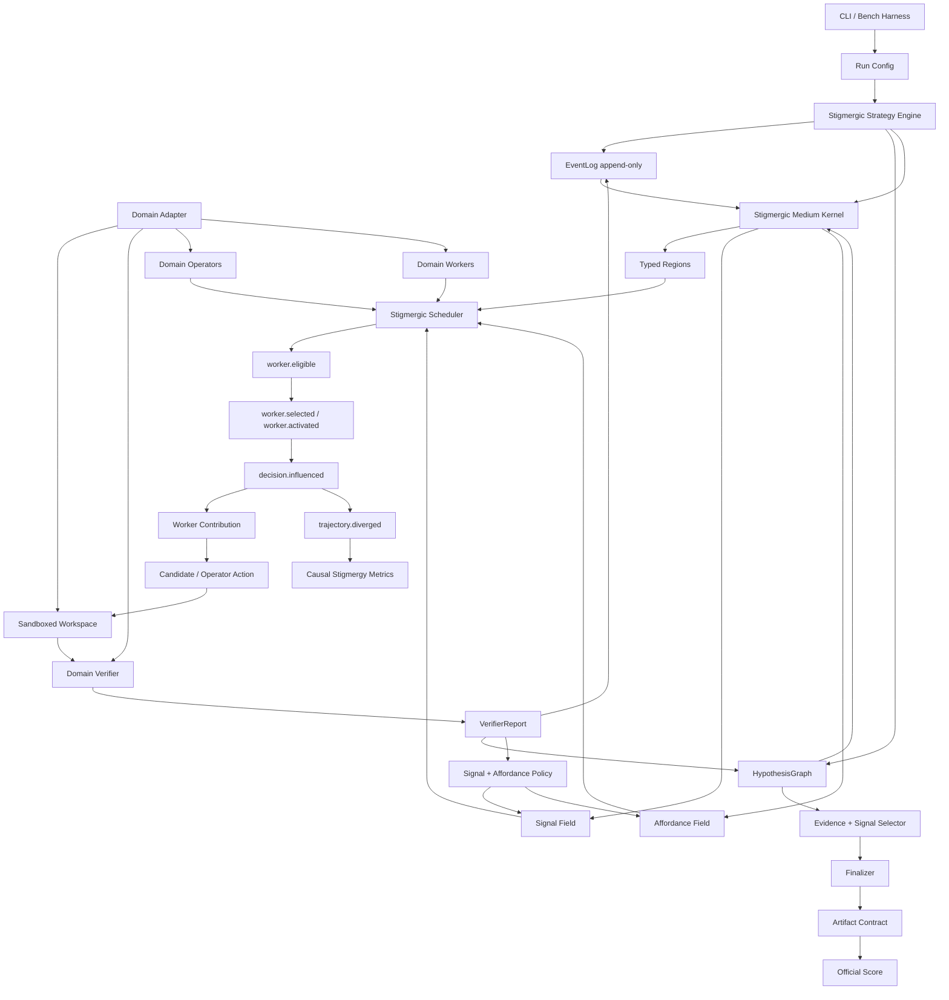

# Plan V11 — Stigmergic Medium Kernel

**Date :** 2026-05-06  
**Statut :** plan canonique accepté ; MVP Phase 7 implémenté le 2026-05-06
**Position :** V10 reste le socle de vérification, d’audit et de replay ; V11 transforme ce socle en véritable framework stigmergique actif
**Décision :** construire un `Stigmergic Medium Kernel` au-dessus de V10, avec contrat causal, affordances, workers spécialisés, scheduler stigmergique, operators typés et mémoire verifier-gated.

**Implémentation actuelle :** l'incrément Phase 7 livre le MVP causal
(`signal.read`, `decision.influenced`, `trajectory.diverged`,
`AffordanceField`, scheduler B5, operators B6, toy smoke automatisé,
télémétrie replayable). La mémoire B7 et le search B8 restent des follow-ups
séparés. Voir `documentation/redisgn_v2/phase_07_artifact.md` et
`documentation/decisions/20260506-v11-stigmergic-medium-kernel.md`.

---

## 0. Résumé exécutif

V10 a corrigé les problèmes les plus graves des versions précédentes : métriques non fiables, absence d’oracle strict, confusion entre artefact partiel et succès, logs dispersés, absence d’EventLog central et impossibilité de reconstruire proprement les trajectoires.

Mais V10 n’est pas encore un vrai framework stigmergique. A4 a introduit un `SignalStore`, des événements `signal.emitted` et `signal.applied`, mais les campagnes A3 vs A4 montrent que les signaux sont beaucoup plus souvent émis qu’ils ne changent réellement les décisions. La couche stigmergique existe, mais elle reste trop faible causalement.

V11 corrige ce problème en déplaçant le centre de gravité :

```text
V10 = verified hypothesis runtime
V11 = causal active stigmergic medium runtime
```

Le cœur V11 devient un **Stigmergic Medium Kernel** : un médium partagé, typé, auditable et causal où les traces vérifiées deviennent des signaux, les signaux créent des affordances, les affordances activent des workers, les workers produisent des contributions vérifiables, et les résultats renforcent ou inhibent les trajectoires futures.

Chaîne canonique V11 :

```text
verifier report
-> signal.emitted
-> affordance.created
-> signal.read
-> worker.eligible
-> worker.selected
-> decision.influenced
-> worker.output
-> candidate.created
-> validation.completed
-> trajectory.diverged
-> funnel_delta measured
```

La contribution V11 n’est donc pas seulement de produire des signaux. Elle est de rendre la stigmergie **active, mesurable, falsifiable et attribuable**.

---

## 1. Diagnostic post-V10

### 1.1 Ce que V10 a bien résolu

V10 est une réussite méthodologique sur plusieurs points :

- `core_v10` est séparé du legacy `core/`.
- Les adapters V10 sont séparés de la logique benchmark.
- L’`EventLog` devient la source de vérité.
- Le `HypothesisGraph` permet de suivre candidats, réparations, parentés, validations et sélections.
- Le `VerifierLoop` rend impossible un `strict_success` sans contrat complet.
- Les métriques sont reconstructibles depuis les événements.
- Les ablations A1/A2/A3/A4 sont plus propres.
- A4 introduit une première couche de signaux stigmergiques.

Ces acquis doivent être conservés.

### 1.2 Ce que V10 ne prouve pas encore

V10 ne prouve pas encore que la stigmergie améliore la résolution.

Les résultats A3 vs A4 montrent :

- A4 émet des signaux ;
- A4 peut influencer au moins une décision ;
- A4 ne surpasse pas A3 en `strict_success` ;
- la plupart des signaux ne sont pas causalement exploités ;
- le budget A3/A4 donne peu d’occasions à la stigmergie d’agir ;
- A3 fait déjà une partie du travail d’inhibition via déduplication et suppression des répétitions de signatures.

Conclusion :

```text
V10 rend la stigmergie visible, mais pas encore causalement forte.
```

### 1.3 Risque principal si l’on continue V10 telle quelle

Le risque est de produire une architecture de plus en plus complexe où la stigmergie reste une couche d’observabilité :

```text
signal.emitted beaucoup
signal.applied rarement
strict_success inchangé
narration scientifique fragile
```

V11 doit éviter ce piège en imposant une chaîne causale stricte.

---

## 2. Objectif V11

### 2.1 Question centrale

> Dans quelle mesure un médium stigmergique typé, alimenté par des validations vérifiées, peut-il modifier causalement la trajectoire de résolution d’un système LLM sur des tâches long-horizon vérifiables ?

### 2.2 Reformulation de la contribution

Ne plus prétendre :

```text
La stigmergie améliore naturellement les performances des agents LLM.
```

Prétendre plutôt :

```text
Un médium stigmergique peut être défini comme une couche causale auditable :
chaque trace doit avoir une provenance, être lue, influencer une décision,
modifier une trajectoire et produire un effet mesurable ou une absence d’effet mesurable.
```

### 2.3 Claim défendable

> StigmergiAgentic V11 explore l’hypothèse qu’une coordination utile entre agents LLM ne réside pas dans la multiplication d’agents autonomes, mais dans un médium partagé où hypothèses, validations, échecs, signaux de support, affordances et inhibitions rendent la recherche de solutions traçable, falsifiable et potentiellement transférable.

---

## 3. Définition stricte d’un vrai framework stigmergique

Un framework est stigmergique seulement si ces conditions sont satisfaites.

| Condition | Exigence V11 |
|---|---|
| Médium central | Les décisions passent par un environnement partagé, pas par une conversation directe entre agents. |
| Traces actives | Une trace peut modifier un worker activé, une action proposée, une région inspectée, une hypothèse supprimée ou un budget alloué. |
| Perception locale | Les workers lisent des régions typées du médium, pas l’état global complet. |
| Renforcement | Les succès vérifiés augmentent la probabilité de chemins similaires. |
| Inhibition | Les échecs vérifiés réduisent la probabilité de répéter des chemins improductifs. |
| Affordances | Les feedbacks deviennent des actions possibles, pas seulement des diagnostics. |
| Causalité mesurée | Chaque décision influencée doit indiquer les signaux, affordances ou mémoires qui l’ont modifiée. |
| Vérification souveraine | La stigmergie guide la recherche, mais ne fabrique jamais le succès. |

Formule opérationnelle :

```text
trace vérifiée
-> médium modifié
-> perception locale différente
-> worker différent ou action différente
-> verifier
-> nouveau signal
```

Si une trace n’influence aucune action future, elle reste une trace d’audit. Elle n’est pas encore une trace stigmergique opérationnelle.

---

## 4. Contrat causal stigmergique

### 4.1 Chaîne causale obligatoire

Un signal n’est scientifiquement stigmergique que s’il peut entrer dans la chaîne suivante :

```text
1. une contribution produit une trace dans le médium ;
2. cette trace est persistée avec une preuve vérifiable ;
3. une contribution future lit cette trace ;
4. la lecture modifie une décision ;
5. cette décision modifie la trajectoire ;
6. l’effet sur le funnel est mesuré.
```

Sans cette chaîne, on a de la télémétrie, pas une coordination stigmergique prouvée.

### 4.2 Hiérarchie des événements causaux

V11 distingue explicitement :

```text
signal.emitted      = le signal existe
signal.read         = un composant l’a consulté
signal.applied      = il a été utilisé dans un calcul
decision.influenced = il a changé un choix
trajectory.diverged = il a changé la trajectoire
funnel_delta        = il a eu un effet mesuré
```

### 4.3 Contrat 1 — Signal provenance

Chaque signal doit porter sa provenance.

```json
{
  "signal_id": "sig_dep_resolve_old_spring",
  "kind": "inhibit",
  "target": "failure_type:dependency_resolution_error",
  "created_from": {
    "event_id": "evt_045",
    "hypothesis_id": "h_c2_r1",
    "verifier_status": "failed",
    "failure_type": "dependency_resolution_error"
  },
  "evidence": ["maven log tail", "validator digest"]
}
```

### 4.4 Contrat 2 — Signal read

Chaque lecture du médium doit être tracée.

```json
{
  "type": "signal.read",
  "actor": "stigmergic_scheduler",
  "decision_id": "dec_091",
  "region": "affordance_region",
  "read_policy": "top_k_by_activation",
  "signals_seen": [
    "sig_dep_resolve_old_spring",
    "sig_preserve_tests"
  ]
}
```

### 4.5 Contrat 3 — Decision influence

Chaque décision influencée doit documenter son contrefactuel.

```json
{
  "type": "decision.influenced",
  "decision_id": "dec_091",
  "decision_kind": "worker_activation",
  "actor": "stigmergic_scheduler",
  "baseline_choice": {
    "selected_worker": "generic_repairer"
  },
  "stigmergic_choice": {
    "selected_worker": "surefire_operator"
  },
  "signals_used": ["sig_official_tests_minus_2"],
  "affordances_used": ["aff_fix_surefire_summary"],
  "effect": "worker_selected"
}
```

### 4.6 Contrat 4 — Trajectory divergence

Chaque divergence de trajectoire doit être comparable.

```json
{
  "type": "trajectory.diverged",
  "instance_id": "repo_x",
  "control_arm": "B2_branching_repair",
  "treatment_arm": "B5_stigmergic_scheduler",
  "divergence_point": "worker_activation",
  "decision_id": "dec_091",
  "cause": "signal_read",
  "signals_used": ["sig_official_tests_minus_2"],
  "downstream_delta": {
    "patch_applies": "same",
    "compile_success": "improved",
    "test_success": "same",
    "official_success": "same"
  }
}
```

---

## 5. Architecture cible V11



### 5.1 Changement de centre de gravité

V10 :

```text
event -> hypothesis -> blackboard -> verifier -> signal
```

V11 :

```text
verified trace
-> active medium
-> signal + affordance
-> worker activation
-> operator/candidate
-> verifier
-> reinforced medium
```

Le médium n’est plus seulement une projection. Il devient la surface causale de coordination.

---

## 6. Composants fondamentaux

| Composant | Rôle |
|---|---|
| `EventLog` | Histoire immuable, source d’audit et de replay. |
| `HypothesisGraph` | Structure de recherche, parenté des hypothèses et domination. |
| `TypedBlackboard` | Projection typée de l’état courant. |
| `StigmergicMediumKernel` | Couche causale de signaux, lectures, influences et divergences. |
| `SignalField` | Support, inhibition, renforcement, nouveauté, risque, coût. |
| `AffordanceField` | Actions disponibles maintenant, dérivées des feedbacks et signaux. |
| `WorkerRegistry` | Catalogue de workers capables de lire/écrire certaines régions. |
| `StigmergicScheduler` | Active les workers selon signaux, affordances, coûts et budgets. |
| `OperatorLibrary` | Actions typées et vérifiables, moins fragiles que le patch libre. |
| `VerifierLoop` | Oracle de vérité local/officiel. |
| `MemoryStore` | Traces consolidées cross-run, uniquement verifier-gated. |

---

## 7. Stigmergic Medium Kernel

### 7.1 Rôle

Le `StigmergicMediumKernel` est responsable de :

- recevoir des événements vérifiés ;
- produire des signaux ;
- produire des affordances ;
- exposer des signaux aux workers, selectors et schedulers ;
- tracer les lectures ;
- tracer les décisions influencées ;
- reconstruire le médium depuis l’EventLog ;
- calculer les métriques causales ;
- appliquer decay, retirement et contradiction des signaux ;
- relier les signaux à la mémoire verifier-gated.

### 7.2 API cible

```python
class StigmergicMediumKernel:
    def emit_from_feedback(self, feedback, candidate, event_context) -> tuple[SignalRecordV11, ...]: ...
    def emit_from_success(self, validation, candidate, event_context) -> tuple[SignalRecordV11, ...]: ...
    def create_affordances(self, feedback, signals, context) -> tuple[Affordance, ...]: ...
    def read(self, *, actor, decision_id, region, query, top_k=3) -> SignalRead: ...
    def influence(self, *, decision_id, baseline_choice, stigmergic_choice, signals_used, affordances_used, effect) -> DecisionInfluence: ...
    def decay(self, now_seq: int) -> None: ...
    def retire(self, signal_id: str, reason: str) -> None: ...
    def snapshot(self) -> dict: ...

    @classmethod
    def from_events(cls, events) -> "StigmergicMediumKernel": ...
```

### 7.3 Règle forte

Le médium est reconstruit, jamais patché manuellement comme source de vérité.

```text
EventLog + HypothesisGraph + signal events + memory snapshot -> MediumSnapshot
```

---

## 8. Régions typées du médium

### 8.1 `ObjectiveRegion`

Contient l’objectif, le contrat de succès, les contraintes et les budgets.

```json
{
  "target": "migrate_java_8_to_17",
  "strict_contract": [
    "patch_delivered",
    "patch_applies",
    "compile_success",
    "test_success",
    "class_version_ok",
    "official_success"
  ],
  "budget": {
    "llm_calls_remaining": 12,
    "runtime_seconds_remaining": 1800
  }
}
```

### 8.2 `ObservationRegion`

Contient :

- résumé du repo ;
- fichiers connus ;
- dépendances ;
- structure Maven/Gradle ;
- tests ;
- contraintes visibles ;
- artefacts disponibles.

### 8.3 `LocalizationRegion`

Contient :

- fichiers suspects ;
- symboles suspects ;
- configs suspectes ;
- logs pertinents ;
- régions de code à inspecter.

### 8.4 `HypothesisRegion`

Contient :

- hypothèses ouvertes ;
- hypothèses échouées ;
- hypothèses validées localement ;
- hypothèses strictement réussies ;
- hypothèses dominées ;
- parenté des branches.

### 8.5 `VerificationRegion`

Contient :

- derniers `VerifierReport` ;
- signaux benchmark ;
- diagnostics structurés ;
- statuts local/officiel ;
- erreurs infra séparées.

### 8.6 `RepairRegion`

Contient :

- actions recommandées ;
- anti-actions ;
- patterns d’échec ;
- tentatives déjà faites ;
- erreurs à ne pas répéter.

### 8.7 `AffordanceRegion`

Contient les actions disponibles maintenant.

Exemple :

```json
{
  "affordance_id": "aff_run_effective_pom",
  "action_type": "run_command",
  "target": "mvn -q help:effective-pom",
  "reason": "java.version absent du pom visible mais requis par le build",
  "priority": 0.77,
  "source_signal_ids": ["sig_missing_property"],
  "expected_worker_kind": "pom_inspector"
}
```

### 8.8 `SelectionRegion`

Contient :

- candidats finalisables ;
- score ;
- risque ;
- coût ;
- support/inhibition ;
- statut local ;
- statut officiel ;
- raison de sélection.

### 8.9 `MemoryRegion`

Contient uniquement les patterns, operators ou skills autorisés.

En évaluation finale :

```text
memory writes = forbidden
memory reads = frozen snapshot only
```

---

## 9. Signal Field

### 9.1 Types de signaux

| Signal | Effet |
|---|---|
| `support` | Augmente la probabilité de choisir une cible. |
| `inhibit` | Réduit la probabilité de choisir une cible. |
| `reinforce` | Renforce un chemin après succès vérifié. |
| `repel` | Éloigne d’une région, action ou worker après échecs répétés. |
| `novelty` | Encourage une hypothèse différente quand le système boucle. |
| `risk` | Signale une action ou hypothèse dangereuse. |
| `cost` | Signale une action trop coûteuse pour le gain attendu. |
| `affinity` | Lie un worker à un pattern où il a déjà contribué positivement. |
| `memory` | Trace cross-run verifier-gated disponible pour influence future. |

### 9.2 Cibles de signaux

Les signaux peuvent cibler :

```text
worker:<id>
action:<operator_or_action>
file:<path>
pattern:<failure_pattern>
hypothesis:<id>
origin:<provider_or_worker>
signature:<hash>
region:<medium_region>
memory:<pattern_id>
```

Exemples :

```json
{
  "kind": "inhibit",
  "target": "action:replace_text_without_exact_match",
  "intensity": 0.95,
  "evidence": ["replacement_count_too_low repeated 4 times"],
  "scope": "run"
}
```

```json
{
  "kind": "support",
  "target": "worker:official_eval_interpreter",
  "intensity": 0.80,
  "evidence": ["local chain green but official_success false"],
  "scope": "run"
}
```

```json
{
  "kind": "support",
  "target": "action:run_effective_pom",
  "intensity": 0.75,
  "evidence": ["java.version replacement missing in visible pom"],
  "scope": "run"
}
```

### 9.3 Politique minimale de signaux

| Source | Signal |
|---|---|
| `failure_type` répété | `INHIBIT failure_type:*` |
| signature candidate échouée | `INHIBIT signature:*` |
| validation locale passée | `SUPPORT origin:*`, `SUPPORT edit_pattern:*` |
| official success | `REINFORCE pattern:*` fort |
| official failure après local pass | `SUPPORT worker:official_eval_interpreter`, `INHIBIT misleading_local_success:*` |
| anti-action | `INHIBIT anti:*` |
| pattern mémoire train validé | `MEMORY pattern:*` |

---

## 10. Affordance Field

### 10.1 Pourquoi les affordances sont nécessaires

Un signal abstrait ne suffit pas. Le framework doit transformer les feedbacks en actions possibles.

Mauvais niveau :

```text
failure_type = replacement_count_too_low
```

Niveau V11 :

```text
failure_type = replacement_count_too_low
-> inhibit action:repeat_same_replace_text
-> support worker:exact_edit_guard
-> create affordance:inspect_current_file
-> create affordance:derive_exact_old_span
```

### 10.2 Contrat

```python
@dataclass(frozen=True)
class Affordance:
    affordance_id: str
    action_type: str
    target: str
    reason: str
    priority: float
    source_event_ids: tuple[str, ...]
    source_signal_ids: tuple[str, ...]
    expected_worker_kind: str | None
    expires_at_seq: int | None
```

### 10.3 Événements

```text
affordance.created
affordance.consumed
affordance.expired
affordance.inhibited
```

### 10.4 Exemples

```json
{
  "type": "affordance.created",
  "payload": {
    "affordance_id": "aff_exact_edit_pom",
    "action_type": "inspect_current_file",
    "target": "pom.xml",
    "reason": "replacement_count_too_low",
    "source_signal_ids": ["sig_replace_text_failed"],
    "expected_worker_kind": "exact_edit_guard"
  }
}
```

```json
{
  "type": "affordance.consumed",
  "payload": {
    "affordance_id": "aff_exact_edit_pom",
    "worker_id": "exact_edit_guard",
    "decision_id": "dec_120",
    "result": "operator_invoked"
  }
}
```

---

## 11. Worker model

### 11.1 Principe

Un worker est un contributeur local. Il ne possède pas le système. Il lit une portion du médium, décide s’il peut contribuer, puis écrit une contribution vérifiable.

Contrat :

```python
class StigmergicWorker(Protocol):
    worker_id: str
    worker_kind: str
    reads: set[str]
    writes: set[str]
    handles: set[str]

    def perceive(self, medium: MediumSnapshot) -> LocalView: ...
    def can_contribute(self, view: LocalView) -> ContributionIntent: ...
    def act(self, view: LocalView) -> WorkerContribution: ...
```

### 11.2 Workers génériques

| Worker | Rôle |
|---|---|
| `repo_observer` | Dépose les premières traces sur fichiers, dépendances, tests, structure. |
| `failure_classifier` | Convertit logs et signaux verifier en patterns d’échec. |
| `localizer` | Propose les fichiers, symboles ou configs à inspecter. |
| `exact_edit_guard` | Empêche les edits textuels non ancrés dans le fichier courant. |
| `operator_selector` | Choisit un opérateur typé plutôt qu’un patch libre. |
| `selector` | Classe les hypothèses sélectionnables. |
| `budget_guard` | Réduit ou stoppe les chemins coûteux. |

### 11.3 Workers MigrationBench

| Worker | Handles |
|---|---|
| `pom_inspector` | `pom_parse_error`, `java_version_missing`, `plugin_version_old`. |
| `maven_compiler_operator` | `class_version_error`, `compile_source_target_error`. |
| `dependency_operator` | `dependency_resolution_error`, `javax_missing`, `jaxb_missing`. |
| `surefire_operator` | `official_eval_failed`, `test_summary_missing`, `#tests=-2`. |
| `test_preservation_checker` | `preserve_existing_tests`, `test_count_drop`. |
| `official_eval_interpreter` | Local green but official failed. |
| `jakarta_migration_worker` | `javax_to_jakarta` patterns when visible. |

### 11.4 Événements worker

```text
worker.eligible
worker.selected
worker.activated
worker.output
worker.rejected
```

### 11.5 Abandon du dogme role-free

V11 n’abandonne pas la stigmergie. Il abandonne l’idée que la stigmergie exige des agents homogènes.

Nouvelle philosophie :

```text
workers spécialisés + perception locale + médium actif = coordination stigmergique utile
```

---

## 12. Stigmergic Scheduler

### 12.1 Rôle

Le scheduler sélectionne les prochaines contributions à partir du médium.

Il remplace la logique :

```text
candidate_provider -> repair_provider
```

par :

```text
medium -> affordances -> eligible workers -> activation scores -> contributions
```

### 12.2 Score d’activation

Pour un worker `w` et une affordance `a` :

```text
activation(w, a) =
  capability_match(w, a)
+ support(worker/action/pattern)
+ affinity(worker, pattern)
+ novelty_bonus(w, a)
- inhibition(worker/action/pattern)
- repeated_failure_penalty(w, a)
- cost_penalty(w)
- risk_penalty(a)
```

Version pondérée initiale :

```text
score =
  0.35 * capability_match
+ 0.20 * signal_support
+ 0.15 * failure_relevance
+ 0.10 * affinity
+ 0.10 * novelty
- 0.15 * inhibition
- 0.10 * cost
- 0.10 * risk
```

Les poids sont configurables et doivent être pré-enregistrés par campagne.

### 12.3 Décision traçable

Chaque activation produit un événement :

```json
{
  "type": "worker.activated",
  "payload": {
    "worker_id": "surefire_operator",
    "affordance_id": "aff_fix_tests_minus_2",
    "activation_score": 0.82,
    "score_terms": {
      "capability_match": 1.0,
      "signal_support": 0.8,
      "inhibition": 0.0,
      "cost": 0.2
    },
    "source_signal_ids": ["sig_official_tests_minus_2"]
  }
}
```

### 12.4 Sélection

Le scheduler peut utiliser :

- top-k déterministe ;
- softmax avec température faible ;
- diversité par worker kind ;
- budget-aware pruning ;
- inhibition hard-drop pour signatures ou actions interdites.

La configuration par défaut doit être déterministe pour faciliter l’audit.

---

## 13. Operators typés

### 13.1 Pourquoi

Le patch libre généré par LLM est trop fragile. V11 doit réduire l’espace d’action en proposant des opérateurs déterministes, paramétrables et vérifiables.

Le LLM peut encore aider, mais il doit choisir ou paramétrer un opérateur, pas forcément écrire tout le diff.

Règle V11 :

```text
Le patch libre LLM est un fallback, pas le mécanisme principal.
La trajectoire normale passe par des operators typés et des edits vérifiables.
```

### 13.2 Contrat

```python
@dataclass(frozen=True)
class OperatorInvocation:
    operator_id: str
    params: dict[str, Any]
    target_files: tuple[str, ...]
    rationale: str
    source_affordance_id: str | None
```

```python
class PatchOperator(Protocol):
    operator_id: str
    handles: set[str]

    def applicable(self, workspace: WorkspaceHandle, params: dict[str, Any]) -> bool: ...
    def apply(self, workspace: WorkspaceHandle, params: dict[str, Any]) -> Candidate: ...
```

### 13.3 Operators MigrationBench initiaux

```text
ExactReplaceText
MavenEnsureCompilerRelease
MavenUpgradeCompilerPlugin
MavenAddOrUpgradeSurefireForTargetJava
MavenUpgradeLombokForTargetJava
MavenUpgradeBundlePlugin
MavenAddJavaFxDependencies
MavenAddDependency
MavenAddJaxbDependency
ReplaceSunMiscBase64WithJavaUtilBase64
ClassifyMissingExternalDependency
DiagnoseBytecodeReaderIncompatibility
MavenRunEffectivePomInspection
JakartaImportMigration
PreserveExistingTestsGuard
WriteFileWithGuard
```

Les operators MigrationBench doivent être **target-aware** : le benchmark
fournit un `MigrationContext` (`source_java`, `target_java`,
`target_class_major`, `build_system`, `migration_mode`, `dependency_policy`)
et les operators appliquent des actions paramétrées depuis ce contexte. Aucun
operator ne doit encoder Java 17 dans son nom ou dans sa logique métier ; les
seuils Maven/JAXB/Lombok sont sélectionnés via un profil de compatibilité par
cible Java.

Après l'audit `operator.unavailable`, les affordances doivent être spécifiques
avant d'être génériques. `fix_compile_error` reste un secours, mais les logs
Lombok/javac internals, JavaFX, Felix bundle plugin, Surefire `#tests=-2`,
`sun.misc.BASE64*`, dépendances snapshot/internes et Spring/ASM class-major
doivent créer respectivement des actions target-aware ou diagnostiques. Les
cas Spring/ASM restent diagnostic-only tant qu'un upgrade framework sûr n'est
pas spécifié.

### 13.4 Règle d’or

```text
Aucun replace_text ne peut être émis si `old` n’est pas prouvé présent dans le fichier courant.
```

Cette règle doit être un operator guard ou une inhibition hard-coded.

### 13.5 Événements operator

```text
operator.invoked
operator.applied
operator.rejected
operator.failed
```

---

## 14. Mémoire stigmergique V11

### 14.1 Pourquoi la mémoire devient centrale

La stigmergie est souvent plus naturellement démontrable cross-run qu’intra-run.

Intra-run, surtout sur MigrationBench, il y a peu de temps, peu de candidats validés et peu de vrais tie-breaks.

Cross-run donne une surface plus forte :

```text
une instance laisse une trace vérifiée
-> une autre instance lit cette trace
-> la décision change
-> le funnel change
```

### 14.2 Position dans le ladder

En V11, la mémoire vient avant le MCTS/search avancé.

Raison :

```text
mémoire cross-run = contribution stigmergique centrale
MCTS = optimiseur de recherche pouvant masquer la contribution stigmergique
```

### 14.3 Types de mémoire

```text
EpisodicMemory = traces d’un run
PatternMemory = patterns consolidés depuis plusieurs runs
OperatorMemory = opérateurs qui marchent sur certains patterns
WorkerAffinityMemory = workers efficaces sur certains patterns
ProceduralMemory = skills exécutables verifier-gated
```

### 14.4 Pattern typé

```json
{
  "pattern_id": "pat_jaxb_java17",
  "trigger": {
    "failure_type": "compile_error",
    "log_contains": "package javax.xml.bind does not exist"
  },
  "suggested_action": {
    "type": "add_dependency",
    "groupId": "jakarta.xml.bind",
    "artifactId": "jakarta.xml.bind-api"
  },
  "evidence": {
    "train_successes": 3,
    "train_failures": 0,
    "source_instances": ["repo_a", "repo_b", "repo_c"]
  },
  "status": "candidate|validated|retired"
}
```

### 14.5 Promotion verifier-gated

Un pattern est promu seulement si :

- il vient d’un split train/adapt ;
- il a une provenance complète ;
- il est associé à un verifier report positif ou une amélioration nette du funnel ;
- il a été utile au moins `k` fois ou validé qualitativement ;
- il ne provoque pas de régression connue ;
- il est versionné dans un snapshot.

### 14.6 Eval hygiene

Pendant l’évaluation :

```text
memory writes = forbidden
memory reads = frozen snapshot only
memory usage = event logged
```

Événements :

```text
memory.promoted
memory.read
memory.used
memory.influenced
```

### 14.7 Baselines mémoire anti-placebo

Pour B7, comparer :

```text
memory_disabled
memory_correct
memory_shuffled
```

Si `memory_correct` ne bat pas `memory_shuffled`, la mémoire ne transfère pas réellement un savoir utile.

---

## 15. Recherche stigmergique V11

### 15.1 Principe

La recherche avancée arrive après :

```text
medium causal
affordances
scheduler
operators
memory
```

Ne pas implémenter MCTS trop tôt.

### 15.2 Recherche guidée par médium

```text
frontier = hypothèses ouvertes
expand = affordances les plus attractives
simulate = operator/candidate + verifier
reward = verifier signals
update = support/inhibit/reinforce
prune = dominated or inhibited
```

### 15.3 Score d’un nœud

```text
node_score =
  verifier_reward
+ signal_support
+ novelty
+ memory_prior
- risk
- cost
- repeated_failure
```

### 15.4 Rewards initiaux

| Signal | Reward |
|---|---:|
| patch_delivered | +0.05 |
| patch_applies | +0.10 |
| compile_success | +0.25 |
| test_success | +0.25 |
| class_version_ok | +0.10 |
| official_success | +0.40 |
| strict_success | +1.00 |
| repeated_signature | -0.30 |
| replacement_count_too_low | -0.20 |
| test_count_drop | -0.50 |

Les rewards guident la recherche ; ils ne remplacent pas les métriques officielles.

---

## 16. Événements EventLog obligatoires V11

### 16.1 Signaux

```text
signal.emitted
signal.read
signal.applied
signal.decayed
signal.retired
```

### 16.2 Affordances

```text
affordance.created
affordance.consumed
affordance.expired
affordance.inhibited
```

### 16.3 Workers

```text
worker.eligible
worker.selected
worker.activated
worker.output
worker.rejected
```

### 16.4 Operators

```text
operator.invoked
operator.applied
operator.rejected
operator.failed
```

### 16.5 Décisions et trajectoires

```text
decision.influenced
trajectory.diverged
```

### 16.6 Mémoire

```text
memory.promoted
memory.read
memory.used
memory.influenced
```

### 16.7 Règles anti-storytelling

```text
Un signal non lu ne peut pas défendre une contribution stigmergique.
Un signal lu mais sans décision influencée est une trace observée.
Une décision influencée sans divergence est une modification locale.
Une divergence sans delta funnel reste un effet causal, mais pas un gain.
```

---

## 17. Métriques V11

### 17.1 Métriques de performance

```text
strict_success_count
official_success_count
test_success_count
compile_success_count
patch_applies_count
artifact_delivered_count
cost_per_success
runtime_per_success
```

### 17.2 Métriques de présence

```text
signal_emitted_total
signal_active_total
signal_decay_rate
```

### 17.3 Métriques de lecture

```text
signal_read_count
signal_read_rate
unique_signal_read_count
```

### 17.4 Métriques d’influence

```text
decision_influenced_count
decision_influence_rate
influence_by_effect
```

### 17.5 Métriques de divergence

```text
trajectory_divergence_count
trajectory_divergence_rate
first_divergence_stage
```

### 17.6 Métriques d’utilité

```text
signal_precision
signal_harm_rate
funnel_delta_after_influence
time_to_first_useful_signal
```

### 17.7 Métriques affordance

```text
affordance_created_count
affordance_consumed_count
affordance_reuse_rate
affordance_expired_rate
```

### 17.8 Métriques anti-auto-illusion

```text
unused_signal_rate = signals_never_read / signals_emitted
unused_affordance_rate = affordances_never_consumed / affordances_created
cosmetic_signal_rate = signals_applied_without_decision_change / signals_applied
cost_without_effect = cost_spent_after_signals_that_never_changed_action
```

### 17.9 Métriques cross-run

```text
memory_pattern_promoted_count
memory_pattern_read_count
memory_influence_count
cross_run_transfer_rate
pattern_generalization_rate
```

### 17.10 Métrique centrale

```text
stigmergic_causality_rate =
  decisions_with_signal_or_affordance_influence
  / total_decisions_after_first_feedback
```

Le seuil `>= 0.30` peut être utilisé comme objectif d’ingénierie sur les tâches contrôlées, mais ne doit pas être présenté comme seuil scientifique universel.

---

## 18. Ablation ladder V11

| Bras | Nom | Mécanisme | Question |
|---|---|---|---|
| B0 | `direct_provider` | LLM direct | Niveau brut du modèle. |
| B1 | `verifier_loop` | Candidat unique + verifier | Le socle mesure-t-il correctement ? |
| B2 | `branching_repair` | Branches + repair provider | L’exploration simple aide-t-elle ? |
| B3 | `medium_passive` | Médium reconstruit, non causal | Coût de l’observabilité. |
| B4 | `medium_affordance` | Feedback -> affordances | Les feedbacks deviennent-ils actionnables ? |
| B5 | `stigmergic_scheduler` | Signaux + affordances activent workers | Les traces changent-elles les actions ? |
| B6 | `operator_search` | Operators typés, patch libre limité | Les operators réduisent-ils les erreurs ? |
| B7 | `memory_augmented` | Mémoire verifier-gated read-only en eval | Les traces cross-run transfèrent-elles ? |
| B8 | `stigmergic_search` | Best-N/MCTS guidé par médium | La recherche avancée ajoute-t-elle un gain distinct ? |

### 18.1 Changement clé par rapport à V10

Dans V10 :

```text
A5 = tree search
A6 = memory
```

Dans V11 :

```text
B7 = memory cross-run
B8 = search contrôlé
```

Raison :

```text
La mémoire cross-run est plus proche de la stigmergie que le tree-search.
Le tree-search peut masquer la contribution centrale.
```

---

## 19. Roadmap V11

### Phase 0 — Documentation et ADR

Livrables :

```text
documentation/redisgn_v2/plan_v11_stigmergic_medium_kernel.md
documentation/decisions/ADR-020-v11-stigmergic-medium-kernel.md
```

Definition of Done :

```text
Le projet distingue explicitement :
- V10 = runtime vérifiable ;
- V11 = médium stigmergique actif et causal.
```

### Phase 1 — Events causaux

Livrables :

```text
signal.read
decision.influenced
trajectory.diverged
metrics associées dans telemetry
```

Definition of Done :

```text
Un run A4 produit une chaîne complète :
signal.emitted -> signal.read -> decision.influenced.
Les métriques sont replayables.
```

### Phase 2 — Typed blackboard réel

Livrables :

```text
régions typées
worker registry
capability matching
worker.eligible
worker.selected
worker.output
blackboard.region.updated
```

Definition of Done :

```text
A2 n’est plus un placeholder.
A2 peut être comparé honnêtement à A1/A3.
```

### Phase 3 — AffordanceField

Livrables :

```text
feedback -> affordance
signal -> affordance priority
affordance -> eligible workers
```

Definition of Done :

```text
replacement_count_too_low génère inspect_current_file + exact_edit_guard.
official_eval_failed génère official_eval_interpreter.
compile_error génère localizer + operator_selector.
```

### Phase 4 — StigmergicScheduler minimal

Livrables :

```text
medium -> affordances -> workers -> activation score
worker activation events
decision influence events
```

Definition of Done :

```text
Le runner V11 n’appelle plus directement candidate_provider/repair_provider comme mécanisme central.
Il active des workers via affordances + signaux.
```

### Phase 5 — Operators typés MigrationBench

Livrables :

```text
ExactReplaceText
MavenEnsureCompilerRelease
MavenUpgradeCompilerPlugin
MavenUpgradeSurefirePlugin
MavenAddDependency
PreserveExistingTestsGuard
```

Definition of Done :

```text
Au moins 5 operators produisent des patches vérifiables.
Les edits libres sont fallback ou guardés.
replacement_count_too_low diminue sur smoke.
```

### Phase 6 — A4 causal intra-run

Livrables :

```text
B3/B4/B5 comparison
signal_read_count
decision_influenced_count
trajectory_divergence_rate
funnel_delta_after_influence
```

Definition of Done :

```text
decision_influenced_count > 0 sur smoke.
trajectory_divergence_rate calculé.
Gain ou absence de gain interprétable.
```

### Phase 7 — A5 memory cross-run

Livrables :

```text
pattern memory verifier-gated
train/eval snapshots
read-only eval
memory.promoted
memory.read
memory.influenced
shuffle_memory baseline
```

Definition of Done :

```text
Au moins un pattern est promu depuis train.
Au moins un pattern est lu en eval.
Au moins une décision eval est influencée.
memory_correct est comparé à memory_disabled et memory_shuffled.
```

### Phase 8 — Search optionnel

Livrables :

```text
best-N ou MCTS-light
comparaison avec/sans médium
comparaison avec/sans mémoire
cost/pass trade-off
```

Definition of Done :

```text
Le search n’est gardé que si son gain est distinct de la mémoire et de la stigmergie.
```

---

## 20. Minimum viable V11

Le plan complet est ambitieux. Pour éviter une nouvelle refonte interminable, la version minimale doit viser :

```text
1. signal.read
2. decision.influenced
3. trajectory.diverged
4. AffordanceField
5. StigmergicScheduler minimal
6. ExactEditGuard
7. 3 à 5 operators MigrationBench
8. toy_patch_repair
9. MigrationBench smoke_5
```

Objectif minimal :

```text
feedback vérifié
-> signal
-> affordance
-> worker activé
-> décision différente
-> patch différent
-> validation différente ou absence d’amélioration mesurée
```

Même un résultat négatif est utile si la chaîne causale est complète.

---

## 21. Structure de fichiers cible

### 21.1 Option recommandée court terme : couche sur `core_v10`

```text
core_v10/
  stigmergy/
    __init__.py
    records.py
    medium.py
    signal_field.py
    affordances.py
    policy.py
    metrics.py
    replay.py
    counterfactual.py
    scheduler.py
    workers.py

  workers/
    __init__.py
    base.py
    failure_classifier.py
    exact_edit_guard.py
    operator_selector.py
    selector.py

  operators/
    __init__.py
    base.py
    patch_operator.py
    text_operator.py
```

### 21.2 MigrationBench

```text
adapters_v10/
  migrationbench/
    workers/
      __init__.py
      pom_inspector.py
      dependency_operator.py
      surefire_operator.py
      official_eval_interpreter.py
      test_preservation_checker.py

    operators/
      __init__.py
      maven_compiler.py
      maven_plugins.py
      maven_dependencies.py
      tests.py
      jakarta.py
```

### 21.3 Tests prioritaires

```text
tests/unit/v11/test_signal_provenance.py
tests/unit/v11/test_signal_read_events.py
tests/unit/v11/test_decision_influence.py
tests/unit/v11/test_trajectory_divergence.py
tests/unit/v11/test_affordance_generation.py
tests/unit/v11/test_worker_activation.py
tests/unit/v11/test_operator_guards.py
tests/unit/v11/test_memory_pattern_promotion.py

tests/integration/v11/test_a4_causal_chain.py
tests/integration/v11/test_a5_memory_readonly_eval.py
tests/integration/v11/test_toy_patch_repair.py
```

---

## 22. Expériences prioritaires

### 22.1 Expérience 1 — Microbench stigmergique contrôlé

Objectif : tester le mécanisme, pas battre l’état de l’art.

Créer 10 à 20 mini-repos ou fixtures semi-synthétiques avec patterns répétés :

```text
javax.xml.bind absent
maven-compiler-plugin ancien
source/target 1.8
surefire trop ancien
Lombok incompatible
Spring Boot ancien incompatible Java 17
bad replace_text
test count drop
```

Comparer :

```text
B2 branching_repair
B4 medium_affordance
B5 stigmergic_scheduler
B7 memory_augmented
```

Critère fort :

```text
B7 lit un pattern appris sur train et améliore compile_success/test_success sur eval.
```

### 22.2 Expérience 2 — Toy patch repair

Cas synthétiques :

```text
bad replace_text
missing dependency
wrong source/target
test deleted
class version mismatch
```

But :

```text
Prouver que les affordances et workers réduisent les répétitions d’erreurs.
```

### 22.3 Expérience 3 — MigrationBench smoke causal

Comparer :

```text
B2 branching_repair
B3 medium_passive
B5 stigmergic_scheduler
B6 operator_search
```

Métriques :

```text
signal_read_count
decision_influenced_count
trajectory_divergence_rate
replacement_count_too_low_rate
patch_applies
compile_success
cost_per_patch_applies
```

### 22.4 Expérience 4 — MigrationBench main_30

Seulement après succès smoke.

Comparer :

```text
B2 branching_repair
B5 stigmergic_scheduler
B6 operator_search
B7 memory_augmented
```

---

## 23. Baselines obligatoires

### 23.1 Baselines internes

| Baseline | Rôle |
|---|---|
| `B2_branching_repair` | Contrôle sans médium actif. |
| `B3_medium_passive` | Médium reconstruit mais non causal. |
| `B5_stigmergic_scheduler` | Médium causal intra-run. |
| `B7_memory_disabled` | Contrôle mémoire. |
| `B7_memory_correct` | Mémoire correcte. |
| `B7_memory_shuffled` | Baseline anti-placebo. |

### 23.2 Baselines externes

| Baseline | Priorité |
|---|---|
| `solo_direct` | obligatoire |
| `solo_self_refine` | obligatoire |
| `planner_executor` | obligatoire |
| `agentless_self_debug` | très recommandé |
| `langgraph_supervisor_like` | recommandé si temps disponible |

### 23.3 Règle anti-strawman

Aucune conclusion forte ne peut être tirée si le framework n’est comparé qu’à des baselines faibles.

---

## 24. Critères de succès

### 24.1 Succès architectural

V11 réussit si :

- le médium est reconstructible ;
- les workers lisent des vues locales ;
- les signaux créent ou reclassent des affordances ;
- le scheduler active les workers via signaux et affordances ;
- chaque décision peut être expliquée par ses gradients ;
- le verifier reste souverain.

### 24.2 Succès stigmergique minimal

V11 réussit minimalement si :

```text
signal.read_count > 0
decision_influenced_count > 0
trajectory_divergence_count > 0
stigmergic_causality_rate mesurable
unused_signal_rate mesurable
signal_harm_rate mesurable
```

### 24.3 Succès fort

V11 est forte si :

```text
B5 > B3 sur un microbench contrôlé
B6 réduit replacement_count_too_low ou augmente patch_applies
B7 memory_correct > memory_disabled
B7 memory_correct > memory_shuffled
funnel_delta_after_influence positif ou négatif mais attribuable
```

### 24.4 Succès article

Un article devient envisageable si :

- multi-seed ou répétitions contrôlées ;
- baseline agentless/self-debug ;
- artefact reproductible ;
- signal positif sur B5/B6/B7 ou résultat négatif très propre ;
- étude qualitative causale convaincante ;
- absence de claims de supériorité non prouvés.

---

## 25. Claims matrix

| Claim | Statut attendu V11 |
|---|---|
| V10/V11 produit des métriques replayables | Défendable. |
| Le verifier empêche les faux succès | Défendable. |
| A4 intra-run émet des signaux | Défendable. |
| A4 intra-run améliore strict_success | Non prouvé, probablement négatif. |
| Le médium stigmergique influence des décisions | À prouver avec `decision.influenced`. |
| Les affordances rendent les feedbacks actionnables | À prouver avec B4/B5. |
| Les operators typés réduisent les erreurs de patch libre | À prouver avec B6. |
| La mémoire cross-run transfère des patterns utiles | Hypothèse centrale B7. |
| Le framework bat des baselines fortes | Non prouvé aujourd’hui. |
| Le framework fournit une contribution DSR | Défendable si limites assumées. |

---

## 26. Anti-patterns interdits

Ne pas faire :

```text
ajouter MCTS sans médium causal
ajouter memory sans protocole train/eval
continuer à générer des patchs libres comme mécanisme principal
compter signal.emitted comme preuve de stigmergie
confondre logging et coordination
relancer main_30 avant que smoke causal ne bouge
réintroduire agents role-free sans affordances
ignorer memory_shuffled baseline
```

Faire :

```text
médium actif
contrat causal
signal.read
decision.influenced
trajectory.diverged
affordances actionnables
workers locaux
scheduler stigmergique
operators typés
memory verifier-gated
benchmarks contrôlés avant benchmarks réels
```

---

## 27. Phrase directrice

> StigmergiAgentic V11 transforme la stigmergie d’une métaphore de coordination en mécanisme computationnel causal : les traces vérifiées créent des gradients d’action qui activent des workers, orientent des opérateurs, inhibent les répétitions, renforcent les chemins validés et rendent chaque divergence de trajectoire mesurable.

---

## 28. Décision finale recommandée

Ne pas poursuivre simplement :

```text
V10.5 = MCTS
V10.6 = memory
```

Poursuivre plutôt :

```text
V11.1 = contrat causal stigmergique
V11.2 = signal.read + decision.influenced + trajectory.diverged
V11.3 = typed blackboard réel
V11.4 = affordance field
V11.5 = stigmergic scheduler
V11.6 = typed operators
V11.7 = memory cross-run verifier-gated
V11.8 = search optionnel contrôlé
```

La priorité immédiate n’est pas d’élargir la recherche.
La priorité est de rendre le médium causal.

---

## 29. Résumé en une phrase

V11 garde l’objectif stigmergique initial, mais remplace la question faible “combien de signaux ai-je émis ?” par la question forte : “quelles décisions ont réellement été changées par des traces vérifiées, par quelles affordances, via quels workers, et avec quel effet mesurable sur la trajectoire de résolution ?”
