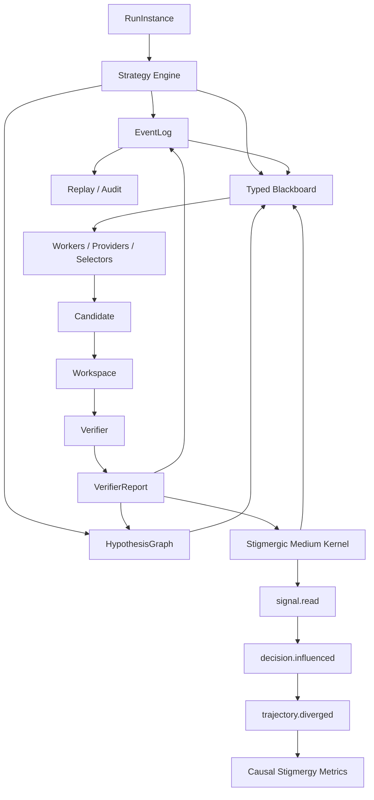

# Plan V11 — Stigmergic Medium Kernel

**Date :** 2026-05-06  
**Statut :** proposition de refonte scientifique après audit V10/A4  
**Position :** conserver l’objectif stigmergique, mais déplacer la contribution du simple `SignalStore` vers un médium causal auditable  
**Décision proposée :** ne pas jeter V10 ; construire V11 comme durcissement conceptuel et expérimental de V10 autour d’un contrat de causalité stigmergique.

---

## 0. Résumé exécutif

La V10 a corrigé les défauts les plus graves des versions précédentes : métriques non fiables, absence d’oracle strict, confusion entre artefact partiel et succès, absence d’EventLog central, difficulté à reconstruire les trajectoires. Elle a aussi introduit une première couche stigmergique A4 avec `SignalStore`, `signal.emitted` et `signal.applied`.

Mais l’audit des campagnes A3 vs A4 montre une faiblesse majeure : la stigmergie est implémentée et tracée, mais elle agit trop peu. Sur MigrationBench `main_30`, A4 émet des signaux, mais ne modifie presque jamais la trajectoire de résolution. L’effet final sur `strict_success` est nul.

V11 ne doit donc pas être une nouvelle fuite en avant architecturale. Elle doit répondre à une question plus dure :

> Quand peut-on dire qu’un système LLM est réellement coordonné par stigmergie, et non simplement instrumenté par des signaux décoratifs ?

La réponse proposée est un **Stigmergic Medium Kernel** : un médium partagé qui impose un contrat causal complet.

```text
trace déposée -> trace lue -> décision influencée -> trajectoire divergente -> effet mesuré
```

La contribution V11 n’est pas de promettre un gain immédiat, mais de rendre l’effet stigmergique **observable, falsifiable et attribuable**.

---

## 1. Diagnostic post-V10

### 1.1 Ce que V10 a bien réparé

V10 est une réussite méthodologique sur les points suivants :

- séparation claire entre `core_v10`, adapters et benchmark logic ;
- `EventLog` comme source de vérité ;
- `HypothesisGraph` pour suivre candidats, réparations, parentés et validations ;
- verifier-first contract ;
- `strict_success` impossible sans contrat complet ;
- replay des métriques depuis les événements ;
- ablations A1/A2/A3/A4 explicitement configurées ;
- début de couche stigmergique active avec `SignalStore`.

Ces acquis doivent être conservés.

### 1.2 Ce que V10 ne prouve pas encore

V10 ne prouve pas encore que la stigmergie améliore la résolution.

Les résultats A3 vs A4 montrent :

- A4 émet des signaux ;
- A4 peut influencer au moins une décision ;
- A4 ne surpasse pas A3 en `strict_success` ;
- la plupart des signaux ne sont pas causalement exploités ;
- le budget A3/A4 donne peu d’occasions à la stigmergie d’agir ;
- la couche A3 fait déjà une partie du travail d’inhibition par signature et déduplication.

Conclusion :

> V10 rend la stigmergie visible, mais pas encore causalement forte.

### 1.3 Risque principal si l’on continue V10 telle quelle

Le risque est de produire une architecture de plus en plus complexe où la stigmergie reste une couche de télémétrie :

```text
signal.emitted beaucoup
signal.applied rarement
strict_success inchangé
narration scientifique fragile
```

V11 doit éviter ce piège.

---

## 2. Nouvelle question scientifique

### 2.1 Question centrale V11

> Dans quelle mesure un médium stigmergique typé, alimenté par des validations vérifiées, peut-il modifier causalement la trajectoire de résolution d’agents LLM sur des tâches long-horizon vérifiables, par rapport à une boucle verifier-first sans mémoire de traces ?

### 2.2 Reformulation de la contribution

Ne plus prétendre :

```text
La stigmergie améliore les performances des agents LLM.
```

Prétendre plutôt :

```text
Un médium stigmergique peut être défini comme une couche causale auditable : chaque signal doit avoir une provenance, être lu par une décision, modifier un choix futur, et permettre une comparaison contrefactuelle de trajectoire.
```

### 2.3 Claim défendable

> StigmergiAgentic V11 explore l’hypothèse qu’une coordination utile entre agents LLM ne réside pas dans la multiplication d’agents autonomes, mais dans un médium partagé où hypothèses, validations, échecs, signaux de support et inhibitions rendent la recherche de solutions traçable, falsifiable et potentiellement transférable. Les résultats peuvent être positifs ou négatifs : la contribution principale est de rendre l’effet stigmergique mesurable au lieu de le supposer.

---

## 3. Principe fondateur : contrat causal stigmergique

### 3.1 Définition opérationnelle

Un signal n’est stigmergique que s’il satisfait la chaîne suivante :

```text
1. une contribution produit une trace dans le médium ;
2. cette trace est persistée avec une preuve vérifiable ;
3. une contribution future lit cette trace ;
4. la lecture modifie une décision ;
5. cette décision modifie la trajectoire ;
6. l’effet sur le funnel est mesuré.
```

Sans cette chaîne, on a seulement de la télémétrie.

### 3.2 Les quatre contrats V11

#### Contrat 1 — Signal provenance

Chaque signal doit porter sa provenance.

```json
{
  "signal_id": "sig_dep_resolve_old_spring",
  "kind": "inhibit",
  "target": "failure_type:dependency_resolution_error",
  "created_from": {
    "event_id": "evt_045",
    "hypothesis_id": "h_c2_r1",
    "verifier_status": "failed",
    "failure_type": "dependency_resolution_error"
  },
  "evidence": ["maven log tail", "validator digest"]
}
```

#### Contrat 2 — Signal read

Chaque lecture du médium doit être tracée.

```json
{
  "type": "signal.read",
  "actor": "repair_provider",
  "decision_id": "dec_091",
  "read_targets": [
    "failure_type:dependency_resolution_error",
    "anti:preserve_existing_tests"
  ],
  "top_k": 3,
  "signals_seen": ["sig_dep_resolve_old_spring", "sig_preserve_tests"]
}
```

#### Contrat 3 — Decision influence

Chaque décision influencée doit documenter son contrefactuel.

```json
{
  "type": "decision.influenced",
  "decision_id": "dec_091",
  "decision_kind": "repair_prompt_context",
  "baseline_choice": {
    "prompt_blocks": ["feedback", "files", "prior_edits"]
  },
  "stigmergic_choice": {
    "prompt_blocks": ["feedback", "signals_digest", "files", "prior_edits"]
  },
  "signals_used": ["sig_dep_resolve_old_spring"],
  "effect": "prompt_augmented"
}
```

#### Contrat 4 — Trajectory divergence

Chaque divergence de trajectoire doit être comparable.

```json
{
  "type": "trajectory.diverged",
  "instance_id": "repo_x",
  "control_arm": "A3_branching_repair",
  "treatment_arm": "A4_stigmergic_medium",
  "divergence_point": "repair_provider_input",
  "cause": "signal_read",
  "signals_used": ["sig_dep_resolve_old_spring"],
  "downstream_delta": {
    "patch_applies": "same",
    "compile_success": "improved",
    "test_success": "same",
    "official_success": "same"
  }
}
```

---

## 4. Architecture V11

### 4.1 Vue cible



### 4.2 Les six composants centraux

| Composant | Rôle |
|---|---|
| `EventLog` | Source historique, append-only, replayable. |
| `HypothesisGraph` | Structure de recherche et parenté des hypothèses. |
| `TypedBlackboard` | Projection active et typée de l’état courant. |
| `VerifierLoop` | Transformation des hypothèses en preuves ou échecs. |
| `StigmergicMediumKernel` | Couche causale de signaux avec provenance, lecture, influence et divergence. |
| `StrategyEngine` | Exécute A0..A6 à budget contrôlé. |

### 4.3 Différence avec V10

V10 :

```text
A3 branching_repair + A4 SignalStore optionnel
```

V11 :

```text
Medium partagé présent comme composant central, désactivé ou activé selon les bras.
```

Le médium n’est plus un add-on tardif. Il devient le mécanisme expérimental que l’on active ou retire.

---

## 5. Nouveau noyau proposé

```text
core_v11/
  __init__.py
  contracts.py
  event_log.py              # ou réexport core_v10 si stable
  hypothesis_graph.py       # ou réexport core_v10 si stable
  blackboard.py
  verifier.py
  strategy_engine.py
  stigmergy/
    __init__.py
    medium.py               # StigmergicMediumKernel
    records.py              # SignalRecord, SignalRead, DecisionInfluence
    policy.py               # feedback -> signal, success -> support, failure -> inhibit
    counterfactual.py       # baseline/treatment comparison hooks
    metrics.py              # causal metrics
    replay.py               # rebuild medium from EventLog
  workers/
    __init__.py
    registry.py
    capability.py
    localizer.py
    proposer.py
    repairer.py
    selector.py
  memory/
    __init__.py
    patterns.py             # verifier-gated semantic patterns
    procedural.py           # optional executable skills
    snapshots.py            # train/eval hygiene
  experiments/
    __init__.py
    ablations.py
    manifests.py
    report.py
```

Important : V11 peut réutiliser `core_v10` plutôt que tout recopier. `core_v11` peut d’abord être une couche additionnelle sur V10.

---

## 6. Contrats de données V11

### 6.1 `SignalRecordV11`

```python
@dataclass(frozen=True)
class SignalRecordV11:
    signal_id: str
    kind: Literal["support", "inhibit", "reinforce", "novelty", "memory"]
    target: str
    intensity: float
    created_from_event_id: str
    created_from_hypothesis_id: str | None
    evidence: tuple[str, ...]
    created_at_seq: int
    last_seen_seq: int
    half_life: int
    emit_count: int
    status: Literal["active", "decayed", "retired", "contradicted"]
```

### 6.2 `SignalRead`

```python
@dataclass(frozen=True)
class SignalRead:
    read_id: str
    decision_id: str
    actor: str
    region: str
    signals_seen: tuple[str, ...]
    read_policy: str
    timestamp_seq: int
```

### 6.3 `DecisionInfluence`

```python
@dataclass(frozen=True)
class DecisionInfluence:
    decision_id: str
    decision_kind: str
    actor: str
    baseline_choice: dict[str, Any]
    stigmergic_choice: dict[str, Any]
    signals_used: tuple[str, ...]
    effect: Literal[
        "drop",
        "reorder",
        "prompt_augmented",
        "worker_selected",
        "memory_recalled",
        "finalize_tiebreak"
    ]
```

### 6.4 `TrajectoryDivergence`

```python
@dataclass(frozen=True)
class TrajectoryDivergence:
    instance_id: str
    control_arm: str
    treatment_arm: str
    divergence_point: str
    decision_id: str
    signals_used: tuple[str, ...]
    downstream_delta: dict[str, Any]
```

---

## 7. Événements EventLog obligatoires

V11 ajoute les événements suivants :

```text
signal.emitted
signal.decayed
signal.retired
signal.read
decision.influenced
worker.eligible
worker.selected
worker.output
trajectory.diverged
memory.pattern_promoted
memory.pattern_read
memory.pattern_influenced
```

### 7.1 Règle forte

Une métrique stigmergique n’est valide que si elle est reconstruisible depuis ces events.

### 7.2 Règle anti-storytelling

Un signal non lu ne peut jamais être utilisé pour défendre une contribution stigmergique.

Un signal lu mais sans décision influencée est une trace observée, pas un effet causal.

Un signal influençant une décision mais sans divergence de trajectoire est une modification locale, pas encore un effet système.

---

## 8. Métriques V11

### 8.1 Métriques de présence

| Métrique | Définition |
|---|---|
| `signal_emitted_total` | Nombre de signaux émis. |
| `signal_active_total` | Nombre de signaux encore actifs en fin de run. |
| `signal_decay_rate` | Fraction des signaux décayés ou retirés. |

### 8.2 Métriques de lecture

| Métrique | Définition |
|---|---|
| `signal_read_count` | Nombre d’événements `signal.read`. |
| `signal_read_rate` | `signal.read` / décisions éligibles. |
| `unique_signal_read_count` | Nombre de signaux distincts lus. |

### 8.3 Métriques d’influence

| Métrique | Définition |
|---|---|
| `decision_influenced_count` | Nombre de décisions modifiées par signaux. |
| `decision_influence_rate` | Décisions influencées / décisions éligibles. |
| `influence_by_effect` | Répartition drop/reorder/prompt/worker/memory/finalize. |

### 8.4 Métriques de divergence

| Métrique | Définition |
|---|---|
| `trajectory_divergence_count` | Nombre d’instances où le traitement diverge du contrôle. |
| `trajectory_divergence_rate` | Divergences / instances comparables. |
| `first_divergence_stage` | Étape de première divergence. |

### 8.5 Métriques d’utilité

| Métrique | Définition |
|---|---|
| `signal_precision` | Influences menant à amélioration du funnel / influences totales. |
| `signal_harm_rate` | Influences menant à régression / influences totales. |
| `funnel_delta_after_influence` | Delta apply/compile/test/official après influence. |
| `time_to_first_useful_signal` | Nombre d’events avant premier signal influent utile. |

### 8.6 Métriques cross-run

| Métrique | Définition |
|---|---|
| `memory_pattern_promoted_count` | Patterns promus depuis train. |
| `memory_pattern_read_count` | Patterns lus en eval. |
| `memory_influence_count` | Décisions eval influencées par mémoire. |
| `cross_run_transfer_rate` | Instances eval où une mémoire train influence une décision. |
| `pattern_generalization_rate` | Patterns utiles sur repos différents de ceux d’origine. |

---

## 9. Ablation ladder V11

### 9.1 Ladder révisé

| Bras | Nom | Mécanisme | Question |
|---|---|---|---|
| A0 | `direct_llm` | LLM direct vers artefact | Niveau brut du modèle. |
| A1 | `verifier_loop` | Candidat unique + verifier + feedback | Le verifier corrige-t-il les métriques mensongères ? |
| A2 | `typed_blackboard` | Régions typées + workers + capability matching | Le blackboard explicite réduit-il les erreurs de coordination ? |
| A3 | `branching_repair` | Branches concurrentes + selector déterministe | L’exploration concurrente aide-t-elle ? |
| A4 | `stigmergic_medium_intra_run` | A3 + medium causal intra-run | Les signaux modifient-ils causalement la trajectoire ? |
| A5 | `verifier_gated_memory` | A4 + mémoire train/eval read-only | Les traces se transfèrent-elles entre instances ? |
| A6 | `verifier_guided_search_controlled` | Search best-N/MCTS avec et sans medium | Le search ajoute-t-il un gain distinct de la stigmergie ? |

### 9.2 Changement clé par rapport à V10

Dans V10 :

```text
A5 = tree search
A6 = memory
```

Dans V11 :

```text
A5 = memory cross-run
A6 = tree search contrôlé
```

Raison : la mémoire cross-run est plus proche de la stigmergie que le tree-search. Le tree-search risque de masquer l’effet central.

---

## 10. Typed Blackboard réel

### 10.1 Pourquoi A2 doit être réparé

Dans V10, A2 peut être un placeholder linéaire. En V11, A2 doit devenir un vrai bras de coordination explicite. Sinon A3/A4 ne contrôlent pas proprement l’apport du blackboard.

### 10.2 Régions minimales

```text
observation_region
localization_region
candidate_region
verification_region
repair_region
selection_region
budget_region
```

### 10.3 Workers minimaux

| Worker | Lit | Écrit |
|---|---|---|
| `observer` | instance/workspace | observation_region |
| `localizer` | observation_region, verification_region | localization_region |
| `proposer` | observation_region, localization_region | candidate_region |
| `verifier` | candidate_region | verification_region |
| `repairer` | verification_region, repair_region | candidate_region |
| `selector` | candidate_region, verification_region, selection_region | selected candidate |

### 10.4 Événements obligatoires

```text
worker.eligible
worker.selected
worker.output
blackboard.region.updated
```

### 10.5 Definition of Done A2

A2 est validé seulement si :

- au moins trois régions sont écrites pendant un run ;
- au moins trois workers contribuent ;
- les décisions de worker selection sont tracées ;
- le blackboard est reconstructible depuis EventLog + HypothesisGraph ;
- A2 n’importe pas de logique benchmark dans le core.

---

## 11. Stigmergic Medium Kernel

### 11.1 Rôle

Le `StigmergicMediumKernel` est responsable de :

- recevoir des événements vérifiés ;
- produire des signaux ;
- exposer des signaux aux workers et selectors ;
- tracer les lectures ;
- tracer les décisions influencées ;
- reconstruire le médium depuis EventLog ;
- calculer les métriques causales.

### 11.2 API cible

```python
class StigmergicMediumKernel:
    def emit_from_feedback(self, feedback, candidate, event_context) -> tuple[SignalRecordV11, ...]: ...
    def emit_from_success(self, validation, candidate, event_context) -> tuple[SignalRecordV11, ...]: ...
    def read(self, *, actor, decision_id, region, query, top_k=3) -> SignalRead: ...
    def influence(self, *, decision_id, baseline_choice, stigmergic_choice, signals_used, effect) -> DecisionInfluence: ...
    def decay(self, now_seq: int) -> None: ...
    def retire(self, signal_id: str, reason: str) -> None: ...
    def snapshot(self) -> dict: ...
    @classmethod
    def from_events(cls, events) -> "StigmergicMediumKernel": ...
```

### 11.3 Politique de signaux minimale

| Source | Signal |
|---|---|
| `failure_type` répété | `INHIBIT failure_type:*` |
| signature candidate échouée | `INHIBIT signature:*` |
| validation locale passée | `SUPPORT origin:*`, `SUPPORT edit_pattern:*` |
| official success | `REINFORCE pattern:*` fort |
| official failure après local pass | `INHIBIT misleading_local_success:*` |
| anti-action | `INHIBIT anti:*` |
| pattern mémoire train validé | `MEMORY pattern:*` |

---

## 12. Mémoire V11 : priorité scientifique

### 12.1 Pourquoi la mémoire devient centrale

La stigmergie est plus naturellement démontrable cross-run qu’intra-run.

Intra-run MigrationBench donne peu d’occasions : peu de candidats validés, peu de tie-breaks, beaucoup d’échecs avant la sélection finale.

Cross-run donne une vraie surface :

```text
une instance laisse une trace vérifiée -> une autre instance lit cette trace -> la décision change -> le funnel change
```

### 12.2 Mémoire typée, pas skill textuelle d’abord

V11 commence par des patterns typés, pas par des skills exécutables libres.

```json
{
  "pattern_id": "pat_jaxb_java17",
  "trigger": {
    "failure_type": "compile_error",
    "log_contains": "package javax.xml.bind does not exist"
  },
  "suggested_action": {
    "type": "add_dependency",
    "groupId": "jakarta.xml.bind",
    "artifactId": "jakarta.xml.bind-api"
  },
  "evidence": {
    "train_successes": 3,
    "train_failures": 0,
    "source_instances": ["repo_a", "repo_b", "repo_c"]
  },
  "status": "candidate|validated|retired"
}
```

### 12.3 Promotion verifier-gated

Un pattern est promu seulement si :

- il vient d’un split train/adapt ;
- il a une provenance complète ;
- il est associé à un verifier report positif ou à une amélioration nette du funnel ;
- il a été utile au moins `k` fois ou validé qualitativement ;
- il ne provoque pas de régression connue ;
- il est versionné dans un snapshot.

### 12.4 Eval hygiene

Pendant l’évaluation :

- aucune écriture mémoire ;
- lecture uniquement depuis un snapshot pré-enregistré ;
- tous les `memory.pattern_read` sont tracés ;
- tous les `memory.pattern_influenced` sont tracés ;
- A5 est comparé à A4 à budget constant.

---

## 13. Expériences prioritaires

### 13.1 Expérience 1 — Microbench stigmergique contrôlé

Objectif : tester le mécanisme, pas battre l’état de l’art.

Créer 10 à 20 mini-repos ou fixtures semi-synthétiques avec patterns répétés :

- `javax.xml.bind` absent ;
- `maven-compiler-plugin` ancien ;
- `source/target 1.8` ;
- surefire trop ancien ;
- Lombok incompatible ;
- Spring Boot ancien incompatible Java 17.

Comparer :

```text
A3 branching_repair
A4 stigmergic_medium_intra_run
A5 verifier_gated_memory
```

Critère fort :

```text
A5 lit un pattern appris sur train et améliore compile_success/test_success sur eval.
```

### 13.2 Expérience 2 — MigrationBench main_30 corrigé

Objectif : tester sur benchmark réel.

Comparer :

```text
A3 branching_repair
A4 stigmergic_medium_intra_run
A5 verifier_gated_memory
```

Métriques :

- `strict_success` ;
- `official_success` ;
- `compile_success` ;
- `test_success` ;
- `dependency_resolution_error_rate` ;
- `repair_cycles_to_first_local_valid` ;
- `signal_read_count` ;
- `decision_influenced_count` ;
- `trajectory_divergence_rate` ;
- `cross_run_transfer_rate`.

### 13.3 Expérience 3 — Étude qualitative causale

Sélectionner trois cas :

1. signal utile ;
2. signal ignoré ou sans effet ;
3. signal nuisible ou trompeur.

Pour chaque cas, produire :

- EventLog extrait ;
- HypothesisGraph ;
- signaux émis ;
- signaux lus ;
- décisions influencées ;
- divergence avec contrôle ;
- impact sur le funnel.

---

## 14. Baselines obligatoires

### 14.1 Baselines minimales mémoire

| Baseline | Rôle |
|---|---|
| `A3_branching_repair` | Contrôle sans médium actif. |
| `A4_medium_no_memory` | Médium intra-run uniquement. |
| `A5_memory_readonly` | Mémoire cross-run verifier-gated. |
| `A5_shuffle_memory` | Mémoire non pertinente / randomisée pour tester le risque de placebo. |

### 14.2 Baselines externes prioritaires

| Baseline | Priorité |
|---|---|
| `solo_direct` | obligatoire |
| `solo_self_refine` | obligatoire |
| `planner_executor` | obligatoire |
| `agentless_self_debug` | très recommandé |
| `langgraph_supervisor_like` | recommandé si temps disponible |

### 14.3 Règle anti-strawman

Aucune conclusion forte ne peut être tirée si le framework n’est comparé qu’à des baselines faibles.

---

## 15. Roadmap V11

### Phase 0 — Documentation de pivot

Livrables :

- `plan_v11_stigmergic_medium_kernel.md` ;
- ADR V11 ;
- claims matrix mémoire ;
- tableau “solide / fragile / faux / non prouvé”.

Definition of Done :

- le mémoire peut expliquer pourquoi V10 est une étape nécessaire mais insuffisante ;
- les claims A4 sont explicitement bornés.

### Phase 1 — Events causaux

Livrables :

- `signal.read` ;
- `decision.influenced` ;
- `trajectory.diverged` ;
- métriques associées dans telemetry.

Definition of Done :

- un run A4 produit une chaîne complète provenance -> read -> influence ;
- les métriques sont replayables.

### Phase 2 — A2 typed blackboard réel

Livrables :

- régions typées ;
- worker registry ;
- capability matching ;
- events `worker.eligible`, `worker.selected`, `worker.output`.

Definition of Done :

- A2 n’est plus un placeholder ;
- A2 peut être comparé honnêtement à A1/A3.

### Phase 3 — A4 causal intra-run

Livrables :

- A4 lit réellement les signaux ;
- le digest est visible dans les prompts ou explicitement absent selon config ;
- chaque influence documente son contrefactuel.

Definition of Done :

- `decision_influenced_count > 0` sur smoke ;
- `trajectory_divergence_rate` calculé sur main_30 ;
- le gain ou l’absence de gain est interprétable.

### Phase 4 — A5 memory cross-run

Livrables :

- pattern memory verifier-gated ;
- train/eval snapshots ;
- read-only eval ;
- events `memory.pattern_promoted`, `memory.pattern_read`, `memory.pattern_influenced`.

Definition of Done :

- au moins un pattern est promu depuis train ;
- au moins un pattern est lu en eval ;
- au moins une décision eval est influencée ;
- impact funnel mesuré.

### Phase 5 — Campagnes

Livrables :

- microbench contrôlé ;
- MigrationBench smoke ;
- MigrationBench main_30 ;
- rapport comparatif ;
- étude qualitative.

Definition of Done :

- toutes les instances demandées ont une ligne de résultat ;
- crash/timeout compte comme failure ;
- live == replay ;
- bundles reproductibles.

### Phase 6 — Search optionnel

Livrables :

- best-N ou MCTS-light ;
- comparaison avec et sans médium ;
- cost/pass trade-off.

Definition of Done :

- le search n’est gardé que si son gain est distinct de la stigmergie.

---

## 16. Fichiers à créer ou modifier

### 16.1 Nouveaux fichiers prioritaires

```text
core_v11/stigmergy/records.py
core_v11/stigmergy/medium.py
core_v11/stigmergy/policy.py
core_v11/stigmergy/metrics.py
core_v11/stigmergy/replay.py
core_v11/stigmergy/counterfactual.py
```

### 16.2 Si V11 reste une couche sur V10

```text
core_v10/stigmergy/records.py
core_v10/stigmergy/medium.py
core_v10/stigmergy/metrics.py
```

Option recommandée pour le mémoire : commencer comme couche sur `core_v10`, pas recréer tout `core_v11` immédiatement.

### 16.3 Tests prioritaires

```text
tests/unit/v11/test_signal_provenance.py
tests/unit/v11/test_signal_read_events.py
tests/unit/v11/test_decision_influence.py
tests/unit/v11/test_trajectory_divergence.py
tests/unit/v11/test_memory_pattern_promotion.py
tests/integration/v11/test_a4_causal_chain.py
tests/integration/v11/test_a5_memory_readonly_eval.py
```

---

## 17. Critères de succès

### 17.1 Succès minimal mémoire

Le mémoire est défendable si V11 permet de dire :

- l’hypothèse initiale forte n’est pas confirmée ;
- V10 a rendu les métriques fiables ;
- A4 intra-run montre une activation faible ;
- V11 définit le contrat causal nécessaire pour évaluer correctement la stigmergie ;
- au moins une expérience montre la chaîne complète `signal -> read -> influence -> divergence`.

### 17.2 Succès fort

Le résultat devient fort si :

- A5 memory améliore au moins un niveau du funnel sur microbench ou MigrationBench ;
- les patterns appris sont lus en eval ;
- l’effet est attribuable à des décisions influencées ;
- le `signal_harm_rate` est mesuré et faible ;
- la comparaison contre A4/A3 est à budget constant.

### 17.3 Succès article

Un article devient envisageable si :

- multi-seed ou répétitions contrôlées ;
- baseline agentless/self-debug ;
- artefact reproductible ;
- A5 montre un signal positif ou un résultat négatif très propre ;
- étude qualitative causale convaincante ;
- pas de claims de supériorité non prouvés.

---

## 18. Claims matrix recommandée

| Claim | Statut attendu V11 |
|---|---|
| V10/V11 produit des métriques replayables | Défendable. |
| Le verifier empêche les faux succès | Défendable. |
| A4 intra-run émet des signaux | Défendable. |
| A4 intra-run améliore strict_success | Non prouvé, probablement négatif. |
| Le médium stigmergique influence des décisions | À prouver avec `decision.influenced`. |
| La mémoire cross-run transfère des patterns utiles | Hypothèse centrale V11. |
| Le framework est meilleur que baselines fortes | Non prouvé aujourd’hui. |
| La thèse apporte une contribution DSR | Défendable si limites assumées. |

---

## 19. Recommandation finale

Ne pas faire :

```text
V7.3
V3 cleaned
A4 avec seulement signal.emitted/signal.applied
MCTS-first
skills textuelles Sprint 9 patchées
more agents
```

Faire :

```text
V11.0 = contrat causal stigmergique
V11.1 = signal.read + decision.influenced + trajectory.diverged
V11.2 = typed blackboard réel
V11.3 = A4 causal intra-run
V11.4 = A5 memory cross-run verifier-gated
V11.5 = campagnes microbench + MigrationBench
V11.6 = search optionnel contrôlé
```

Phrase mémoire recommandée :

> Les résultats de V10 montrent que la présence de signaux stigmergiques ne suffit pas à produire une coordination utile. V11 reformule donc la stigmergie comme un contrat causal : une trace n’a de valeur scientifique que si elle est lue, influence une décision, modifie une trajectoire et produit un effet mesurable. Cette reformulation transforme l’échec empirique initial en contribution méthodologique : rendre la stigmergie agentique falsifiable.

---

## 20. Résumé en une phrase

V11 garde l’objectif stigmergique, mais remplace la question faible “combien de signaux ai-je émis ?” par la question forte “quelles décisions ont réellement été changées par des traces vérifiées, et avec quel effet sur la trajectoire de résolution ?”
