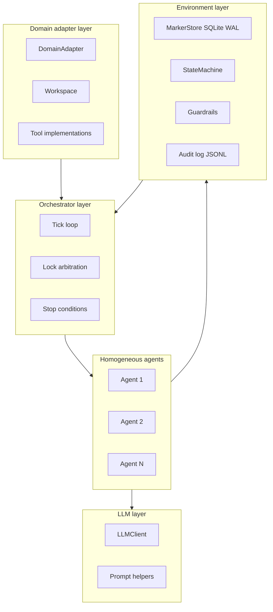
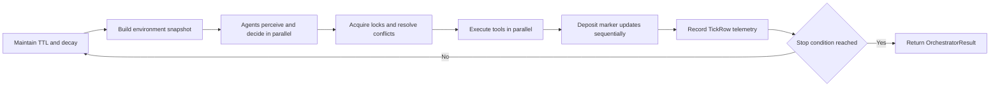
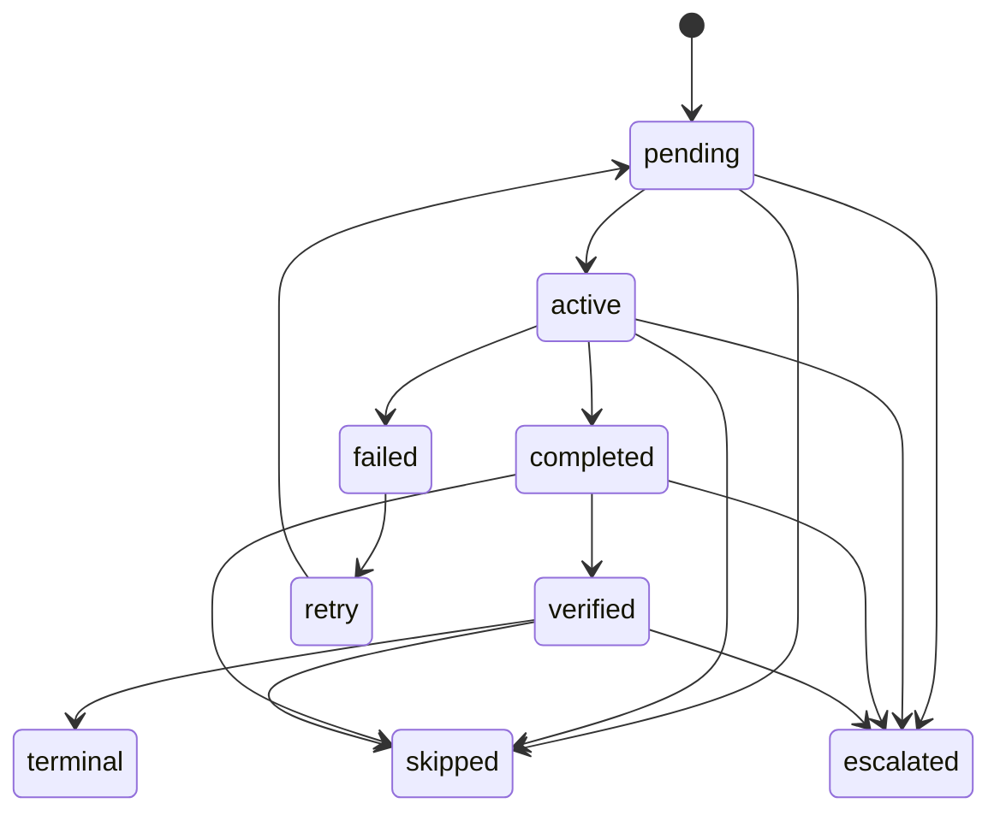
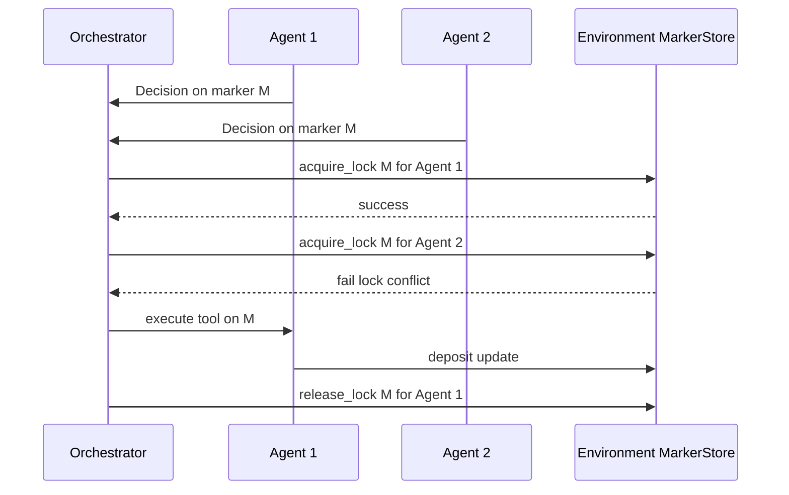

# Sprint 02 — Current Artifact Functioning

## Sprint scope

Sprint 2 V2 extends the Sprint 1 environment with a generic runtime:
- homogeneous stigmergic agents
- pressure-driven action selection
- parallel tick orchestrator
- tool registry contracts
- environment composition layer
- provider-aware LLM client ported in `llm/client.py`

## Current artifact behavior

The artifact now supports end-to-end generic execution in memory:

- Agents perceive one shared environment snapshot.
- Pressures are computed per action type from marker intensity and eligibility.
- Agents pick actions probabilistically (softmax) or greedily (`temperature=0`).
- Lock conflicts are resolved through marker-scoped store locks.
- Tool outputs are deposited transactionally through `Environment.apply_action_result`.
- Orchestrator runs tick-by-tick with stop conditions and per-tick telemetry.

## Runtime schemas

### Colony architecture

### Tick execution loop

### Marker lifecycle in Sprint 2

### Lock conflict resolution

## Public interfaces and contracts

### Runtime contracts (`core/tool_registry.py`)

- `Decision`
- `ActionResult`
- `Tool` (ABC)
- `ToolRegistry`

### Pressure model (`core/pressure.py`)

- `compute_pressures(markers, action_types, weights, inhibition_threshold)`
- `select_action(pressures, temperature, rng=None)`

### Environment layer (`core/environment.py`)

- `EnvironmentSnapshot`
- `Environment.snapshot`
- `Environment.acquire_lock` / `Environment.release_lock`
- `Environment.apply_action_result`
- `Environment.maintain`
- `Environment.enforce_budget`

### Agent runtime (`core/agent.py`)

- `StigmergicAgent.perceive_and_decide`
- `StigmergicAgent.execute`

### Orchestrator (`core/orchestrator.py`)

- `TickRow`
- `OrchestratorResult`
- `Orchestrator.run` (async)
- `Orchestrator.run_sync` (sync wrapper)

### Adapter and LLM contracts

- `adapters/base.py`: `DomainAdapter`, `Workspace`, `Objective`
- `llm/client.py`: `LLMClient`, `LLMResponse`, `ModelPricing`
- `llm/prompts.py`: generic prompt templates

## Guardrails and constraints

- Budget ceilings are enforced by `GuardrailEngine` through `Environment.enforce_budget`.
- Marker writes remain transactional in SQLite WAL (`BEGIN IMMEDIATE`).
- Lock ownership is required for safe concurrent marker updates.
- State transitions are validated through `StateMachine` on changed states.
- Every marker mutation keeps append-only audit semantics in `audit_log.jsonl`.

## Known limits / not implemented yet

- No TravelPlanner adapter implementation.
- No CodeMigration adapter implementation in V2 runtime.
- No SWE-bench adapter implementation.
- No V2-aligned baseline runners.
- No V2 emergence/Pareto instrumentation yet.

## Validation evidence

- `uv run pytest tests/unit/test_pressure.py tests/unit/test_agent.py tests/unit/test_orchestrator.py tests/unit/test_llm_client.py -q` -> `30 passed`
- `uv run pytest tests/unit -v` -> `61 passed`
